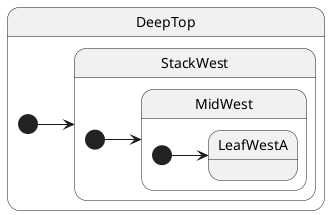

# Initialization

## Topology

No external transition — ihsm walks the **initial chain** after `makeHsm()`.




### Expected trace

See the **Trace** panel on the [interactive docs site](https://filasieno.github.io/ihsm/tutorials/), or run `npm run test:tutorials` headlessly.

## Starting point

```typescript
const sm = createDeepMachine();
await sm.sync();
```

## What happens

| Step | Action |
| ---- | ------ |
| 1 | Start at `DeepTop`, follow `@InitialState StackWest` |
| 2 | Follow `@InitialState MidWest` |
| 3 | Follow `@InitialState LeafWestA` — no further initial child |
| 4 | Active leaf = **`LeafWestA`** |

Each composite on the path runs `onEntry` **outer → inner**.


## Verify

```shell
npm run test:tutorials -- --grep '05 · 01 initialization'
```
