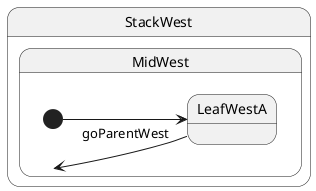

# Leaf → parent composite

## Topology

Target is the **immediate parent** composite. **LCA = that parent** (`MidWest`).




### Expected trace

See the **Trace** panel on the [interactive docs site](https://filasieno.github.io/ihsm/tutorials/), or run `npm run test:tutorials` headlessly.

## Starting point

`LeafWestA`

## What happens

| Step | Action |
| ---- | ------ |
| 1 | LCA = **`MidWest`** |
| 2 | Exit **`LeafWestA`** |
| 3 | Enter path toward `MidWest`; `MidWest` has `@InitialState LeafWestA` |
| 4 | Runtime **descends** again → enter **`LeafWestA`** |
| 5 | Final leaf = **`LeafWestA`** (same class, but exit+entry ran) |

You requested the parent composite, but ihsm always ends on a **leaf**. Re-entering the parent's initial child looks like a “refresh” of the default substate.

## Code

```typescript
sm.post('goParentWest');
await sm.sync();
```


## Verify

```shell
npm run test:tutorials -- --grep '05 · 04 to parent'
```
