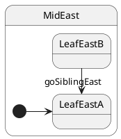

# East-stack sibling

## Topology

Leaf → sibling leaf on the **east stack**. **LCA = `MidEast`** — same rule as a west-stack sibling under `MidWest`.




### Expected trace

See the **Trace** panel on the [interactive docs site](https://filasieno.github.io/ihsm/tutorials/), or run `npm run test:tutorials` headlessly.

## Starting point

`LeafEastB` — use `restore()` so you do not walk from west init:

```typescript
const sm = createDeepMachine();
await sm.sync();
sm.restore(LeafEastB, { ...sm.ctx, trace: [...sm.ctx.trace] });
```

## What happens

| Step | Action |
| ---- | ------ |
| 1 | LCA = **`MidEast`** |
| 2 | Exit **`LeafEastB`**, enter **`LeafEastA`** |
| 3 | `StackEast` and `DeepTop` untouched |

The exit/entry pattern matches a sibling move under `MidWest`; only the stack and class names differ.

## Code

```typescript
sm.post('goSiblingEast');
await sm.sync();
```


## Verify

```shell
npm run test:tutorials -- --grep '05 · 11 east-stack sibling'
```
