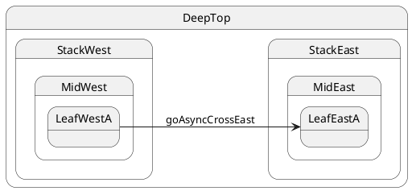

# Async handler, then cross-stack transition

## Topology

Same cross-stack move as case 07, but the handler is **`async`** — transition runs **after** `await`.




### Expected trace

See the **Trace** panel on the [interactive docs site](https://filasieno.github.io/ihsm/tutorials/), or run `npm run test:tutorials` headlessly.

## Starting point

`LeafWestA`

## What happens

| Step | Action |
| ---- | ------ |
| 1 | Handler starts — `handler:goAsyncCrossEast:start` |
| 2 | `await sleep(10)` — state stays **`LeafWestA`**; mailbox still queues other posts |
| 3 | After await — `handler:goAsyncCrossEast:after-await` |
| 4 | `transition(LeafEastA)` — LCA = **`DeepTop`**, same exit/entry as case 07 but target is **`LeafEastA`** |
| 5 | `await sm.sync()` waits for **handler + transition** |

## Code

```typescript
sm.post('goAsyncCrossEast');
await sm.sync();
```


## Verify

```shell
npm run test:tutorials -- --grep '05 · 13 async cross'
```
