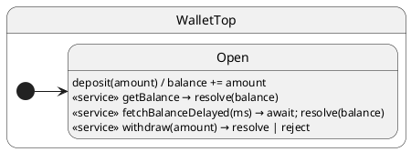

# Call Services

## Problem

Sometimes you need a **typed response** from the same actor — not just fire-and-forget events. External mutable state breaks encapsulation.

## Solution

Handlers live on state classes; clients call `post`, `call`, or `sync` on the `Hsm` instance.

| Side | Where | Role |
| ---- | ----- | ---- |
| **Handler** | State class method | Receives `resolve` / `reject` (+ payload); must call one of them |
| **Client** | Code that holds `Hsm` | `await call('service', …)` — gets typed `Promise<T>` |

| API | Client waits? | Return value? | Handler signature |
| --- | ------------- | ------------- | ----------------- |
| **`post('event', …)`** | No | No | `(payload…) => void \| Promise<void>` |
| **`call('service', …)`** | Yes | Yes — `Promise<T>` | `(resolve, reject, payload…) => void \| Promise<void>` |

You do **not** need `sync()` after `await call(...)` — the Promise *is* the wait.

## UML statechart



## Protocol

```typescript
export interface WalletProtocol {
	deposit(amount: number): void;
	getBalance(
		resolve: ResolveCallback<number>,
		reject: RejectCallback
	): void;
	fetchBalanceDelayed(
		resolve: ResolveCallback<number>,
		reject: RejectCallback,
		delayMs: number
	): Promise<void>;
	withdraw(
		resolve: ResolveCallback<number>,
		reject: RejectCallback,
		amount: number
	): void;
}
```

---

## Example 1 · `post` event — fire-and-forget

### Handler (state machine)

```typescript
deposit(amount: number): void {
	this.ctx.balance += amount;
}
```

No `resolve` — this is an **event**, not a service.

### Client (caller)

```typescript
const wallet = createWallet(100);
await wallet.sync();

wallet.post('deposit', 25);  // returns void — no result
await wallet.sync();         // optional: wait for balance update
```

---

## Example 2 · Sync `call` — resolve before return

### Handler (state machine)

```typescript
getBalance(resolve: ResolveCallback<number>, _reject: RejectCallback): void {
	resolve(this.ctx.balance);
}
```

The runtime injects `resolve` / `reject` as the **first two arguments** — the client never passes them.

### Client (caller)

```typescript
const balance = await wallet.call('getBalance'); // Promise<number> → 100
```

No `sync()` needed — `await call(...)` blocks until the handler calls `resolve(...)`.

---

## Example 3 · Sync `call` with `reject`

### Handler (state machine)

```typescript
withdraw(resolve: ResolveCallback<number>, reject: RejectCallback, amount: number): void {
	if (amount > this.ctx.balance) {
		reject(new Error('insufficient funds'));
		return;
	}
	this.ctx.balance -= amount;
	resolve(this.ctx.balance);
}
```

### Client (caller)

```typescript
try {
	await wallet.call('withdraw', 200);
} catch (error) {
	// handler called reject(...) → rejected Promise
}

const remaining = await wallet.call('withdraw', 40); // → 60
```

---

## Example 4 · Async `call` — await inside handler, then resolve

### Handler (state machine)

```typescript
async fetchBalanceDelayed(
	resolve: ResolveCallback<number>,
	_reject: RejectCallback,
	delayMs: number
): Promise<void> {
	await this.sleep(delayMs);
	resolve(this.ctx.balance);
}
```

The runtime `await`s the returned `Promise` before finishing dispatch. The client's `call()` still settles only when **`resolve` or `reject`** is invoked — not from the handler's return value alone.

### Client (caller)

```typescript
const later = await wallet.call('fetchBalanceDelayed', 10); // → 100 after delay
```

---

## Example 5 · `post` + `sync` vs `call` side by side

| Need | Handler | Client |
| ---- | ------- | ------ |
| Update balance (no reply) | `deposit(amount) { … }` | `wallet.post('deposit', 5)` |
| Read balance (typed reply) | `getBalance(resolve, …) { resolve(…) }` | `await wallet.call('getBalance')` |
| Wait for posted work | — | `await wallet.sync()` |

Batching posts: [Post and sync](../08-post-and-sync/README.md).

---

## Reading the trace

With `TraceLevel.VERBOSE_DEBUG` and a custom `TraceWriter`, ihsm logs each dispatch step. Trace line format is covered in [Tracing](../02-tracing/README.md).

Each line is **`domain|…|StateName: message`**. Domains nest as the runtime descends: `initialize` → `#eventName` → `execute` → `transition from X to Y`.

On the [documentation page](https://filasieno.github.io/ihsm/reference), use the embedded playground to dispatch events and inspect the **Trace** panel. Or run `npm run test:examples` headlessly.

**What to notice:** `#getBalance` is a service dispatch (same queue as events). Client `await call(...)` resolves when the handler calls `resolve(...)`.

## Verify

```shell
npm run test:examples -- --grep 'Tutorial 10'
```

