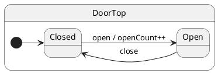

# Hello state machine

## Problem

Model each mode as a **state class**. Events are methods; crossing a mode boundary calls `this.hsm.transition(NextState)`.

## Solution

One `Config` bag declares context + notifications. `makeActor` returns a handle with flat methods (`door.open()`). Machinery (`transition`, `sync`, `currentState`) lives on `door.hsm`.

## UML statechart



## Config

```typescript
interface DoorConfig extends Config {
  context: DoorCtx;
  notifications: {
    open(): void;
    close(): void;
  };
}


export class DoorTop extends TopState {
  declare readonly __ihsm: DoorConfig;
}
```

Mark the **initial state** with `@InitialState`. After `makeActor` + `await door.hsm.sync()`, the runtime descends here.

```typescript
@InitialState
class Closed extends DoorTop {
  open(): void {
    this.ctx.openCount += 1;
    this.hsm.transition(Open);
  }
}

class Open extends DoorTop {
  close(): void {
    this.hsm.transition(Closed);
  }
}
```

## Client

```typescript
import { makeActor, Port } from 'ihsm';

const door = makeActor(DoorTop, { openCount: 0 }, new Port());
await door.hsm.sync();

door.open();                    // fire-and-forget notification
await door.hsm.sync();          // handler + transition finished

door.close();
await door.hsm.sync();

door.open();
door.close();
await door.hsm.sync();

console.log(door.hsm.currentStateName); // 'Closed'
console.log(door.ctx.openCount);          // 2
```

| Side | Call | Blocks? |
| ---- | ---- | ------- |
| Client | `door.open()` | No — returns immediately |
| Client | `await door.hsm.sync()` | Yes — drains enqueued work |

See [Post & sync](../08-post-and-sync/README.md) for batching and handler chaining.

## Verify

```shell
npm run test:examples -- --grep 'Tutorial 01'
```
