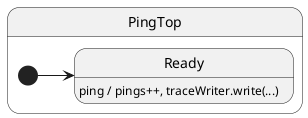

# Tracing

## Problem

You need visibility into dispatch and transitions in development, without paying that cost in production — and you need a **shared vocabulary** to read dispatch traces consistently across examples.

## Solution

Set **`TraceLevel`** on the factory (or on a live machine), inject a custom **`TraceWriter`**, and read lines built from **`Properties`** snapshot fields. Use **`VERBOSE_DEBUG`** while learning; switch to **`PRODUCTION`** in hot paths.

## UML statechart



Tracing is orthogonal to state structure — same chart with observability layered on.

---

## Tracing API reference

Everything below is exported from `ihsm` (`src/index.ts`). Handlers see the same fields on **`this`** (via `TopState` getters) and on **`this.hsm`**; clients use the **`Hsm`** handle returned by `makeActor`.

### `TraceLevel` (enum)

Controls **which dispatch implementation** runs. Changing `traceLevel` on a live instance swaps init/event dispatch factories immediately.

| Member | Numeric value | Dispatch module | Runtime trace output |
| ------ | ------------- | ----------------- | -------------------- |
| `PRODUCTION` | `0` | `dispatch.production` | **None** — no `_trace*` calls |
| `DEBUG` | `1` | `dispatch.debug` | Boundaries: init frame, event frame, transitions, error/unhandled recovery, `execute` — **no** prototype lookup walk, **no** per-state “skipped onEntry/onExit”, **no** transition cache hit/miss lines |
| `VERBOSE_DEBUG` | `2` | `dispatch.trace` | Full detail: lookup domains, cache hit/miss, skipped default hooks, every `onEntry`/`onExit` step |

**Defaults:** `makeActor(...)` uses `TraceLevel.DEBUG` and `ConsoleTraceWriter` unless you pass overrides.

```typescript
import { makeActor, TraceLevel, TraceWriter } from 'ihsm';

const sm = makeActor(Top, ctx, true, TraceLevel.VERBOSE_DEBUG, myWriter);
sm.traceLevel = TraceLevel.DEBUG; // downgrade live instance
```

Factory signature (tracing-related parameters only):

```typescript
makeActor(
  topState,
  ctx,
  initialize?,           // default true — enqueue init task (traced when level ≠ PRODUCTION)
  traceLevel?,           // default TraceLevel.DEBUG
  traceWriter?,          // default: console logger
  dispatchErrorCallback? // default: traceWriter.write(...) then rethrow
);
```

### `TraceWriter` (interface)

Single method — your sink for **runtime** and **handler** lines.

```typescript
export interface TraceWriter {
  write<Context, Protocol>(
    hsm: Properties<Context, Protocol>,
    msg: any
  ): void;
}
```

| Parameter | Type | Role |
| --------- | ---- | ---- |
| `hsm` | `Properties<Context, Protocol>` | Read-only snapshot at write time (see table below). You normally pass the machine handle or `this` inside a handler — both expose the same properties. |
| `msg` | `any` | **String** → default formatters prefix with `traceHeader` + `currentStateName` (see [Line format](#line-format)). **Non-string** (e.g. `Error`) → passed through unchanged by `ConsoleTraceWriter` / `CollectingTraceWriter` (collector stringifies objects). |

**Handler ad-hoc logs** (same prefix rules as the runtime):

```typescript
ping(): void {
  this.ctx.pings += 1;
  this.traceWriter.write(this, `ping count is now ${this.ctx.pings}`);
  // equivalent: this.traceWriter.write(this.hsm, '...');
}
```

Replace the writer anytime: `sm.traceWriter = new CollectingTraceWriter()`.

### `Properties` — fields used while tracing

`Properties` is implemented by the runtime object behind **`Hsm`** and forwarded on **`State`** / **`TopState`**. These fields matter when implementing or reading traces:

| Field | Access | Type | When populated | Use in traces |
| ----- | ------ | ---- | -------------- | ------------- |
| `currentState` | read-only | `StateClass<Context, Protocol>` | Always | Constructor of the **leaf** state executing now |
| `currentStateName` | read-only | `string` | Always | Display name (from `registerStateNames` / `defineStateName`, else `Class.name`) — **suffix** of every formatted string line |
| `topState` | read-only | `StateClass<Context, Protocol>` | Always | Root class passed to `makeActor` |
| `topStateName` | read-only | `string` | Always | Display name of `topState` |
| `ctxTypeName` | read-only | `string` | Always | `ctx` constructor name at machine creation — metadata only; **not** prepended to `traceHeader` today |
| `traceHeader` | read-only | `string` | During nested dispatch | Prefix built from the internal domain stack: `''` or `domain|subdomain|` (see [Trace domains](#trace-domains-nested-prefixes)) |
| `eventName` | read-only | `string` | Inside event/service dispatch | Current `#event` or service name; `''` when idle |
| `eventPayload` | read-only | `any[]` | Inside dispatch | Arguments for the running handler (excludes `resolve`/`reject` injected for `call`) |
| `traceLevel` | read/write | `TraceLevel` | Always | Switch verbosity live |
| `traceWriter` | read/write | `TraceWriter` | Always | Inject test doubles, OpenTelemetry bridges, etc. |
| `dispatchErrorCallback` | read/write | `DispatchErrorCallback` | Always | Last-resort hook; **default** writes a string line then `write(hsm, err)` before rethrowing |

**Related on handlers (not on `Properties` but tracing-adjacent):**

| Field | Where | Role |
| ----- | ----- | ---- |
| `ctx` | `State` | Domain data; handlers log business facts via `traceWriter` |
| `hsm` | `TopState` | Same machine API as the client handle inside handlers |

### `DispatchErrorCallback`

```typescript
(hsm: Base<Context, Protocol>, err: Error) => void
```

Default behavior: one string line (`An event dispatch has failed; …`), then `traceWriter.write(hsm, err)` (non-string), then **rethrow**. Override via `makeActor`’s sixth argument or `hsm.dispatchErrorCallback = …` for tests that must catch failures without console noise.

---

## Wiring (this tutorial)

Shared collector (used in specs and the docs playground) lives in `examples/shared/trace.ts`:

```typescript
export class CollectingTraceWriter implements TraceWriter {
  readonly lines: string[] = [];

  write(hsm: Properties<unknown, unknown>, msg: unknown): void {
    if (typeof msg === 'string') {
      this.lines.push(`${hsm.traceHeader}${hsm.currentStateName}: ${msg}`);
    } else {
      this.lines.push(typeof msg === 'object' ? JSON.stringify(msg) : String(msg));
    }
  }

  clear(): void { this.lines.length = 0; }
}
```

Factory for tutorial 02:

```typescript
export function createTracedPing(writer: CollectingTraceWriter) {
  return makeActor(PingTop, { pings: 0 }, true, TraceLevel.VERBOSE_DEBUG, writer);
}
```

Helper `withTrace(top, ctx)` in the same file returns `{ sm, writer }` with `VERBOSE_DEBUG` preconfigured.

---

## Line format

Every **string** line written while a domain stack is active looks like:

```text
{traceHeader}{currentStateName}: {message}
```

| Segment | Source (`Properties`) | Example |
| ------- | --------------------- | ------- |
| `{traceHeader}` | `traceHeader` | `initialize\|`, `#ping\|execute\|`, `transition from Ready to Busy\|` |
| `{currentStateName}` | `currentStateName` | `Ready`, `PingTop` |
| `{message}` | argument to `write` / runtime | `started event dispatch`, `done: event dispatch successful` |

**Top-level lines** (empty `traceHeader`) still use the state suffix:

```text
Ready: begin event dispatch of #ping
```

**Frame completion markers** (written before popping a domain):

| Prefix | Meaning |
| ------ | ------- |
| `done: …` | Domain finished successfully |
| `failure: …` | Domain ended with error (lookup miss, handler throw, failed recovery) |

**Non-string `msg`:** `ConsoleTraceWriter` logs the value as-is (no prefix). Used for raw `Error` objects on the default error callback path.

---

## Trace domains (nested prefixes)

The runtime maintains an internal **domain stack**. `_tracePush(domain, msg)` pushes `domain`, then writes `msg` with the updated header. `_tracePopDone` / `_tracePopError` write `done:` / `failure:` lines, then pop.

Nested dispatch therefore produces headers like:

```text
#ping|lookup|execute|Ready: not found in state Ready
```

### Domain labels (stack segments)

| Domain | When pushed | Typical opening message |
| ------ | ----------- | ------------------------ |
| `initialize` | Machine init descent | `started initialization from …` |
| `#<eventName>` | Each `notify` / `call` dispatch | `started event dispatch` |
| `lookup` | Finding handler, `onError`, or `onUnhandled` | `started lookup of #ping event handler` |
| `execute` | Running handler or recovery hook | `started event handler execution` |
| `transition from <A> to <B>` | LCA exit/entry walk | `started transition from A to B` |
| `error recovery` | After handler throw | `started error recovery` |
| `unhandled recovery` | Unknown event | `started unhandled event recovery` |

`VERBOSE_DEBUG` adds **sibling** lines inside those domains (no extra stack frame), for example:

- `begin initialization` / `end initialization`
- `begin event dispatch of #ping` / `end event dispatch`
- `skip Foo.onEntry(): default empty implementation`
- `Foo.onEntry() done` / `Foo.onExit() done` / `… skipped: default empty implementation`
- `requested transition from A to B`
- `transition cache hit|miss for A to B`
- `no transition requested`
- `not found in state X` during lookup
- `#ping found in state Y` / `not found in state …` (lookup pop)
- `event #ping is unhandled in state …`

`DEBUG` keeps outer frames (`initialize`, `#event`, `transition from …`, `execute`, recovery) but omits lookup walks, cache lines, and skipped-hook commentary.

---

## Example trace (tutorial 02)

After `await sm.hsm.sync()` then `sm.notify.ping(); await sm.hsm.sync();` with `VERBOSE_DEBUG`, expect a nested sequence similar to:

```text
PingTop: begin event dispatch of #ping
#ping|Ready: started event dispatch
#ping|lookup|Ready: started lookup of #ping event handler
#ping|lookup|Ready: done: #ping found in state PingTop
#ping|execute|Ready: started event handler execution
#ping|execute|Ready: ping count is now 1          ← handler traceWriter.write
#ping|execute|Ready: done: event handler execution successful
#ping|Ready: done: event dispatch successful
Ready: end event dispatch
```

(Exact state names depend on `registerStateNames` and the active leaf — here `Ready` extends `PingTop`.)

---

## Reading traces in the docs UI

On the [reference page](https://filasieno.github.io/ihsm/reference), use the embedded playground: dispatch events and inspect the **Trace** panel (`CollectingTraceWriter` + `VERBOSE_DEBUG`).

Compare levels on the same chart:

- **`DEBUG`** — enough to follow init → event → transition → handler without prototype-chain noise.
- **`VERBOSE_DEBUG`** — use when correlating “why wasn’t my handler found?” or “why didn’t `onEntry` run?”.

Headless check:

```shell
npm run test:examples -- --grep 'Tutorial 02'
```
