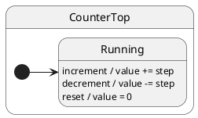

# Context

## What this presents

Domain data on `ctx` that survives transitions unless replaced in `restore()`.

## Why it's done this way

Context is separate from active state — counters and buffers persist across mode changes without encoding data in the state class name.


## Problem

Domain counters and configuration must survive many events. Storing them outside the actor invites drift between “state name” and “state data”.

## Solution

Pass **context** as the second argument to `makeActor(CounterTop, ctx, port)`. Handlers mutate `this.ctx`; the active state class can stay unchanged.

## UML statechart



Internal transitions: every event stays in `Running`; only `ctx.value` changes.

Context holds mutable domain fields:

```typescript
export interface CounterCtx {
	value: number;
	step: number;
}
```

Handlers live on the top state and **only touch ctx** — no `transition()`:

```typescript
export class CounterTop extends TopState<CounterCtxConfig> {
	increment(): void {
		this.ctx.value += this.ctx.step; // ← ctx update, same state
	}

	decrement(): void {
		this.ctx.value -= this.ctx.step;
	}

	reset(): void {
		this.ctx.value = 0;
	}
}
```

One concrete state is enough when behavior does not depend on mode:

```typescript
@InitialState
export class Running extends CounterTop {}
```

makeActor seeds initial data:

```typescript
const counter = makeActor(CounterTop, { value: 10, step: 5 });
await counter.hsm.sync();

counter.notify.increment();
await counter.hsm.sync();
// counter.ctx.value === 15, currentState still Running
```

## Reading the trace

With `TraceLevel.VERBOSE_DEBUG` and a custom `TraceWriter`, ihsm logs each dispatch step. Trace line format is covered in [Tracing](../02-tracing/README.md).

Each line is **`domain|…|StateName: message`**. Domains nest as the runtime descends: `initialize` → `#eventName` → `execute` → `transition from X to Y`.

On the [documentation page](https://filasieno.github.io/ihsm/reference), use the embedded playground to dispatch events and inspect the **Trace** panel. Or run `npm run test:examples` headlessly.

**What to notice:** `#increment` runs handler + `execute` domain but **no** `requested transition` — internal transition; only `ctx.value` changes.

## Verify

```shell
npm run test:examples -- --grep 'Tutorial 03'
```
