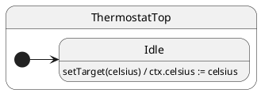

# Protocol Typing

## Problem

String event names and untyped payloads fail at runtime after refactors — a typo in an event name compiles until the first dispatch in production.

## Solution

Declare a **`Config`** bag with typed `notifications` and `services` buckets. TypeScript checks `thermostat.notify.setTarget(22)` against method names and parameter types.

Other HSM libraries use runtime strings or untyped event objects; they **cannot**
tie `notify` / `call` argument lists and Promise return types to the same
method signatures your state classes implement. ihsm does — see the reference
manual:
[Advanced: Protocol typing and compile-time safety](../reference/REFERENCE.md#advanced-protocol-typing-and-compile-time-safety).

## UML statechart



Typing is compile-time; at runtime this is an internal transition in `Idle`.

The protocol is the machine’s **event vocabulary** (here, folded into `Config`):

```typescript
interface ThermostatConfig extends Config {
  context: ThermostatCtx;
  notifications: {
    setTarget(celsius: number): void;
    readTarget(): void;
  };
  services: {
    readTarget(): Promise<number>;
  };
}
```

State classes implement the buckets; the factory is typed end-to-end:

```typescript
export class ThermostatTop extends TopState<ThermostatConfig> {
  setTarget(celsius: number): void {
    this.ctx.celsius = celsius; // ← payload type enforced at notify.setTarget
  }
}

const t = makeActor(ThermostatTop, { celsius: 18 }, new Port());

t.notify.setTarget(22);   // ✓
// t.notify.setTargt(22); // ✗ compile error: unknown event
// t.notify.setTarget('hot'); // ✗ compile error: string ≠ number
```

## Reading the trace

With `TraceLevel.VERBOSE_DEBUG` and a custom `TraceWriter`, ihsm logs each dispatch step. Trace line format is covered in [Tracing](../02-tracing/README.md).

Each line is **`domain|…|StateName: message`**. Domains nest as the runtime descends: `initialize` → `#eventName` → `execute` → `transition from X to Y`.

On the [documentation page](https://filasieno.github.io/ihsm/reference), use the embedded playground to dispatch events and inspect the **Trace** panel. Or run `npm run test:examples` headlessly.

**What to notice:** Same internal pattern as context: `#setTarget` handler completes without a transition block.

## Verify

```shell
npm run test:examples -- --grep 'Tutorial 04'
```

