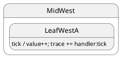

# Internal transition

## What this presents

Internal transition: handler runs without `transition()` — no exit/entry.

## Why it's done this way

Use when the event updates data but the active state class should not change.


## Topology

Handler runs; **no** `this.hsm.transition()`. State class unchanged — no `onExit` / `onEntry`.




### Expected trace

See the **Trace** panel on the [interactive docs site](https://filasieno.github.io/ihsm/reference), or run `npm run test:examples` headlessly.

## Starting point

`LeafWestA` after init.

## What happens

| Step | Action |
| ---- | ------ |
| 1 | `notify.tick()` dispatches to inherited `DeepTop.tick()` |
| 2 | Handler updates `ctx.value` and pushes `handler:tick` |
| 3 | No `transition()` → **no** lifecycle hooks |
| 4 | Active leaf stays **`LeafWestA`** |

## Code

```typescript
sm.notify.tick();
await sm.hsm.sync();
```


## Verify

```shell
npm run test:examples -- --grep '05 · 02 internal'
```
