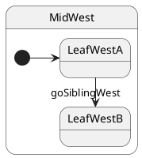

# Leaf → sibling leaf

## Topology

Two leaves share the same parent composite. **LCA = parent** (`MidWest`).




### Expected trace

See the **Trace** panel on the [interactive docs site](https://filasieno.github.io/ihsm/reference), or run `npm run test:examples` headlessly.

## Starting point

`LeafWestA`

## What happens

| Step | Action |
| ---- | ------ |
| 1 | LCA = **`MidWest`** (common parent of `LeafWestA` and `LeafWestB`) |
| 2 | Exit **`LeafWestA`** only — `MidWest`, `StackWest`, `DeepTop` stay active |
| 3 | Enter **`LeafWestB`** |
| 4 | Final leaf = **`LeafWestB`** |

Ancestors above the LCA do **not** run `onExit` / `onEntry`.

## Code

```typescript
sm.goSiblingWest();
await sm.hsm.sync();
```


## Verify

```shell
npm run test:examples -- --grep '05 · 03 sibling'
```
