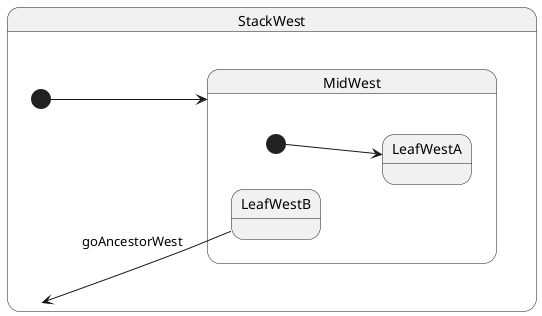

# Leaf → ancestor composite

## What this presents

Transition from deep leaf to a non-parent ancestor composite.

## Why it's done this way

Exit up to the LCA, then enter down the target's initial chain; states above the LCA are untouched.


## Topology

Target is a **grandparent** (or higher ancestor), not the root. **LCA = that ancestor** (`StackWest`).




### Expected trace

See the **Trace** panel on the [interactive docs site](https://filasieno.github.io/ihsm/reference), or run `npm run test:examples` headlessly.

## Starting point

`LeafWestB` (after `goSiblingWest` from `LeafWestA`).

## What happens

| Step | Action |
| ---- | ------ |
| 1 | LCA = **`StackWest`** |
| 2 | Exit **`LeafWestB`**, then **`MidWest`** — stop before `StackWest` |
| 3 | **`DeepTop` is not exited** — still an ancestor of both source and target |
| 4 | Re-enter **`MidWest`** → `@InitialState` **`LeafWestA`** |
| 5 | Final leaf = **`LeafWestA`** |

## Code

```typescript
sm.notify.goSiblingWest();
await sm.hsm.sync();
sm.notify.goAncestorWest();
await sm.hsm.sync();
```


## Verify

```shell
npm run test:examples -- --grep '05 · 05 to ancestor'
```
