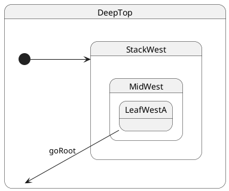

# Leaf → root (LCA = top)

## What this presents

Transition from a nested leaf back to the root composite.

## Why it's done this way

Root's own onExit/onEntry are skipped at the LCA; ihsm immediately descends the initial branch again.


## Topology

Target is the **root state class** `DeepTop`. **LCA = `DeepTop`**.




### Expected trace

See the **Trace** panel on the [interactive docs site](https://filasieno.github.io/ihsm/reference), or run `npm run test:examples` headlessly.

## Starting point

`LeafWestA`

## What happens

| Step | Action |
| ---- | ------ |
| 1 | LCA = **`DeepTop`** |
| 2 | Exit entire west stack: **`LeafWestA` → `MidWest` → `StackWest`** |
| 3 | **`DeepTop.onExit` / `onEntry` do not run** — LCA is neither exited nor re-entered |
| 4 | Re-enter **`StackWest`** ( `@InitialState` branch ) → **`MidWest` → `LeafWestA`** |
| 5 | Final leaf = **`LeafWestA`** |

Transitioning to the root **does not** leave you “bare” at the root class — ihsm immediately descends the **initial branch** again.

## Code

```typescript
sm.notify.goRoot();
await sm.hsm.sync();
```


## Verify

```shell
npm run test:examples -- --grep '05 · 06 to root'
```
