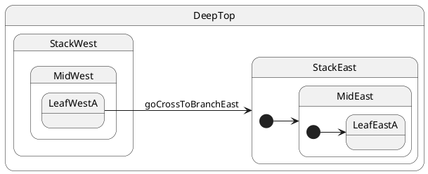

# Cross-stack: leaf → branch composite

## What this presents

Cross-stack transition into a branch composite (not a leaf).

## Why it's done this way

Target composite's `@InitialState` chain runs after entry — you land on the initial leaf.


## Topology

Target is the **branch composite** `StackEast`, not a leaf. **LCA = `DeepTop`**.




### Expected trace

See the **Trace** panel on the [interactive docs site](https://filasieno.github.io/ihsm/reference), or run `npm run test:examples` headlessly.

## Starting point

`LeafWestA`

## What happens

| Step | Action |
| ---- | ------ |
| 1 | LCA = **`DeepTop`** — exit west stack completely |
| 2 | Enter **`StackEast`** |
| 3 | Target is composite → follow `@InitialState` chain: **`MidEast` → `LeafEastA`** |
| 4 | Final leaf = **`LeafEastA`** (initial east leaf, not `LeafEastB`) |

You call `transition(StackEast)`; ihsm always activates a **leaf**.

## Code

```typescript
sm.notify.goCrossToBranchEast();
await sm.hsm.sync();
```


## Verify

```shell
npm run test:examples -- --grep '05 · 08 cross-stack to branch'
```
