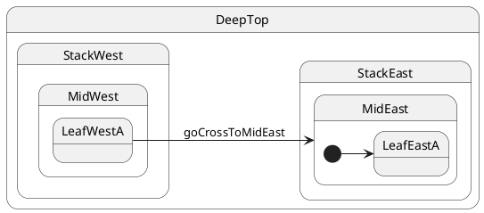

# Cross-stack: leaf → mid composite

## Topology

Target is **`MidEast`** — a composite **inside** the east stack, not the branch root. **LCA = `DeepTop`**.




### Expected trace

See the **Trace** panel on the [interactive docs site](https://filasieno.github.io/ihsm/reference), or run `npm run test:examples` headlessly.

## Starting point

`LeafWestA`

## What happens

| Step | Action |
| ---- | ------ |
| 1 | LCA = **`DeepTop`** |
| 2 | Exit west stack |
| 3 | Path to `MidEast` still enters **`StackEast`** first (parent of `MidEast`) |
| 4 | Enter **`MidEast`**, then `@InitialState` **`LeafEastA`** |
| 5 | Final leaf = **`LeafEastA`** |

## Same trace as case 08?

When the **initial leaf chain** from the branch root matches, `transition(StackEast)` and `transition(MidEast)` produce the **same** exit/entry sequence. The requested target class matters for **cache keys** and documentation; the **active leaf** is determined by `@InitialState` descent.

## Code

```typescript
sm.goCrossToMidEast();
await sm.hsm.sync();
```


## Verify

```shell
npm run test:examples -- --grep '05 · 09 cross-stack to mid'
```
