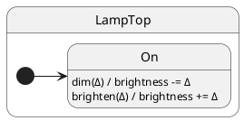

# Internal Transitions

## Problem

Not every event should change mode. Self-transitions or dummy states add noise and re-run lifecycle hooks unnecessarily.

## Solution

Handle the event **without** calling `this.hsm.transition()`. The active state stays the same; only `ctx` (or side effects) change.

## UML statechart



No exit or entry on `dim` / `brighten` — internal transitions on `On`.

Track whether entry ran via a counter in ctx:

```typescript
export class LampTop extends TopState<LampCtx, LampProtocol> {
	onEntry(): void {
		this.ctx.entryCount += 1; // only bumps on real entry
	}
```

Handlers clamp brightness and **do not transition**:

```typescript
	dim(delta: number): void {
		this.ctx.brightness = Math.max(0, this.ctx.brightness - delta);
		// ← no this.hsm.transition() → internal transition
	}

	brighten(delta: number): void {
		this.ctx.brightness = Math.min(100, this.ctx.brightness + delta);
	}
}
```

Guards are plain TypeScript (`Math.max` / `Math.min`) — no separate guard table.

```typescript
lamp.dim(10);
await lamp.hsm.sync();
// brightness changed, entryCount unchanged, state still On
```

## Reading the trace

With `TraceLevel.VERBOSE_DEBUG` and a custom `TraceWriter`, ihsm logs each dispatch step. Trace line format is covered in [Tracing](../02-tracing/README.md).

Each line is **`domain|…|StateName: message`**. Domains nest as the runtime descends: `initialize` → `#eventName` → `execute` → `transition from X to Y`.

On the [documentation page](https://filasieno.github.io/ihsm/reference), use the embedded playground to dispatch events and inspect the **Trace** panel. Or run `npm run test:examples` headlessly.

**What to notice:** `#dim` adjusts brightness with no transition lines — state class stays `On`.

## Verify

```shell
npm run test:examples -- --grep 'Tutorial 07'
```

