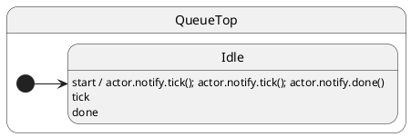

# Notifications and sync

## Problem

If handlers could be re-entered mid-flight, invariants break. You need deterministic ordering when one handler schedules follow-up work — and a clear way to **wait** (or not) from outside the actor.

## Solution

ihsm serializes dispatch with **run-to-completion semantics**.

| Side | Where | Role |
| ---- | ----- | ---- |
| **Handler** | State class method | Runs when the notification is dispatched |
| **Client** | Code that holds the actor handle | Calls `notify` / `call` + `await actor.hsm.sync()` |

| API | Client waits? | Return value? | Use when |
| --- | ------------- | ------------- | -------- |
| **`actor.notify.event(…)`** (notification) | No — returns immediately | No | Fire-and-forget |
| **`await actor.call.service(…)`** (service) | Yes — `await` the Promise | Yes — typed reply | Request/response |
| **`await actor.hsm.sync()`** | Yes | No | Drain everything already enqueued |

**Rule of thumb:** need a value back → **`await actor.call.service()`**. Just tell the actor something happened → **`actor.notify.event()`**. Need a batch of notifications to finish → **`actor.notify.tick(); actor.notify.done(); await actor.hsm.sync()` once**.

Typed services: [Call services](../10-call-services/README.md).

## UML statechart



## Config

Notifications are plain methods on the state class — return `void` (or `Promise<void>` for async):

```typescript
interface QueueConfig {
  context: QueueCtx;
  notifications: {
    start(): void;
    tick(): void;
    done(): void;
  };
}
```

---

## Example 1 · Batch notifications from the client, one `sync`

### Handler

```typescript
export class QueueTop extends TopState {
  tick(): void {
    this.ctx.events.push('tick');
  }
  done(): void {
    this.ctx.events.push('done');
  }
}
```

### Client

```typescript
const sm = createQueueMachine();
await sm.hsm.sync();

sm.notify.tick();
sm.notify.tick();
sm.notify.done();
await sm.hsm.sync();

// sm.ctx.events === ['tick', 'tick', 'done']
```

One `sync` after the batch — not after every notification.

---

## Example 2 · Handler chains `this.notify` — client needs extra `sync`

### Handler

`start` schedules follow-ups **after** it returns:

```typescript
export class QueueTop extends TopState {
  start(): void {
    this.ctx.events.push('start');
    this.notify.tick();
    this.notify.tick();
    this.notify.done();
  }
}
```

### Client

Inner notifications are not enqueued until `start` finishes:

```typescript
const sm = createQueueMachine();
await sm.hsm.sync();

sm.notify.start();
await sm.hsm.sync(); // through start only → ['start']
await sm.hsm.sync(); // through tick, tick, done
```

---

## Example 3 · Service vs notification + sync

When the client needs a **return value**, use a service — not a notification + `sync`. See [Call services](../10-call-services/README.md).

```typescript
const balance = await wallet.call.getBalance();

wallet.notify.deposit(10);
await wallet.hsm.sync(); // optional: wait for deposit side effect
```

## Verify

```shell
npm run test:examples -- --grep 'Tutorial 08'
```
