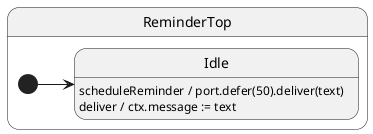

# Deferred notifications (`hsm.port.defer`)

## Problem

Handlers sometimes need to schedule follow-up work after a delay without blocking the current handler.

## Solution

`this.hsm.port.defer(millis).eventName(…)` arms a timer through the machine's **port timer service** (`Port.setTimeout`), then enqueues the notification like any other. **Handler-only** — not on the external actor surface.

## UML statechart



## Handler

```typescript
export class ReminderTop extends TopState {
  scheduleReminder(text: string): void {
    this.hsm.port.defer(50).deliver(text); // returns immediately; timer armed
  }

  deliver(text: string): void {
    this.ctx.message = text;
  }
}
```

## Client

```typescript
const sm = createReminder();
await sm.hsm.sync();

sm.notify.scheduleReminder('hello later');
await sleep(100); // real time in production; TestPort.advance in tests
await sm.hsm.sync();

// sm.ctx.message === 'hello later'
```

| Step | Who | What |
| ---- | --- | ---- |
| 1 | Client | `sm.notify.scheduleReminder('…')` |
| 2 | Handler | `hsm.port.defer(50).deliver(…)` — returns; timer armed |
| 3 | Port timer | fires → `deliver` enqueued |
| 4 | Client | `await sm.hsm.sync()` — `deliver` runs |

In tests use `TestPort.advance(ms)` instead of wall-clock sleep. See [testing-01](../testing-01-deferred-timers/README.md).

## Verify

```shell
npm run test:examples -- --grep 'Tutorial 09'
```
