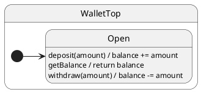

# Call services

## What this presents

Typed request/response: `await actor.call.service()` with handlers returning values or `Promise<T>`.

## Why it's done this way

Services share the same run-to-completion queue as notifications — replies are typed without breaking actor serialization.


## Problem

Sometimes the client needs a **typed reply** from the same actor that processes events — without breaking run-to-completion ordering.

## Solution

Declare **services** on `Config.services`. The generated client method returns `Promise<Reply>`; handlers return a value or `Promise` directly (no `resolve`/`reject` injection).

| Bucket | Handler return | Client call |
| ------ | ---------------- | ----------- |
| **Notification** (`notifications`) | `void` / `Promise<void>` | `actor.notify.deposit(5)` |
| **Service** (`services`) | `T` / `Promise<T>` | `await actor.call.getBalance()` |

## UML statechart



## Config

```typescript
interface WalletConfig {
  context: WalletCtx;
  notifications: { deposit(amount: number): void };
  services: {
    getBalance(): Promise<number>;
    withdraw(amount: number): Promise<number>;
    fetchBalanceDelayed(delayMs: number): Promise<number>;
  };
}
```

## Handlers

```typescript
export class WalletTop extends TopState {
  deposit(amount: number): void {
    this.ctx.balance += amount;
  }

  getBalance(): number {
    return this.ctx.balance;
  }

  withdraw(amount: number): number {
    if (amount > this.ctx.balance) throw new Error('insufficient funds');
    this.ctx.balance -= amount;
    return this.ctx.balance;
  }

  async fetchBalanceDelayed(delayMs: number): Promise<number> {
    await new Promise<void>(resolve => this.hsm.port.setTimeout(resolve, delayMs));
    return this.ctx.balance;
  }
}
```

## Client

```typescript
const wallet = makeActor(WalletTop, { balance: 75 }, new Port());
await wallet.hsm.sync();

wallet.notify.deposit(25);

const balance = await wallet.call.getBalance(); // → 100

try {
  await wallet.call.withdraw(200);
} catch {
  // handler throw → rejected Promise
}

const remaining = await wallet.call.withdraw(40); // → 60
const later = await wallet.call.fetchBalanceDelayed(10); // → 60 after sleep
```

| Goal | Handler | Client |
| ---- | ------- | ------ |
| Update balance (no reply) | `deposit(amount) { … }` | `wallet.notify.deposit(5)` |
| Read balance (typed reply) | `getBalance(): number` | `await wallet.call.getBalance()` |

## Verify

```shell
npm run test:examples -- --grep 'Tutorial 10'
```
