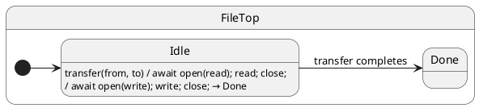

# Async Handlers

## Problem

File and network work is naturally **sequential**: open → read → write → close. Classic statechart tools push you to model **each await as its own state** (`Opening`, `Reading`, `Writing`, `Closing`, …) because the handler must return immediately.

That explodes the chart for mechanical I/O — not because the **domain mode** changed, but because the runtime could not wait inside a handler.

## Solution (major ihsm advantage)

Mark the event handler **`async`**. The runtime **`await`s** the returned `Promise` **before** running `transition()`. The machine **stays in the same state class** for the whole I/O pipeline; you `await` open, read, write, and close **inline** in one method.

You only add extra states when a **waiting mode is meaningful to your domain** (e.g. `Paused`, `Cancelled`, user-visible “Uploading…” with different events allowed) — not for every socket or file syscall.

### Without async handlers (typical elsewhere)

```text
Idle ──open──▶ Opening ──done──▶ Reading ──done──▶ Writing ──done──▶ Closing ──done──▶ Done
```

Five states for one business operation. Each step needs its own handler, `done` event, and error edge.

### With ihsm async handler (one state, one handler)

```text
Idle ──transfer()──▶ Done
      └─ inside transfer: await open; await read; await close; await open; await write; await close
```

**One** `async transfer()` method; **one** active state (`Idle`) until the full pipeline completes.

## UML statechart



The arrow to `Done` is the only **external** transition. All I/O is **inside** the handler — not separate states.

Protocol — one async event for the whole file copy:

```typescript
export interface FileProtocol {
	transfer(from: string, to: string): Promise<void>;
}
```

Simulated file API (real code would use `fs.promises` or a socket library):

```typescript
async function open(path: string, mode: 'r' | 'w'): Promise<number> { … }
async function read(fd: number): Promise<Buffer> { … }
async function write(fd: number, data: Buffer): Promise<number> { … }
async function close(fd: number): Promise<void> { … }
```

**Single handler** — open, read, write, close without substates:

```typescript
@InitialState
export class Idle extends FileTop {
	async transfer(from: string, to: string): Promise<void> {
		this.ctx.sourcePath = from;
		this.ctx.destPath = to;

		const readFd = await open(from, 'r');
		const data = await read(readFd);
		await close(readFd);

		const writeFd = await open(to, 'w');
		this.ctx.bytesWritten = await write(writeFd, data);
		await close(writeFd);

		this.hsm.transition(Done); // ← runs only after every await above
	}
}
```

While `transfer` is in flight:

- **Active state** remains `Idle` (not `Opening` / `Reading` / …).
- The actor **still accepts** `notify` / `call` — messages **queue** until this handler runs to completion (same actor serialization as always).
- **`transition(Done)`** runs only after the handler’s Promise settles successfully.

```typescript
const sm = createFileActor();
await sm.hsm.sync();

sm.notify.transfer('/inbox/a.dat', '/archive/a.dat');
await sm.hsm.sync(); // waits through entire open/read/write/close chain

expect(sm.currentState).equals(Done);
expect(sm.ctx.bytesWritten).greaterThan(0);
```

### When you *should* add a state

| Add a state | Skip extra states |
| ----------- | ----------------- |
| Different **events** allowed while waiting (cancel, pause) | Pure I/O sequencing |
| User-visible **mode** (“Uploading”, “Paying”) | Mechanical syscall chain |
| **Timeout / retry** policy tied to mode | Retry loop inside `async` handler + `ctx` |

## Reading the trace

With `TraceLevel.VERBOSE_DEBUG` and a custom `TraceWriter`, ihsm logs each dispatch step. Trace line format is covered in [Tracing](../02-tracing/README.md).

Each line is **`domain|…|StateName: message`**. Domains nest as the runtime descends: `initialize` → `#eventName` → `execute` → `transition from X to Y`.

On the [documentation page](https://filasieno.github.io/ihsm/reference), use the embedded playground to dispatch events and inspect the **Trace** panel. Or run `npm run test:examples` headlessly.

**What to notice:** `#transfer` stays in `execute|Idle` for the whole async pipeline — no intermediate states for open/read/write/close. `transition from Idle to Done` appears **once**, after all `await`s complete.

## Verify

```shell
npm run test:examples -- --grep 'Tutorial 13'
```

