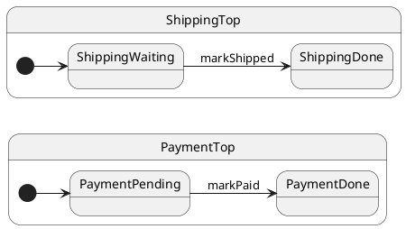

# Nested Machines

## Problem

Payment and shipping in one chart couples unrelated concerns — hard to test and evolve independently.

## Solution

Run **separate `Hsm` instances** (orthogonal regions) and coordinate with a small coordinator class.

## UML statechart

Two parallel machines:



The `OrderCoordinator` owns both actors and orchestrates `fulfill()`.

Payment region:

```typescript
export class PaymentTop extends TopState<PaymentCtxConfig> {
	markPaid(): void {
		this.ctx.paid = true;
		this.hsm.transition(PaymentDone); // ← payment actor only
	}
}
```

Shipping region — independent queue and cache:

```typescript
export class ShippingTop extends TopState<ShippingCtxConfig> {
	markShipped(): void {
		this.ctx.shipped = true;
		this.hsm.transition(ShippingDone);
	}
}
```

Coordinator composes both:

```typescript
export class OrderCoordinator {
	readonly payment = makeActor(PaymentTop, { paid: false });
	readonly shipping = makeActor(ShippingTop, { shipped: false });

	async fulfill(): Promise<void> {
		this.payment.markPaid();
		await this.payment.sync();
		this.shipping.markShipped();
		await this.shipping.sync();
	}
}
```

## Reading the trace

With `TraceLevel.VERBOSE_DEBUG` and a custom `TraceWriter`, ihsm logs each dispatch step. Trace line format is covered in [Tracing](../02-tracing/README.md).

Each line is **`domain|…|StateName: message`**. Domains nest as the runtime descends: `initialize` → `#eventName` → `execute` → `transition from X to Y`.

On the [documentation page](https://filasieno.github.io/ihsm/reference), use the embedded playground to dispatch events and inspect the **Trace** panel. Or run `npm run test:examples` headlessly.

**What to notice:** Each actor has its own trace stream — payment and shipping queues are independent.

## Verify

```shell
npm run test:examples -- --grep 'Tutorial 14'
```

