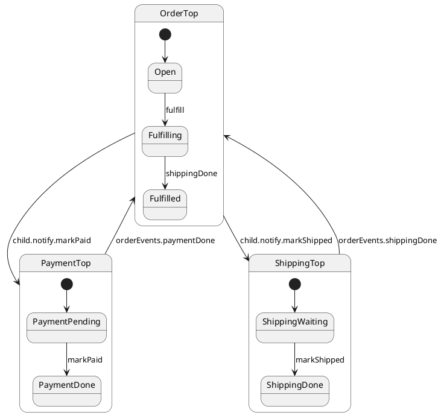

# Nested machines (parent actor + child actors)

## What this presents

Parent order actor with payment/shipping child regions wired by event bridges.

## Why it's done this way

Multiple full actors beat monolithic parallel regions — each child has its own queue, port, and restore surface.


## Problem

Payment and shipping in one chart couples unrelated concerns — hard to test and evolve independently.

A plain **`OrderCoordinator` class** with `async fulfill()` that `await`s child `sync()` is **not** an actor — it is imperative glue code. ihsm models coordination as **notifications** on real machines.

## Solution

`OrderTop` is a **parent actor** (`makeTestActor(OrderTop, …)`). Payment and shipping are **child actors** from `makeChildActor`. The parent sequences `fulfill` with **sync notification handlers only** — no `async` handlers, no `await child.call…` between actors.



Parent actor — **all handlers are synchronous**; orchestration is events:

```typescript
export class OrderTop extends TopState<OrderConfig> {
	fulfill(): void {
		this.hsm.transition(Fulfilling);
	}

	beginPayment(): void {
		this.ctx.payment!.notify.markPaid();
	}

	paymentDone(): void {
		this.notifyNow.beginShipping();
	}

	beginShipping(): void {
		this.ctx.shipping!.notify.markShipped();
	}

	shippingDone(): void {
		this.hsm.transition(Fulfilled);
	}
}

export class Fulfilling extends OrderTop {
	onEntry(): void {
		this.notifyNow.beginPayment();
	}
}
```

Spawn children on `Open.onEntry`:

```typescript
this.ctx.payment = makeChildActor(asParentActor(this), PaymentTop, paymentCtx, new Port<typeof PaymentTop>());
this.ctx.shipping = makeChildActor(asParentActor(this), ShippingTop, shippingCtx, new Port<typeof ShippingTop>());
```

Children report back through a wired **event bridge** (not services, not `async`):

```typescript
paymentCtx.orderEvents = {
	paymentDone: () => this.notifyNow.paymentDone(),
	shippingDone: () => this.notifyNow.shippingDone(),
};
```

Client code notifies `order.notify.fulfill()` — same as any actor. Tests drain each queue with `syncOrderRegions(order)` (harness only, not part of the machine).

## Verify

```shell
npm run test:examples -- --grep 'Tutorial 14'
```
