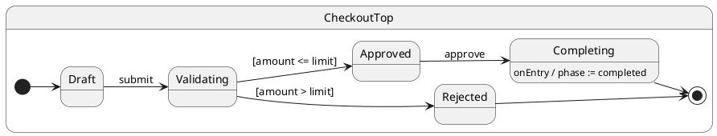

# Complex Workflow

## Problem

Production flows combine hierarchy, async validation, guards, services, and multiple outcomes — hard to keep correct with flags alone.

## Solution

Compose hierarchy, async validation, a **`hsm.immediate``** decision pseudo state, and `call()` in one **checkout workflow**. See [`hsm.immediate`()](../17-post-now/README.md) for hi-priority internal orchestration.

## UML statechart



`submit` runs async validation, then enters `Validating`. The guard runs via **``hsm.immediate`('applyValidation')`** in `onEntry` — not inline in the handler.

Context tracks phase and audit trail:

```typescript
export interface CheckoutCtx {
	orderId: string;
	amount: number;
	limit: number;
	phase: OrderPhase;
	validationNotes: string[];
}
```

Async `submit` hands off to the decision state:

```typescript
@InitialState
export class Draft extends CheckoutTop {
	async submit(): Promise<void> {
		this.ctx.phase = 'validating';
		await this.sleep(10);
		this.ctx.validationNotes.push('fraud-check-ok');
		this.hsm.transition(Validating);
	}
}
```

Decision pseudo state — guard via `hsm.immediate`:

```typescript
export class Validating extends CheckoutTop {
	onEntry(): void {
		this.hsm.immediate.applyValidation();
	}

	applyValidation(): void {
		if (this.ctx.amount <= this.ctx.limit) {
			this.hsm.transition(Approved);
		} else {
			this.ctx.phase = 'rejected';
			this.ctx.validationNotes.push('over-limit');
			this.hsm.transition(Rejected);
		}
	}
}
```

Approve and complete:

```typescript
export class Approved extends CheckoutTop {
	async approve(): Promise<void> {
		this.ctx.phase = 'approved';
		this.hsm.transition(Completing);
	}
}

export class Completing extends CheckoutTop {
	async onEntry(): Promise<void> {
		await this.sleep(10);
		this.ctx.phase = 'completed'; // finalize in entry
	}
}
```

Typed status query:

```typescript
const phase = await order.getStatus(); // Promise<OrderPhase>
```

For extended transitions that must run internal events before other queued work, see [`hsm.immediate`()](../17-post-now/README.md).

## Reading the trace

With `TraceLevel.VERBOSE_DEBUG` and a custom `TraceWriter`, ihsm logs each dispatch step. Trace line format is covered in [Tracing](../02-tracing/README.md).

Each line is **`domain|…|StateName: message`**. Domains nest as the runtime descends: `initialize` → `#eventName` → `execute` → `transition from X to Y`.

On the [documentation page](https://filasieno.github.io/ihsm/reference), use the embedded playground to dispatch events and inspect the **Trace** panel. Or run `npm run test:examples` headlessly.

**What to notice:** Async `#submit` finishes validation, enters `Validating`, then `#applyValidation` (via `hsm.immediate`) runs in the same dispatch before `end event dispatch`.

## Verify

```shell
npm run test:examples -- --grep 'Tutorial 15'
```
