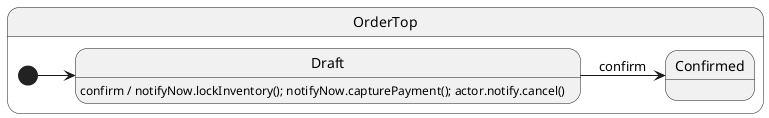

# Hi-priority notifications (`notifyNow`)

## What this presents

Hi-priority `notifyNow` / `this.notifyNow` — drains before normal `notify` from the same handler turn.

## Why it's done this way

Inventory locks and payment capture must run before deferred cancel side effects in the same dispatch.


## Problem

Sometimes a handler must run **follow-up protocol steps before** normal-priority notifications scheduled in the same turn — extended transitions, pseudo-states, inventory locks.

## Solution

**`this.notifyNow.event()`** enqueues on the **hi-priority** queue. After the current handler and its transitions finish, the runtime drains all hi-priority jobs before normal `notify` notifications from that handler.

Only available **inside** handlers (`this.notifyNow`). External clients use `actor.notifyNow` when they need the same priority semantics.

## UML statechart



## Handler

`confirm` schedules a normal `cancel` (deferred side effect) plus critical steps via `notifyNow`:

```typescript
confirm(): void {
  this.ctx.steps.push('confirm-start');
  this.notify.cancel();           // normal — runs after notifyNow steps
  this.notifyNow.lockInventory();
  this.notifyNow.capturePayment();
  this.ctx.steps.push('confirm-end');
  this.hsm.transition(Confirmed);
}
```

`notifyNow` handlers run **after** `confirm-end` is recorded but **before** `cancel`.

## Client

```typescript
sm.notify.confirm();
await sm.hsm.sync(); // through confirm + transition
await sm.hsm.sync(); // drain notifyNow follow-ups
```

Compare with [Notifications & sync](../08-post-and-sync/README.md): plain `this.notify` from a handler is FIFO **after** the handler returns — `notifyNow` cuts ahead of those normal notifications.

Use **`notifyNow`** for internal orchestration in the same dispatch turn — see also [Complex workflow](../15-complex-workflow/README.md).

## Verify

```shell
npm run test:examples -- --grep 'Tutorial 17'
```
