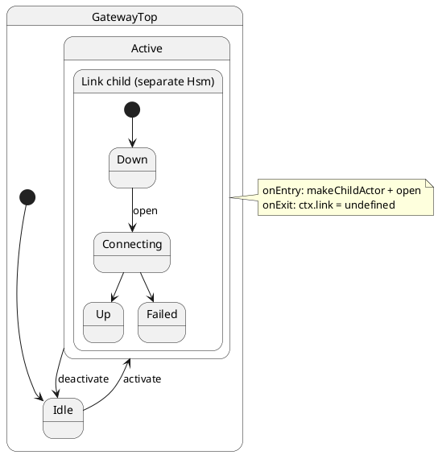

# Chained Child Actors (Parallel States as Child Actors)

## What this presents

`makeChildActor` in parent `onEntry`, drive with `child.notify`, clear in `onExit`.

## Why it's done this way

Owned child actors get isolated queues and protocols — composition without passive parallel regions.


## Why ihsm rejects UML parallel states

Statechart tools (SCXML, XState, UML) offer **`type: 'parallel'`** regions: several
state trees active at once inside **one** machine. ihsm deliberately does **not**
implement that model. Parallel regions look compact on a diagram but share a single
runtime — one queue, one transition cache, one `Config` — and that coupling is
too weak for most production domains.

Orthogonal regions are **not expressive enough** when you need any of the following:

| Real need | What parallel charts miss |
| --------- | ------------------------- |
| **Independent dispatch** | Regions share one FIFO; a slow handler in region A blocks region B |
| **Separate protocols** | One vocabulary for every region; no clean public vs internal split per concern |
| **Owned lifecycle** | Regions are “always on” while the parent is active — no spawn on `onEntry`, drop on `onExit` |
| **Typed cross-region `call`** | No first-class `await child.call.service()`; you bolt actors on anyway |
| **Per-region ports & DST** | One `Port` / timer / random stream; tests cannot mock regions in isolation |
| **Phased or optional concerns** | Hard to model “link exists only in `Active`” without combinatorial state products |
| **Different restore surfaces** | `restore(state, ctx)` is per machine, not per region with separate ctx |
| **Parent-orchestrated retries** | Coordinator logic fights the “all regions always run” assumption |

ihsm composes **full actors** instead. Each concern gets its own `Hsm`, queue,
`Config`, and `Port`. Tutorial [14](../14-nested-machines/README.md) shows
**sibling** actors coordinated externally. This tutorial shows **chained child
actors** — strictly stronger semantics when one machine **owns** another.

## Solution: `makeChildActor` under a parent state

A **gateway session** owns a **link** child:

- Parent `Active.onEntry` → `makeChildActor(asParentActor(this), LinkTop, …)` and `child.notify.open(host)`
- Parent `Active.onExit` → drop `ctx.link` (child lifetime tied to parent state)
- Parent `relay` → `await ctx.link.call.deliver(payload)` (typed service across actors)
- Child keeps its own internal `open` / `dial` vocabulary and connection states



Parent spawns and owns the child:

```typescript
export class Active extends GatewayTop {
	onEntry(): void {
		if (!this.ctx.link) {
			this.ctx.link = makeChildActor(
				asParentActor(this),
				LinkTop,
				{ host: this.ctx.host, attempts: 0, linkUp: false, lastPayload: '' },
			);
		}
		this.ctx.link.notifyNow.open(this.ctx.host);
	}

	onExit(): void {
		this.ctx.link = undefined;
		this.ctx.linkCtx = undefined;
	}
}
```

Keep a **`linkCtx` reference** on the parent when you need to read child domain fields from tests or UI — `ChildActor` handles expose `call` / `notify`, not `ctx`. Use `child.notifyNow.open` from `onEntry` so the child connects before normal-priority work runs (transitions scheduled bare in `onEntry` are cleared at end of dispatch).

Cross-actor service call from the parent handler:

```typescript
async relay(payload: string): Promise<boolean> {
	return this.ctx.link!.call.deliver(payload);
}
```

Child internal protocol stays on the child queue — parent uses `child.notify.open`,
tests can drive `makeTestActor(LinkTop, …)` alone without the gateway.

## Compared to tutorial 14

| Pattern | When |
| ------- | ---- |
| **Sibling region children** (14) | Payment + shipping under `OrderTop`; event bridges, no cross-actor `call` |
| **Chained child actors** (this) | Single owned child; lifecycle tied to parent `onEntry`/`onExit` |

Both replace parallel regions. Chained children add **ownership**, **lifecycle**,
and **parent `onEntry`/`onExit` coupling** that a single parallel chart cannot
express without inventing artificial superstates.

## Verify

```shell
npm run test:examples -- --grep 'Tutorial 18'
```
