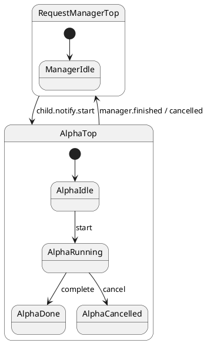

# Request Manager

## What this presents

Manager with request table, per-command child actors, and cancellable deferred work.

## Why it's done this way

Many in-flight commands need per-request children and internal events — not one giant state product.


## Problem

A front-end submits heterogeneous commands (different state machines) that must be tracked,
completed asynchronously, and **cancelled** while in flight — without blocking the manager on
`await child.call…`.

## Solution

`RequestManagerTop` owns a **request table** (`ctx.table`) and spawns a **command child actor**
per `submit`. Two command tops — `AlphaTop` and `BetaTop` — share the same event bridge back
to the manager. Commands arm a deferred `complete` via `hsm.port.defer(50)` so cancellation can
win the race.



Submit allocates an id, records the row, spawns the matching child, and notifies `start`:

```typescript
submit(kind: 'alpha' | 'beta'): void {
  const requestId = ++this.ctx.nextId;
  this.ctx.table[requestId] = { kind, status: 'running' };
  const child = makeChildActor(asParentActor(this), AlphaTop, alphaCtx);
  this.ctx.children[requestId] = child;
  child.notify.start();
}
```

Cancel is also event-only:

```typescript
cancel(requestId: number): void {
  this.ctx.children[requestId]?.notify.cancel();
}
```

In tests, advance child `TestPort` timers then `syncRequestManager(manager)` to drain all queues.

## Verify

```shell
npm run test:examples -- --grep 'Tutorial 19'
```
