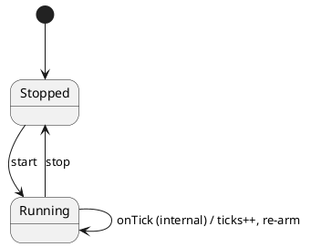

# Testing 01 · Deferred timers & simulated time

The foundation of deterministic testing: never wait on the wall clock. A `Heartbeat` machine emits
one tick **every hour** using `deferredPost`, which is backed by the machine's **standard port timer
service**. In a test we substitute a controllable clock and simulate 48 hours in microseconds.



## The shape

`TopState<Context, Public, Internal, Port>`:

- **`Public`** — `start` / `stop`: events clients may `post`.
- **`Internal`** — `onTick`: raised only by the deferred timer (or a test). Disjoint from `Public`,
  enforced at compile time, so `onTick` never appears on the public `Actor`.
- **Context is a class** (`HeartbeatCtx`) — constructed fresh per actor.
- **No domain port:** the hourly follow-up is scheduled with `this.deferredPost(HOUR_MS, 'onTick')`.
  `deferredPost` delegates to the port timer service — a `Port` (real `setTimeout`) in
  production, or a `TestPort` you advance by hand in tests.

## Test actor vs. test port

| Surface | What it provides |
|---|---|
| **Test actor** (`makeTestActor`) | The machine handle for white-box tests: the **merged** protocol (post internal `onTick` directly), typed access to `port`, and a `subscribe()` channel that observes every event. A production `Actor` (`makeActor`) has none of these — only the public protocol. |
| **Test port** (`TestPort`) | A port test double that **records** what flows through it (`messages` / `events` / `trace`) and can `send` internal events inward. Use `advance(ms)` to fire due `deferredPost` callbacks deterministically; wire `TestActor.subscribe` to `port.record` to trace every posted event. |

## Positional arguments, no wrappers (see [`tutorial.spec.ts`](./tutorial.spec.ts))

The factories take the three mandatory arguments — `topState`, `ctx`, `port` — **positionally**,
then an optional options bag. Set only what you need, never wrap `makeActor` in a helper, and never
pass `undefined` placeholders. Import the test surface from `ihsm/testing`:

```ts
import * as ihsm from 'ihsm/testing';

const clock = new ihsm.TestPort<HeartbeatTop>();
const sm = ihsm.makeTestActor(HeartbeatTop, new HeartbeatCtx(), clock);
sm.post('start'); await sm.sync();
for (let hour = 1; hour <= 48; hour++) {
  clock.advance(HOUR_MS); // fire the due tick — no real waiting
  await sm.sync();         // handler runs, arms the next hour
}
// sm.ctx.ticks === 48
```

Run headless: `npm run test:examples -- --grep 'Testing 01'`.
