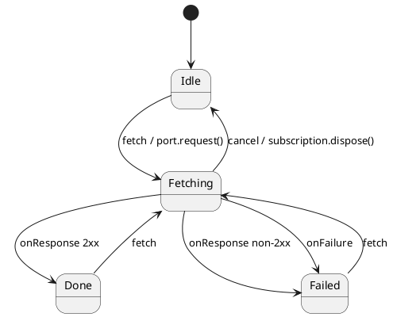

# Testing 02 · Network fetch behind a port

Network calls are the textbook source of flaky tests: real latency, real failures, real DNS.
Put `fetch()` behind a `Port` and the machine becomes pure — a test decides what the
response is **and when it arrives**, with no sockets and no timers.

This example issues an HTTP request (think `https://google.com`) and reacts to the result:

- **`fetch(url)`** (public) → the machine calls `port.request(url)` and enters `Fetching`.
- the port pushes **`onResponse(status, body)`** or **`onFailure(message)`** (internal) when the
  request settles — routed to `Done` (2xx) or `Failed`. (`onFailure`, not `onError`: the latter is
  a reserved ihsm lifecycle hook.)
- **`cancel()`** (public) → `dispose()`s the request; a response that lands afterwards is dropped.

## Why this is deterministic

`request` is an abstract `@mock` method scripted with `port.request.default(...)`: it hands back an
id and an abort `Disposable` but **delivers no response**. A test can therefore observe the
`Fetching` state, then settle it on its own command with `port.send('onResponse', …)` — modelling
slow networks without waiting. Two gates keep things honest:

1. **Timing gate** — nothing is delivered from the synchronous call, so "in flight" is a
   first-class, reachable state. No `setTimeout`, no real latency.
2. **Abort gate** — `cancel()` disposes the subscription; a late `onResponse` reaches `Idle`, which
   ignores it, proving a cancelled request can never mutate state.

## Testing strategies (see [`tutorial.spec.ts`](./tutorial.spec.ts))

One abstract `@mock` serves every scenario with `makeTestActor`:

- **Through the public path**: post `fetch`, assert `Fetching`, `port.send('onResponse', …)` (or
  `onFailure`), assert `Done`/`Failed`.
- **Pin the in-flight state**: build with `initialize: false` to start in `Fetching` and post the
  settled event directly — to focus on the routing logic.

Run headless: `npm run test:examples -- --grep 'Testing 02'`. In the interactive panel below,
press **fetch**, then **deliver 200** / **deliver 503** / **transport error** to settle it, and
watch the **Trace** log. (The live playground uses a small concrete port; the test mock is the
abstract `@mock` scripted with `port.request.default(...)`.)
