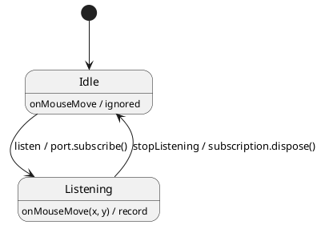

# Testing 03 · Event streaming behind a port

A push source — OS input, a file watcher, a network socket, a WebSocket/SSE feed — emits
events on its own schedule, which is exactly what makes naive code flaky. Put the source behind
a `Port` and the machine becomes pure and deterministically testable.

This example streams **mouse-move** events:

- **`listen`** (public) → the machine `subscribe()`s through the port and enters `Listening`.
- the source pushes **`onMouseMove`** (internal) events, recorded only while `Listening`.
- **`stopListening`** (public) → the machine `dispose()`s the subscription and returns to `Idle`;
  the source goes quiet.

## Why this is deterministic

Two independent gates make tests boring (in a good way):

1. **Source gate** — the mock stream only delivers `onMouseMove` while the subscription is live.
   After `dispose()`, a move is dropped. This proves "stop listening" really detaches.
2. **State gate** — `onMouseMove` is recorded only in `Listening`; the top state ignores it
   otherwise. A late event can never corrupt `Idle`.

## The device state lives in the mock, not the actor

The real OS owns the cursor and keeps moving it whether or not your app is subscribed. So the
**mock** holds the pointer position (`cursor`) and exposes drive commands the tester calls —
`moveTo(x, y)`, `moveBy(dx, dy)`, `path([...])` — each updating the stored position and delivering
`onMouseMove` **only while listening**. The **actor** stores only the moves it *observed while
listening*; the two legitimately diverge (the pointer can travel far while you are not listening).
This is the general lesson: model the simulated world's state inside the test double, and let the
machine own only what it actually perceived.

## Testing strategies (see [`tutorial.spec.ts`](./tutorial.spec.ts))

- **Black-box** (`makeActor` + mock stream): press `listen`, call `moveTo(...)` / `path([...])` to
  simulate the OS pushing moves, assert recorded points, the mock's `position`, and that
  `unsubscribe` happened on `stopListening`.
- **White-box** (`makeTestActor`): post `onMouseMove` directly — no source needed — to focus on
  the machine's reaction.

Run headless: `npm run test:examples -- --grep 'Testing 03'`. In the interactive panel below,
press **listen**, then move the pointer over the **Mouse pad** (or use **stream 8 moves** /
**run simulated session**) and watch the **Trace** log.
