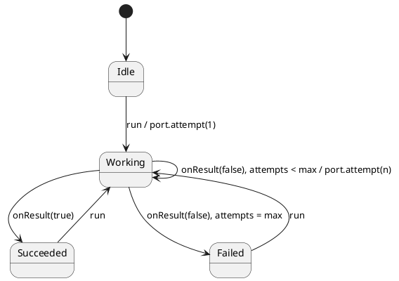

# Testing 04 · Fault injection & seeded DST

## What this presents

Seeded PRNG faults in `@mock` `attempt` — reproducible retry logs and golden traces.

## Why it's done this way

Failure becomes a scripted input; same seed yields byte-identical `ctx.log` across runs.

Deterministic Simulation Testing (DST) flips the usual goal of tests: instead of avoiding
failure, you **manufacture** it — reproducibly. A worker retries a flaky operation; whether each
attempt fails is decided by a **seeded** PRNG living inside the `Port`. Same seed ⇒
same fault sequence ⇒ a failing run you can replay exactly, every time, on any machine.

- **`run()`** (public) → make attempt 1 via `port.attempt(1)`, enter `Working`.
- the port pushes **`onResult(ok)`** (internal); on a fault the machine retries until the budget
  is spent, then lands in `Succeeded` or `Failed`.

## Why this is deterministic

1. **Seeded randomness** — faults come from a deterministic PRNG scripted into the mock via
   `port.feedRandom(...)` and read with `port.random()` (or an equivalent pure generator in the stub),
   never `Math.random()` or the clock. Reusing a seed replays the identical pass/fail sequence.
2. **Golden trace** — `port.calls` records every attempt outcome; the machine's `ctx.log` must
   match it. Diffing two runs of the same seed is exact.
3. **Serialized retries** — each retry is just another run-to-completion event, so there is nothing to race.

This is the core DST loop: when a seeded simulation goes red, you keep the seed, replay it, and
debug a perfectly reproducible failure.

## Testing strategies (see [`tutorial.spec.ts`](./tutorial.spec.ts))

- **Seeded black-box** (`makeActor` + seeded port): run twice with one seed and assert the fault
  sequence and outcome are byte-identical; pin `failRate` to `0` / `1` for guaranteed terminals.
- **Hand-injected white-box** (`makeTestActor` + stub port): `port.send('onResult', false)` /
  `onResult(true)` yourself to walk the retry budget deliberately.

Run headless: `npm run test:examples -- --grep 'Testing 04'`. In the interactive panel below,
press **run**, then **inject fault** / **inject success** to walk the retry budget by hand and
watch the **Trace** log.
