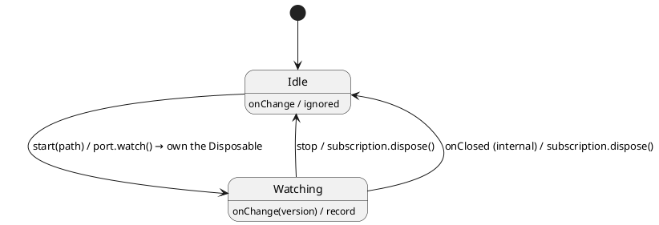

# Testing 05 · Subscriptions & disposables

> **New here?** This chapter assumes you can read TypeScript but have never thought hard about
> *subscription lifetimes*. We go slowly. By the end you will know what a `Disposable` is, why every
> subscription needs one, and how ihsm lets you **prove** — deterministically — that your machine
> never leaks one.

## 1. The problem: subscriptions outlive the call that created them

Most function calls are over the instant they return. A subscription is different: it sets up an
**ongoing** flow of events and keeps running until you explicitly stop it. If you forget to stop it,
you have a **leak** — events keep arriving, memory is held, callbacks fire against dead state. Leaks
are the classic source of "it works, then after an hour the app misbehaves" bugs.

If you have written a **VS Code extension**, you have met this already. Subscribing returns a
`Disposable`, and *you* are responsible for disposing it:

```ts
// VS Code: subscribing returns a Disposable you must dispose.
const sub: vscode.Disposable = vscode.workspace.onDidChangeTextDocument(e => report(e));

// The idiomatic move: hand ownership to the extension context, which disposes it on deactivate.
context.subscriptions.push(sub);

// ...or stop early, by hand:
sub.dispose();
```

That `Disposable` is just an object with one method:

```ts
interface Disposable {
  dispose(): void;
}
```

## 2. What a `Disposable` is in ihsm (straight from the docs)

ihsm uses the exact same idea. Here is the library's own documentation for the type, verbatim:

> **`Disposable`** — Resource teardown handle returned alongside subscription-style port results.
>
> `dispose()` must be **idempotent** — calling it more than once is a no-op. Ports hand one back via
> `ResultWithSubscription`; the state machine owns it and disposes it when the corresponding
> observation is no longer wanted.

Two words there matter enormously:

- **idempotent** — calling `dispose()` twice must be safe (the second call does nothing). Our mock
  enforces this with a `disposed` flag; real ones must too.
- **owns** — somebody has to be responsible for calling `dispose()`. In ihsm that owner is the
  **state machine**, which stores the handle in its context (its own `context.subscriptions`).

A port method that opens a subscription returns both a value *and* the handle, bundled as a
`ResultWithSubscription`:

```ts
interface ResultWithSubscription<Result> {
  readonly value: Result;          // e.g. a watch id
  readonly subscription: Disposable; // call dispose() to detach
}
```

## 3. The machine: a file `Watcher`

`machine.ts` watches a path for changes. Compare it to the VS Code snippet above — same shape.



- **`start(path)`** (public) → calls `port.watch(path)`, **stores the returned `Disposable`** in
  `ctx.subscription`, enters `Watching`.
- the source pushes **`onChange(version)`** (internal) → recorded only while `Watching`.
- **`stop`** (public) → `ctx.subscription.dispose()`, clears the handle, returns to `Idle`.
- **`onClosed`** (internal) → the source closed itself; the machine disposes (idempotently) and
  returns to `Idle`.

The machine **owns** the `Disposable` exactly like `context.subscriptions` owns VS Code's.

## 4. Building the mock: `@mock` + `makeTestPort`

You never *implement* the port. Declare each port method as an `abstract` member whose **signature
matches the real port**, decorate the class with `@mock`, and build it with `makeTestPort` — the port
surface is inferred from `WatcherTop`:

```ts
@ihsm.mock
abstract class WatcherMock extends ihsm.TestPort<WatcherTop> {
  abstract watch(path: string): ihsm.ResultWithSubscription<number>; // signature matches the port
}

const port = ihsm.makeTestPort(WatcherMock);
```

Each abstract method comes back **scriptable** — the per-method analogue of a `jest.fn()` stub.
Script what each call returns with `port.watch.default(impl)` (persistent) or
`port.watch.once(impl)` (one-shot, FIFO), inspect `port.watch.calls` (typed `[path: string][]`), and
`port.watch.reset()` to reuse the mock — including the `Disposable`, so you control teardown:

```ts
let disposed = false;
port.watch.default(path => ({
  value: 7,
  subscription: {
    dispose: () => {
      if (disposed) return;        // idempotent — the docs require it
      disposed = true;
      port.record(`dispose watch ${path}`); // record teardown into the golden trace
    },
  },
}));
```

Two **separate** channels — keep them straight:

| Direction | What | API |
| --------- | ---- | --- |
| Machine → port (**outbound**) | what a port method *returns* | `port.watch.default(impl)` / `port.watch.once(impl)` |
| Port → machine (**inbound**) | internal events the source *pushes* | `port.send('onChange', v)` |

Every call is auto-recorded into the trace. If you call a method that was never scripted, you get a
`PreloadError` that names it — a clear failure, never a silent `undefined`.

## 5. Deterministic Simulation Testing — the payoff

This is **the** feature of ihsm. Because dispatch is serialized and run-to-completion, the port is the only seam to the
outside, and the mock records everything, a test can **prove** the subscription lifecycle with zero
flakiness (see [`tutorial.spec.ts`](./tutorial.spec.ts)):

- **Disposed exactly once.** Subscribe, push changes, `stop` → assert `disposeCount === 1` and
  `ctx.subscription === undefined`. No leak, no double-free.
- **Goes quiet after teardown.** A change that arrives after `stop` is dropped — `Idle` ignores it.
- **Source-initiated close.** `onClosed` releases the handle too; idempotent `dispose()` makes the
  overlap safe.
- **Golden trace.** The exact, ordered transcript — `['watch:/etc/hosts', 'dispose watch /etc/hosts']`
  — is asserted directly. Two runs produce a **byte-identical** trace, so a regression diffs cleanly.

No `setTimeout`, no real filesystem, no `Math.random()`. Advance the machine with `await sm.sync()`
and decide every event yourself. That is what makes the test impossible to flake — and what makes a
failure replayable byte-for-byte.

Run headless: `npm run test:examples -- --grep 'Testing 05'`. In the interactive panel below, press
**start watching**, then **emit change** a few times, and **stop watching** — watch the `dispose`
line land in the **Trace**.
