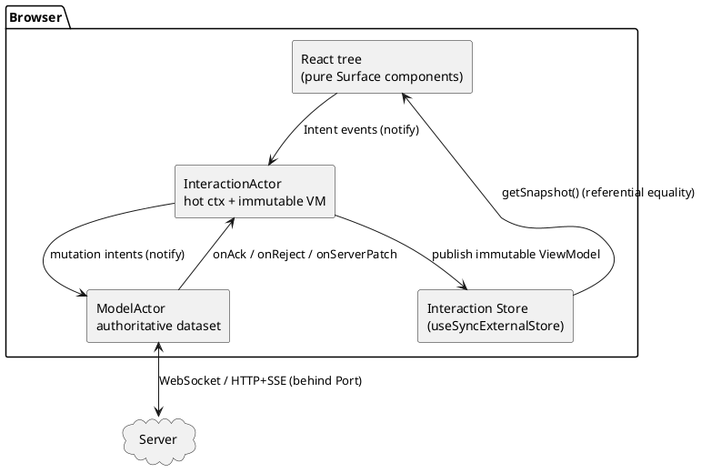

# 1. MOTIVATION & AS-IS

## 1.1 What a Direct Manipulation Interface is

A **Direct Manipulation Interface (DMI)** removes the indirection of forms and buttons. Instead of
"fill a form, press *Add*", the user acts on the data surface itself:

- The **last row of a list is writable**. As soon as the user types, a *transient* record appears.
- `Tab`/`Enter` **commits** the field and **advances** the cursor; reaching the end of a transient
  row materializes it as a real (still optimistic) record and creates a fresh transient below.
- `Esc` abandons a transient. Re-typing over a committed cell starts an inline edit.
- A tree expands in place; a tree-table lets you add a child row by typing on its trailing
  transient line.

There are **no submit buttons and no modal forms**. The command vocabulary is *implicit in the
gestures*: keystroke, `Tab`, `Enter`, `Esc`, arrow keys, drag. This is what makes a DMI feel
fast and direct — and what makes it **hard to build correctly**.

## 1.2 Why a DMI is hard

Every gesture is **optimistic**: the UI must reflect the change immediately, before the server has
confirmed it, then **reconcile** when the authoritative answer arrives over the wire. That creates
a dense field of race conditions:

| Hazard | Example |
|--------|---------|
| Out-of-order acks | Edits to rows A then B; B's ack arrives before A's. |
| Reject after re-edit | Server rejects row 3, but the user already re-typed row 3. |
| Server push vs local pending | A collaborator's patch lands on a row the user is mid-editing. |
| Identity remap | A transient row had a client id; the server assigns the canonical id on ack. |
| Focus loss | The list re-renders when the ViewModel changes and the caret jumps or is lost. |
| Undo across the wire | Undo must also *cancel an in-flight op*, not just invert local state. |
| Reconnect | The socket drops mid-edit; unconfirmed ops must resync without data loss. |

These are exactly the bugs that classic UI stacks ship to production, because they are
**non-deterministic** and therefore rarely covered by tests.

## 1.3 As-is: why React-only and existing bindings are insufficient

| Approach | What it gives | What it leaves untested / unsolved |
|----------|---------------|-------------------------------------|
| **Local component state + `useEffect`** | Fast to start. | Optimistic/reconcile logic is scattered across effects and event handlers; ordering is implicit; impossible to replay a failing session. |
| **Redux / Zustand** | A single store, time-travel-ish. | Reducers are synchronous and pure, but the *async edge* (acks, rejects, timers, reconnect) lives in thunks/sagas/effects — the racy part is back outside the deterministic core. |
| **React Query / SWR** | Great for request/response caching and simple optimistic updates. | Models *resources*, not a *continuous editing protocol*; transient rows, focus, undo journals, and field-level reconciliation are out of scope. |
| **XState + `@xstate/react`** | Real statecharts, `useSelector`, snapshots. | Closest in spirit, but it is a generic binding: it does **not** ship DMI primitives (transient rows, focus survival, optimistic boundaries), and its async services are not isolated behind a single replayable port the way ihsm's are. |

The gap is consistent: the **interaction protocol** — the precise sequence of states and
transitions that governs optimistic editing and reconciliation — is never given a deterministic,
testable home. It leaks into effects and callbacks.

## 1.4 The principle this library is built on

`ihsm` already provides the deterministic home: a **serialized, run-to-completion actor** with a
single **`Port`** boundary for all I/O, a virtual clock, and golden-trace testing. `@ihsm/react`
binds that to React under one strict rule:

> **`ctx` is mutable; the `ViewModel` is immutable.**
>
> The InteractionActor keeps its *hot* interaction bookkeeping (focus, in-flight op map, draft
> coalescing, last server sequence) in a **mutable `ctx`** that React never reads. At the end of
> each turn it projects an **immutable `ViewModel`** — a frozen value, swapped by reference — and
> publishes it. React consumes *only* the ViewModel.

This single decision dissolves the React/actor impedance mismatch:

- **Change detection is free.** A new immutable reference means "changed"; same reference means
  "skip". `useSyncExternalStore` + `Object.is` is exact — no diffing, no version counters.
- **The projection is a pure function** `project(authoritative, hot) → ViewModel`, so it is
  unit-testable and can be asserted as an actor invariant.
- **Everything racy is inside the actor**, behind the port. Swap the port for a mock, script the
  acks/rejects/disconnects, advance the virtual clock, and the entire UI session replays exactly.

## 1.5 The two-actor topology (recap)

`@ihsm/react` owns the **React ↔ InteractionActor** edge (the dashed boxes above): the store/sink,
the hooks, the generic primitives, and the test harness. The ModelActor and transport are the
application's concern; the library only defines the **bridge contract** they must satisfy
(doc 5 §5.2, doc 10 §10.4).

## 1.6 The sharpened thesis: ship the *mechanism*, not the *widgets*

The corollary of §1.4 is uncomfortable but clarifying: **List, Table, Tree, and TreeTable should not
be library components.** If the reusable thing is the *interaction protocol*, then a shipped `<Table>`
is just one frozen policy over that protocol — and the moment an app needs a kanban, a pivot grid, or
a nested form, the library has nothing to offer it. So the library ships:

- a **generic node kernel** — one immutable ViewModel of nodes (optional hierarchy, optional
  columns) and the hard invariants that are identical for *every* shape (reconciliation, focus,
  transient lifecycle, undo, diagnostics, the protocol client);
- four **strategy plug-points** (`ProjectModel`/`NavModel`/`TransientModel`/`Keymap`) — the only
  shape-specific surface;

and the four classic widgets exist as **recipe proofs in the test suite** (doc 10, doc 8 §8.7): a
widget *is* a bundle of four strategies, and a passing recipe proves the kernel is complete. A fifth
shape is a fifth bundle, inheriting every guarantee for free.

Two further commitments make this a *true* Direct Manipulation experience rather than a disguised
form:

1. **One LSP-like, capability-negotiated protocol** (not one per widget). Like LSP, a single contract
   negotiates capabilities (`hierarchy`, `columns`, `windowing`, …) and pushes diagnostics; the legal
   event surface is *derived and typed* from what was negotiated (doc 10 §10.4).
2. **Error tolerance by default.** Forms gate at the door; a DMI **absorbs and repairs**. Invalid
   input is *accepted* (an explicit `invalid` state, distinct from a server `rejected`), flagged as an
   advisory diagnostic, quarantined and traced on the backend, and cleaned up interactively via an
   error inventory (doc 10 §10.6). This — not the absence of a Save button — is what removes the
   form-and-button feel.

The rest of this spec is the design that delivers exactly this: docs 3–9 define the kernel,
primitives, events, and observability; doc 10 defines the generic VM, strategies, protocol, and
error-tolerance model that the widgets are merely proofs of.
