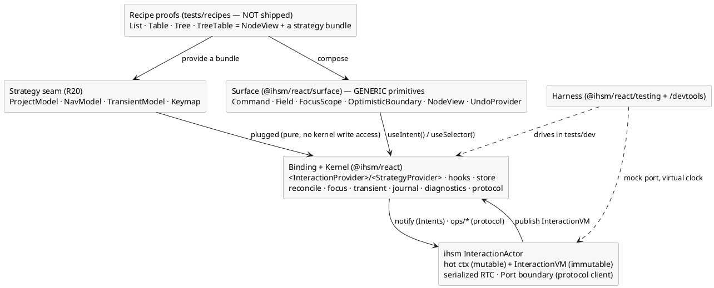
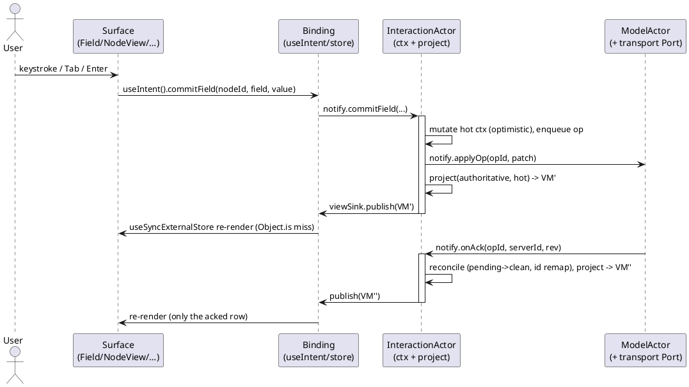

# 3. ARCHITECTURE

This document is the structural overview. The **generic kernel, strategies, and protocol** are doc
10; the component/hook API is doc 4; events and sequences are doc 5.

## 3.1 The package

The library ships the **generic kernel** and *shape-agnostic* primitives. List/Table/Tree/TreeTable
are **recipe proofs** under `tests/recipes/` (R19/R20, doc 10) — not exported.

```
@ihsm/react
├── src/
│   ├── index.ts              # Binding (root export): provider, hooks, store
│   ├── store.ts              # createInteractionStore(): view-sink → external store
│   ├── provider.tsx          # <InteractionProvider> + <StrategyProvider> + context
│   ├── hooks.ts              # useViewModel / useSelector / useIntent / useActorStatus / useStrategies
│   ├── viewModel.ts          # InteractionVM / NodeVM (alias RowVM) / CellVM / RowState + share helpers
│   ├── kernel/               # the generic, shape-agnostic core (doc 10 §10.2)
│   │   ├── reconcile.ts      #   R7 matrix · per-op ids · rev guard
│   │   ├── focus.ts          #   R6 focus survival (client-id identity)
│   │   ├── transient.ts      #   R4 lifecycle (driven by TransientModel)
│   │   ├── journal.ts        #   R8 undo/redo
│   │   ├── diagnostics.ts    #   R22 error inventory + quarantine reconcile
│   │   └── protocol.ts       #   R21 capability-negotiated client (doc 10 §10.4)
│   ├── strategy.ts           # ProjectModel / NavModel / TransientModel / Keymap interfaces (R20)
│   ├── surface/              # subpath "@ihsm/react/surface" — GENERIC primitives (headless + ARIA)
│   │   ├── Command.tsx
│   │   ├── Field.tsx
│   │   ├── FocusScope.tsx    # keyboard nav (delegates geometry to NavModel) + focus survival
│   │   ├── OptimisticBoundary.tsx
│   │   ├── NodeView.tsx      # renders vm.nodes; the substrate for every shape
│   │   └── UndoProvider.tsx
│   ├── testing/              # subpath "@ihsm/react/testing"
│   │   ├── renderInteraction.tsx · fuzzer.ts · assert.ts
│   │   └── recipes/          # List · Table · Tree · TreeTable — PROOFS (doc 8), not exported
│   └── devtools/             # subpath "@ihsm/react/devtools"
│       └── InteractionDevtools.tsx
└── package.json              # exports: "." · "./surface" · "./testing" · "./devtools"
```

## 3.2 Layers



- **Binding + Kernel** is what ships: it connects React to one actor *and* owns every hard invariant
  (reconciliation, focus, transient, undo, diagnostics, protocol). Shape-agnostic.
- **Surface** is generic and headless: `NodeView` renders `vm.nodes`; `Field`/`FocusScope`/etc. are
  shape-independent. No List/Table/Tree here.
- **Strategy seam** is the only shape-specific surface (R20); a **recipe** is a bundle of four
  strategies + `NodeView`, proving the kernel is complete (doc 10 §10.2).
- **Harness** never ships to production (separate subpaths, `"sideEffects": false`).

## 3.3 The ViewModel contract — the node VM

The ViewModel is the *only* thing React sees. It is **immutable**, **structurally shared**, and a
single **node** structure that expresses list/table/tree/treetable via two *optional* axes
(hierarchy, columns). The full definition is doc 10 §10.1; the load-bearing shape:

```ts
export interface InteractionVM {
  readonly rev: number;                       // monotonic; bumped on every published change
  readonly status: ConnectionStatus;
  readonly capabilities: Capabilities;        // negotiated at initialize (doc 10 §10.4)
  readonly focus: Coord | null;               // logical focus authority {nodeId, field}
  readonly selection: Selection;              // degenerate single-cell for list/tree
  readonly columns?: ReadonlyArray<ColumnVM>; // present iff capability `columns`
  readonly nodes: ReadonlyArray<NodeVM>;      // ordered, visible-only; includes transient slot(s)
  readonly diagnostics: ReadonlyArray<Diagnostic>; // the error inventory (R22)
  readonly canUndo: boolean; readonly canRedo: boolean;
  readonly dirtyCount: number; readonly errorCount: number;
}

export interface NodeVM {
  readonly id: ClientId;                       // STABLE client id (never the server id) — React key
  readonly serverId: ServerId | null;          // assigned on ack; null while transient/unconfirmed
  readonly parentId?: ClientId;                // present iff capability `hierarchy`
  readonly depth?: number; readonly expanded?: boolean; readonly hasChildren?: boolean;
  readonly state: RowState;
  readonly transient: boolean;                  // true for the writable trailing slot
  readonly fields: Readonly<Record<FieldKey, CellVM>>;
}
// RowVM is a documented alias for a flat NodeVM (no hierarchy) — the row-oriented prose in this
// spec (Field, focus, reconciliation) reads unchanged. One runtime type.

export type RowState =
  | 'clean'        // matches server
  | 'editing'      // user is actively editing (a draft exists)
  | 'pending'      // op in flight to server
  | 'rejected'     // SERVER refused (ops/reject); awaiting rollback/rebase
  | 'conflict'     // server pushed a change to a locally-pending node
  | 'invalid';     // accepted locally but failing validation (R22) — NOT a server rejection

export interface CellVM {
  readonly value: string;                       // committed value (the draft is DOM-local, §3.6)
  readonly invalid: boolean;                     // mirror of a matching 'error' Diagnostic on this cell
  readonly pending: boolean;
  readonly validation: ValidationVM | null;     // inline view of the cell's diagnostic (null when clean)
}

export interface ValidationVM {
  readonly message: string;
  readonly severity: 'error' | 'warning';       // advisory by default (R22); 'gating' blocks (opt-in)
  readonly source: 'sync' | 'async' | 'server';
  readonly checking: boolean;                    // async validation in flight (debounced)
}

export interface Coord { readonly nodeId: ClientId; readonly field: FieldKey; }
export type ConnectionStatus = 'connected' | 'reconnecting' | 'offline' | 'resyncing';
// Capabilities, ColumnVM, Selection, Diagnostic: doc 10 §10.1/§10.4/§10.5.
```

Three rules make this work:

1. **Stable client id is the identity.** `NodeVM.id` is minted on the client and never changes —
   not even when the server assigns `serverId` on ack. React keys, the focus coordinate, and the
   undo journal all use it. (See R6 and doc 6 §6.2.)
2. **Freeze in dev, structural-share always.** `project()` builds the next VM by reusing unchanged
   `NodeVM` references and only allocating new ones for changed nodes (doc 6 §6.5). In development the
   library `Object.freeze`s the graph to catch accidental mutation; in production freezing is
   skipped for speed (the actor is the only writer anyway).
3. **`rev` is the cheap global signal.** The store compares `rev` (or `Object.is` on the VM) to
   decide whether to notify React; selectors then narrow further.

## 3.4 The store and the view-sink (no production `subscribe`)

`ihsm`'s `actor.subscribe(...)` exists only on the **test** actor; the production `ExternalActor`
exposes `notify` / `notifyNow` / `call` only. So the actor must **push** its ViewModel out through
the **Port boundary** (the same event-bridge pattern ihsm uses for child→parent callbacks). The
app wires a `viewSink` into the InteractionActor's `ctx`/Port; the actor calls
`viewSink.publish(vm)` at the end of any turn that changed the VM.

```ts
// store.ts (essence)
export interface InteractionStore<VM> {
  getSnapshot(): VM;
  getServerSnapshot(): VM;                 // SSR (R14)
  subscribe(listener: () => void): () => void;
  readonly sink: ViewSink<VM>;             // hand this to the actor's ctx/Port
}

export function createInteractionStore<VM>(initial: VM): InteractionStore<VM> {
  let current = initial;
  const listeners = new Set<() => void>();
  return {
    getSnapshot: () => current,
    getServerSnapshot: () => initial,
    subscribe: (l) => { listeners.add(l); return () => listeners.delete(l); },
    sink: {
      publish(vm) {
        if (Object.is(vm, current)) return;       // referential equality — exact change detection
        current = vm;
        for (const l of listeners) l();            // React schedules a re-render
      },
    },
  };
}
```

`useSyncExternalStore(store.subscribe, store.getSnapshot, store.getServerSnapshot)` is the single
integration with React. Because `publish` only fires on a *new* reference and `getSnapshot` returns
that frozen reference, React's tearing-safe path and `Object.is` bail-out give R1 for free.

> **Why not just `await actor.call.getViewModel()` after each notify?** That couples every render
> to a microtask round-trip and loses the "render exactly when it changed" property. The push-sink
> is the supported, deterministic analogue of the test-only `subscribe`.

## 3.5 Selectors and re-render scope (R12)

A component rarely needs the whole VM. `useSelector(select, isEqual?)` runs `select(vm)` inside
`useSyncExternalStore`'s snapshot and only re-renders when the *selected* slice changes:

```ts
const nodeIds = useSelector((vm) => vm.nodes.map((n) => n.id), shallowArrayEqual);
const cell    = useSelector((vm) => vm.nodes.find((n) => n.id === id)?.fields[field]); // Object.is
```

Combined with structural sharing (§3.3 rule 2), a single-cell edit produces a VM where only one
`NodeVM` is a new reference, so only the one `<Row>` whose selector result changed re-renders. This
is how R12's "O(1) nodes re-render" is met without manual `memo` gymnastics — selectors default to
`Object.is`, which is correct precisely because the VM is immutable.

## 3.6 Focus & draft authority (the load-bearing split)

Two pieces of "where am I typing" state are deliberately split:

| Concern | Owner | Why |
|---------|-------|-----|
| **Logical focus** (`{nodeId, field}`) — which cell is active | **Actor** (`ctx.focus` → `vm.focus`) | Drives keyboard navigation (via `NavModel`), transient advance, undo targeting; must be deterministic and replayable. |
| **Caret offset / IME composition / in-progress draft text** | **DOM / local component** | High-frequency, device-specific, must not round-trip through the mailbox or the caret will jump (R5). |

`FocusScope` (doc 4 §4.5) reconciles them: it reads `vm.focus`, and *after* React commits a VM swap
it imperatively restores `document.activeElement` to the element registered for that coordinate.
`Field` keeps the draft local and only emits `commitField` on `Enter`/`Tab`/blur. The committed
value flows back through the VM; the local draft is discarded once it matches. Doc 6 §6.1–6.2 give
the full algorithm.

## 3.7 Data flow, end to end



Every arrow into the actor is a serialized RTC turn; every `publish` is a single immutable
reference swap. There is no place for an interleaved, untested race — which is the entire point.

## 3.8 The `columns` capability — table as a *view*, not a type (R15)

A table is **not** a separate ViewModel; it is the node VM (§3.3) with the negotiated `columns`
capability on (R21). When present, `InteractionVM` carries the column + selection + clipboard axes;
when absent (list/tree), they are simply omitted and the same kernel runs unchanged. Full types are
doc 10 §10.1; the table-only axes:

```ts
export interface ColumnVM {
  readonly field: FieldKey;
  readonly header: string;
  readonly width: number;                       // px; resize is an Intent, not CSS-local
  readonly align: 'start' | 'center' | 'end';
  readonly pinned: 'start' | 'end' | null;      // frozen columns
  readonly editable: boolean;                    // read-only columns reject beginEdit (verdict G)
  readonly sortable: boolean;
  readonly sortDir: 'asc' | 'desc' | null;       // mirror of `vm.sort` for cheap header render
}

export interface Selection {
  readonly active: Coord;                        // the one cell that takes keystrokes (== vm.focus)
  readonly anchor: Coord;                        // range origin (shift+nav / drag start)
  readonly ranges: ReadonlyArray<CellRange>;    // disjoint rectangles (mod+drag adds ranges)
  readonly mode: 'cell' | 'row' | 'column';     // selection granularity
}
export interface CellRange { readonly from: Coord; readonly to: Coord; }   // inclusive rectangle
// vm.sort / vm.filter / vm.clipboard: doc 10 §10.1.
```

Four rules keep this consistent with the rest of the model:

1. **`selection.active` *is* `vm.focus`.** The table never invents a second focus authority; the
   active cell is the focus coordinate (§3.6), so keyboard nav, transient advance, and focus survival
   (R6) work unchanged. `anchor`/`ranges` extend it for *selection*, which is a separate concern from
   *editing* (you can select a block without editing any cell). For list/tree, `selection` is
   degenerate (active == anchor, no ranges).
2. **Sort/filter are projection inputs, not node mutations.** The `ProjectModel` (R20) derives the
   *visible* `nodes` order from `sort`/`filter` over the authoritative dataset; the underlying records
   are untouched, so an optimistic edit to a filtered-out node is still tracked and reconciled.
   Structural sharing (§3.3 rule 2) still holds — re-sorting reuses unchanged `NodeVM` references and
   only re-orders them.
3. **Columns are data, not layout.** Width/order/pinning live in the VM because they are
   user-manipulable (drag to resize/reorder) and must survive a reconnect and be undoable (R8). CSS
   reads `ColumnVM.width`; it never owns it.
4. **Clipboard is a value, not the OS clipboard.** `copy` snapshots the selected block into
   `vm.clipboard` (and the actor *also* writes the system clipboard via the Port for cross-app
   paste); `paste`/`fill-down` are Intents that expand into a batch of `commitField` ops, so a
   100-cell paste is one undo entry and one deterministic test (doc 5 §5.6).

This VM is rendered by the generic `<NodeView>` + the **Table** strategy bundle (doc 4 §4.9, doc 10
§10.2); the DOM gestures that drive it (`shift+arrow`, header-click sort, border-drag resize,
fill-handle drag) are normalized by the `Keymap` strategy (doc 5 §5.0).
