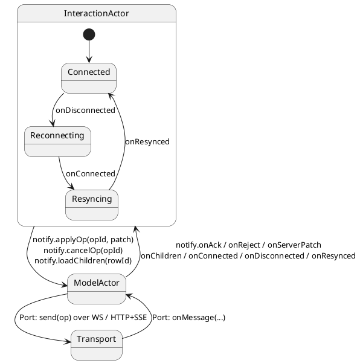
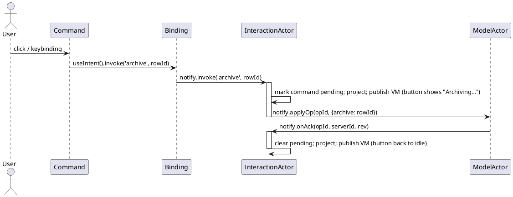
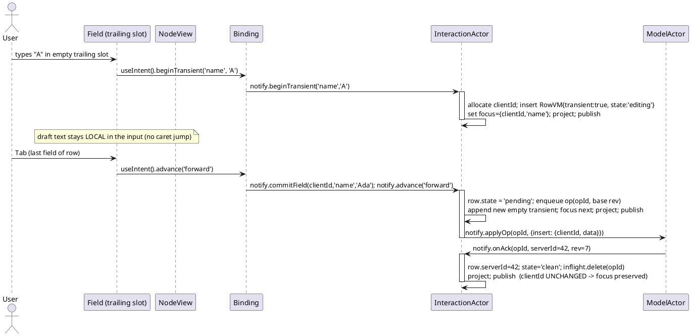
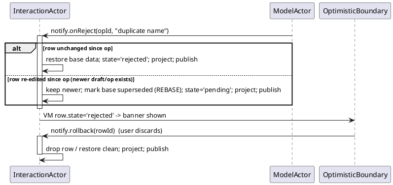
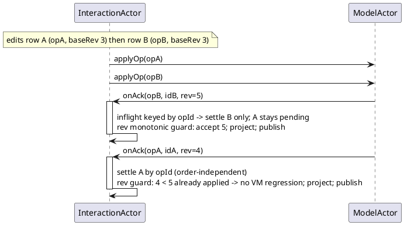
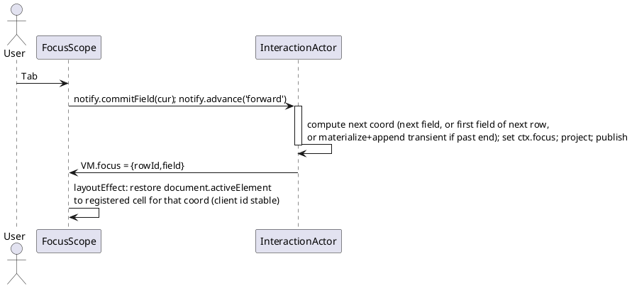
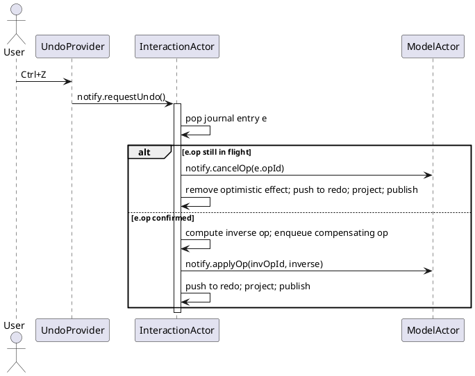
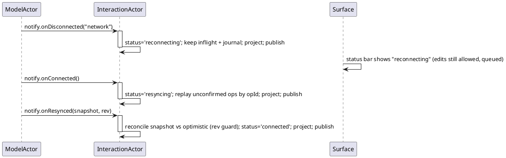
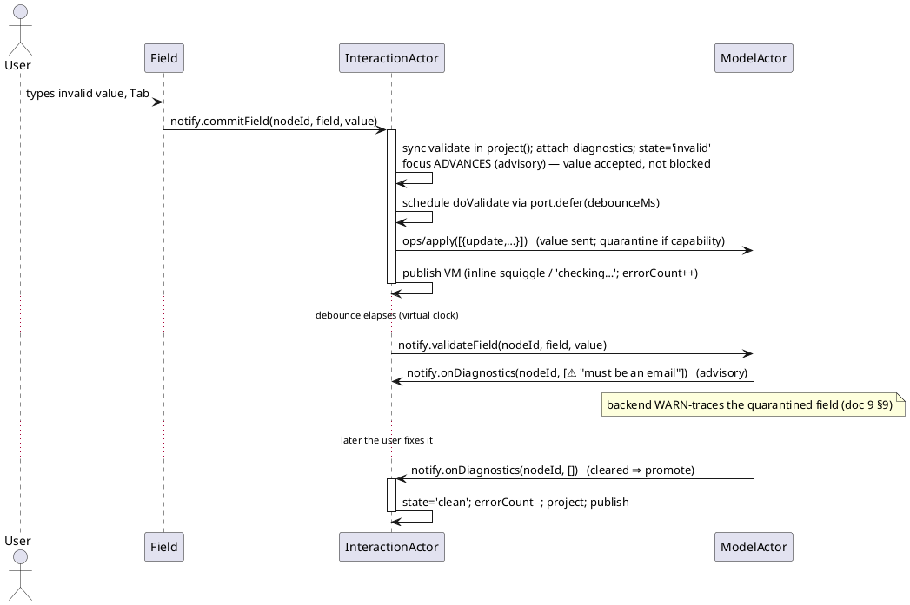

# 5. EVENTS & SEQUENCES

This document defines the **event taxonomy** that crosses each boundary and gives PlantUML
**sequence diagrams** for the load-bearing flows. It closes with the **reconciliation decision
matrix** (R7) — the single most important table in the spec.

## 5.0 Input normalization: DOM events → Intents (R16)

Surface components translate raw DOM input into **exactly one** semantic Intent (or explicitly
ignore it). This is the **only** place DOM-level logic lives; everything downstream is Intents, so
the whole interaction replays from an Intent log with no DOM in the loop. The mapping is *total*:
every key/gesture a primitive listens to has a row, and anything not listed is passed through to the
browser untouched.

### 5.0.1 Keyboard (and IME)

Handled at the `FocusScope`/`Field` level; `mod` = `Cmd` (mac) / `Ctrl` (win/linux).

| DOM event | Condition | Intent | Notes |
|-----------|-----------|--------|-------|
| `keydown` printable | not editing, cell editable | `beginEdit` then feed char | first keystroke starts an edit; on the trailing slot → `beginTransient(field, char)` |
| `keydown` `F2` | cell editable | `beginEdit` | explicit edit-mode entry (no value change) |
| `keydown` `Enter` | editing | `commitField` + `advance('down')` | `Shift+Enter` in a `textarea` inserts a newline (no Intent) |
| `keydown` `Tab` / `Shift+Tab` | always | `commitField?` + `advance('forward'\|'back')` | commits only if a draft exists; wraps per `FocusScope wrap` |
| `keydown` `Esc` | editing | `cancelEdit` | abandons draft; abandons row if transient & empty |
| `keydown` arrows | not editing (or caret at edge) | `advance('up'\|'down'\|'left'\|'right')` / `focusCell` | inside an open edit, arrows move the caret (no Intent) |
| `keydown` arrows + `Shift` | table, not editing | `extendSelection(dir)` | grows the range from `anchor` |
| `keydown` `Home`/`End` | not editing | `focusCell` (row start/end) | `mod+Home`/`mod+End` → grid corner |
| `keydown` `PageUp`/`PageDown` | not editing | `advance` by viewport | virtualization-aware page step |
| `keydown` `Space` | tree node focused, not editing | `expandNode`/`collapseNode` | toggles; on a checkbox cell → toggle value |
| `keydown` `mod+Z` / `mod+Shift+Z` | always | `requestUndo` / `requestRedo` | bound by `UndoProvider` |
| `keydown` `mod+Backspace`/`Delete` | row/cell selected, not editing | `delete` / clear cell | `Command keybinding` path |
| `keydown` `mod+C`/`X`/`V` | table, selection present | `copy` / `cut` / `paste` | also reads/writes the system clipboard via the actor Port |
| `keydown` `mod+D` | table, range present | `fillDown` | fills the range from its top row |
| `compositionstart` | editing | — (suppress commits) | IME guard: no Intent emitted until… |
| `compositionend` | editing | (draft updates only) | …composition resolves; `commitField` still waits for Enter/Tab/blur (R5) |
| `blur` | editing, `commitOn` includes `blur` | `commitField` | focus leaving the cell commits the draft |

### 5.0.2 Mouse / pointer / wheel / drag

| DOM event | Target | Intent | Notes |
|-----------|--------|--------|-------|
| `click` | cell | `focusCell` | sets `selection.active`; collapses range to one cell |
| `dblclick` | cell | `beginEdit` | enters edit mode at the click caret |
| `click` | tree twisty | `expandNode`/`collapseNode` | hit-tests the gutter only |
| `click` | column header | `sortColumn(field)` | cycles asc→desc→none; `Shift+click` appends to multi-sort |
| `click` + `Shift` | cell (table) | `selectRange(anchor→cell)` | rectangular range |
| `click` + `mod` | cell (table) | `extendSelection(toggle cell)` | adds/removes a disjoint range |
| `pointerdown`→`move`→`up` | cell body (table) | `selectRange` (marquee) | drag-select; autoscrolls near edges |
| `pointerdown`→`move`→`up` | row gutter / drag handle | `reorder(rowId, toIndex)` | row drag-reorder; keyboard equiv = `mod+Shift+arrow` |
| `pointerdown`→`move`→`up` | column border | `resizeColumn(field, width)` | live delta is DOM-local; commits on `up` |
| `pointerdown`→`move`→`up` | column header body | `moveColumn(field, toIndex)` | column drag-reorder |
| `pointerdown`→`move`→`up` | range fill-handle | `fillDown` / fill-range | spreadsheet fill gesture |
| `wheel` / scroll | virtualized body | — (no Intent) | windowing reads scroll position; never an actor turn |
| `contextmenu` | cell | — (app-owned) | the library does not impose a context menu |

Two invariants make this testable: **(1)** a handler computes the Intent and returns — it never
mutates state or reads the VM to *decide* business logic (only to hit-test geometry); **(2)** drag
gestures emit their Intent **once on completion** (`pointerup`), with the in-progress delta kept
DOM-local exactly like a `Field` draft, so a drag is a single deterministic Intent, not a stream.

## 5.1 Event taxonomy

Three directions of events, mapped onto the ihsm `Config` facets of the InteractionActor.

### Intent events (Surface → InteractionActor) — `notifications` bucket

The user's gestures, normalized to semantic intentions.

| Intent | Payload | Meaning |
|--------|---------|---------|
| `focusCell` | `(rowId, field)` | Move logical focus. |
| `beginEdit` | `(rowId, field)` | Start editing an existing cell. |
| `beginTransient` | `(field, firstChar)` | First keypress on the trailing writable slot. |
| `commitField` | `(rowId, field, value)` | Commit a field's draft. |
| `cancelEdit` | `(rowId, field)` | `Esc`: discard draft; abandon row if transient & empty. |
| `advance` | `(dir: 'forward'\|'back'\|'down'\|'up')` | `Tab`/`Enter`/arrows. |
| `invoke` | `(name, ...args)` | A named command (`Command`). |
| `reorder` | `(rowId, toIndex)` | Drag/keyboard reorder. |
| `delete` | `(rowId)` | Remove a row. |
| `expandNode` / `collapseNode` | `(rowId)` | Tree expansion. |
| `loadChildren` | `(rowId)` | Lazy child load request. |
| `retryOp` / `rollback` | `(rowId)` | Recover a rejected row. |
| `resolveConflict` | `(rowId, choice)` | Resolve a server/local conflict. |
| `requestUndo` / `requestRedo` | `()` | Journal navigation. |
| `selectRange` | `(from, to)` | Set a rectangular selection (table). |
| `extendSelection` | `(dir \| cell)` | Grow/toggle selection from anchor (table). |
| `sortColumn` | `(field, additive?)` | Cycle/append a column sort (table). |
| `filterColumn` | `(field, filter)` | Set/clear a column filter (table). |
| `resizeColumn` / `moveColumn` | `(field, width)` / `(field, toIndex)` | Column geometry (table). |
| `copy` / `cut` / `paste` / `fillDown` | `(range?)` | Clipboard ops; expand to a **batch** of `commitField` (table). |
| `validateField` | `(rowId, field, value)` | Request async validation (debounced); off the commit path. |

### Model events (ModelActor → InteractionActor) — `internalNotifications` `on*` bucket

Authoritative answers and pushes from the server, delivered by the ModelActor through the bridge.

| Model event | Payload | Meaning |
|-------------|---------|---------|
| `onAck` | `(opId, serverId, rev, quarantined?)` | Op accepted (`ops/ack`); canonical id + revision. `quarantined:true` ⇒ accepted-but-invalid (R22, doc 10 §10.6). |
| `onReject` | `(opId, diagnostics[])` | Op **refused** (`ops/reject`) — permission, stale base; carries field diagnostics. Distinct from accepted-invalid. |
| `onServerPatch` | `(serverId, patch, rev)` | Unsolicited authoritative change (`ops/patch`). |
| `onDiagnostics` | `(nodeId, diagnostics[])` | **Advisory**, push-based validation (`validation/publishDiagnostics`); empty array clears (promotion). |
| `onChildren` | `(nodeId, children)` | Lazy children loaded (`tree/loadChildren`). |
| `onWindow` | `(range, nodes, rev)` | Virtual/paged data window (`dataset/loadWindow`). |
| `onConnected` | `()` | Transport up. |
| `onDisconnected` | `(reason)` | Transport down. |
| `onResynced` | `(snapshot, rev)` | Resync after reconnect completed (`lifecycle/resynced`). |

> These `on*` events are the client-bound half of the **one capability-negotiated protocol** (R21,
> doc 10 §10.4). `onValidated` (explicit `validation/request` reply) is a special case of
> `onDiagnostics`. Which events are legal is fixed by the negotiated capabilities — e.g. no
> `onChildren` without `hierarchy`, no `onWindow` without `windowing`.

### Output (InteractionActor → React) — via the view-sink

A single operation: `viewSink.publish(viewModel)` at the end of any turn that changed the VM
(doc 3 §3.4). Not an event bus — exactly one immutable reference per change.

### Internal glue — `internalNotifications` `do*` bucket

Actor-scheduled events only the actor posts: `doReproject()` (rebuild + publish the VM at the end of
a turn — never from `onEntry`, per ihsm RTC rule 4), `doCoalesceDraft()` (flush a debounced draft
buffer driven by `port.defer`), `doExpireOp(opId)` (op timeout via the virtual clock),
`doValidate(rowId, field)` (fire a debounced async `validateField` after the draft settles, §5.5).

## 5.2 The bridge contract (InteractionActor ↔ ModelActor)

Rules (from ihsm's nested-actor discipline): parent↔child messaging is **`notify` only** — never
`await child.call` across the actors, never `async` orchestration handlers. The transport is **only**
in the ModelActor's Port, so the whole pair is deterministically testable by mocking that one port.

## 5.3 Sequence diagrams

### 5.3.1 Command invoke (the "button", end to end)

### 5.3.2 Transient create → commit → ack (the heart of the DMI)

### 5.3.3 Optimistic reject → rollback

### 5.3.4 Out-of-order acks

### 5.3.5 Focus advance on Tab/Enter

### 5.3.6 Undo of an in-flight op

### 5.3.7 Reconnect → resync

## 5.4 Reconciliation decision matrix (R7 — totality)

Every `(local row state × incoming model event)` cell has exactly one verdict, classified with the
ihsm verdict ladder (**B**ehaviour / **E**mpty-swallow / **G**uard-throw / **P**arent / **U**nhandled).
This table is the contract the InteractionActor must implement and the fuzzer asserts.

| local state \ event | `onAck(opId)` | `onReject(opId)` | `onServerPatch(serverId)` | `onDiagnostics(nodeId)` |
|---------------------|---------------|------------------|----------------------------|--------------------------|
| **clean** | **E** — no matching inflight; warn (late ack) | **E** — warn (late reject) | **B** — apply patch, stays clean | **B** — attach diags; `state→invalid` if any error |
| **editing** (draft, no op yet) | **E** — none inflight | **E** — none inflight | **B** — `state→conflict` (don't clobber draft) | **B** — attach diags (advisory; draft kept) |
| **pending** (op inflight) | **B** — settle: id remap, `rev` bump, `state→clean` (or `invalid` if `quarantined`/diags, or `editing` if newer draft) | **B** — base unchanged → `state→rejected`; re-edited → **rebase**, stay `pending` | **B** — `state→conflict`; hold patch until op settles | **B** — attach diags; settle to `invalid` not `clean` |
| **invalid** (accepted, failing validation — R22) | **B** — re-ack; stays `invalid` until diags clear | **B** — `state→rejected` (hard refusal supersedes advisory) | **B** — patch may clear/replace value → re-derive validity | **B** — empty diags ⇒ **promote** `state→clean`; non-empty ⇒ stay `invalid` |
| **rejected** | **E** — stale | **E** — duplicate reject, idempotent | **B** — patch wins, `state→conflict`-or-`clean` per policy | **B** — attach diags (still rejected) |
| **conflict** | **B** — op settled under conflict → present both, await `resolveConflict` | **B** — `state→rejected` | **B** — newest patch replaces pending server side | **B** — attach diags to the conflicting node |

Guards (**G**, client-error throws) cover Intents in impossible phases (e.g. `commitField` on a node
with no draft); true protocol violations (an `onAck` for an `opId` that was never sent) are left
**U**nhandled so they crash loudly in tests. `rev` monotonicity is enforced on every `onAck`/
`onServerPatch`/`onResynced` so a stale message can never regress the VM (diagram 5.3.4).

**`rejected` vs `invalid` (R22).** `rejected` = the server *refused* the op (`onReject`) — a hard
failure awaiting rollback/rebase. `invalid` = the value was *accepted* (locally and, with the
`quarantine` capability, server-side) but **fails advisory validation** — it persists, is navigable
via the diagnostics inventory, and is repaired interactively. Advisory diagnostics never block;
`validationMode:'gating'` is the per-field opt-in that keeps focus and refuses `advance` (doc 10 §10.6).

## 5.5 Validation & error tolerance (R17/R22)

Validation has two tiers, both surfaced as **advisory** `Diagnostic`s (doc 10 §10.5) on
`CellVM.validation` / `vm.diagnostics`, never in React. **Advisory is the default**: a failing value
is *accepted* into `state:'invalid'`, not blocked.

| Tier | Where it runs | Trigger | Effect |
|------|---------------|---------|--------|
| **Synchronous** | inside `project()` (pure, replayable) | every draft commit / reproject | attaches diagnostics; `state→invalid`; **does not block** (unless that field is `validationMode:'gating'`) |
| **Asynchronous** | bridge round-trip (e.g. uniqueness) | `validateField` (debounced on the **virtual clock** via `port.defer`) | optimistic commit accepted; a later `onDiagnostics(nodeId, [...])` marks `invalid`; an empty array **promotes** to `clean` |

**Async determinism:** the debounce uses `port.defer` on the virtual clock, so a test advances the
clock to fire it — no wall-time flake. A reconnect (`onDisconnected`) cancels in-flight
`validateField` and re-issues on `onResynced`, exactly like an op. The full quarantine model
(server-side draft layer + promotion) is doc 10 §10.6.

## 5.6 Batch (clipboard / fill) flow

`paste`/`fillDown` expand **inside the actor** into N `update` ops under **one journal entry** and
(with the `batchOps` capability) **one `ops/apply`** carrying N patches. Reconciliation is
unchanged: each affected `NodeVM` follows the §5.4 matrix; the whole batch acks/rejects atomically if
the op is atomic, or per-node if not (the actor declares which). Undo of a paste is a single step.

## 5.7 Capability negotiation (R21)

At startup the InteractionActor runs `initialize` against the ModelActor and stamps the granted
`Capabilities` onto `vm.capabilities` (doc 10 §10.4). The negotiated set **derives the legal event
surface**: the typed Intent dispatchers (`useIntent`) and the `on*` model events are narrowed to it,
so a missing capability (`hierarchy:false`) makes `expandNode`/`onChildren` a **type error**, not a
runtime branch. Capability negotiation is a single macrostep at boot (traced once, doc 9 §9.5);
re-negotiation (e.g. after a server upgrade on reconnect) is an explicit `lifecycle/resynced` carrying
a new capability set.
