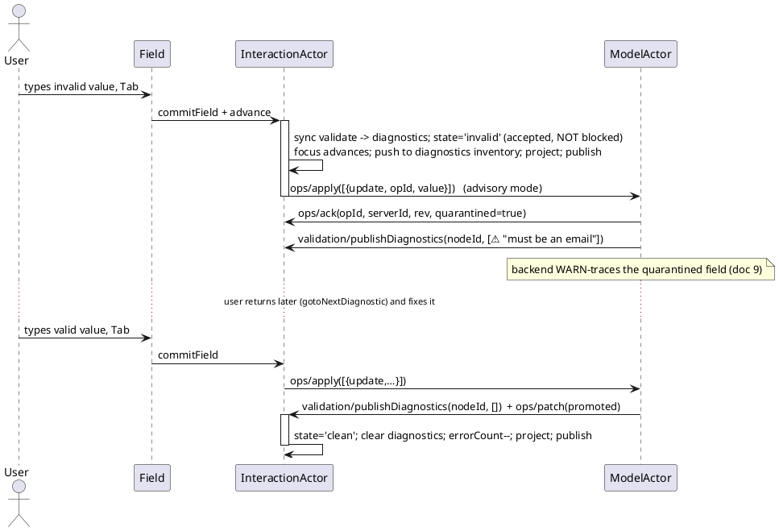

# 10. GENERIC KERNEL, STRATEGIES & PROTOCOL

This document defines the **generic core** the library actually ships (R19/R20), the **one
capability-negotiated protocol** that drives the backend (R21), and the **error-tolerance /
quarantine** model (R22). List, Table, Tree, and TreeTable are *not* defined here as components —
they are **recipe proofs** (doc 4 §4.9, doc 8) assembled from the pieces below.

---

## 10.1 One structure for all four shapes

List, table, tree, and tree-table are the **same** ordered, keyed set of **nodes**; they differ only
in *projection + interaction policy*, never in data model:

| Shape | `parentId`/`depth`/`expanded` | `columns` | Transient slot |
|-------|-------------------------------|-----------|----------------|
| **List** | absent | one implicit | trailing row |
| **Table** | absent | N | trailing row |
| **Tree** | present | one | trailing child (optional) |
| **TreeTable** | present | N | trailing child |

So the kernel needs exactly one ViewModel — the **node VM** — with two *optional* axes (hierarchy,
columns). Everything the library exists to guarantee (reconciliation R7, focus R6, transient R4,
undo R8, resync R9, input R16, validation R17/R22, tracing R18) operates on **nodes + cells +
focus** and is therefore shape-agnostic.

```ts
export interface InteractionVM {
  readonly rev: number;
  readonly status: ConnectionStatus;
  readonly capabilities: Capabilities;            // negotiated at initialize (§10.4)
  readonly focus: Coord | null;
  readonly selection: Selection;                  // degenerate (single cell) for list/tree
  readonly columns?: ReadonlyArray<ColumnVM>;     // present iff capability `columns`
  readonly nodes: ReadonlyArray<NodeVM>;          // flat, ordered, visible-only
  readonly diagnostics: ReadonlyArray<Diagnostic>;// the error inventory (R22)
  readonly canUndo: boolean;
  readonly canRedo: boolean;
  readonly dirtyCount: number;                     // nodes != server
  readonly errorCount: number;                     // cells in invalid-accepted/rejected
}

export interface NodeVM {
  readonly id: ClientId;                           // STABLE client id — React key & focus identity
  readonly serverId: ServerId | null;
  readonly parentId?: ClientId;                    // present iff capability `hierarchy`
  readonly depth?: number;
  readonly expanded?: boolean;
  readonly hasChildren?: boolean;                  // for lazy load affordance
  readonly fields: Readonly<Record<FieldKey, CellVM>>;
  readonly state: RowState;
  readonly transient: boolean;
}

export interface Coord { readonly nodeId: ClientId; readonly field: FieldKey; }
```

> **`RowVM` is `NodeVM` with no hierarchy.** Docs 3–9 keep the name `RowVM` as a documented alias for
> a flat node, so the row-oriented prose (Field, focus, reconciliation) reads unchanged. There is one
> runtime type.

`RowState` gains the error-tolerance state (R22):

```ts
export type RowState =
  | 'clean' | 'editing' | 'pending' | 'rejected' | 'conflict'
  | 'invalid';        // accepted locally but failing validation — NOT a server rejection (§10.6)
```

---

## 10.2 The kernel / strategy split

The kernel is everything that is hard *and* identical across shapes. A "widget" is the kernel plus a
bundle of four pure strategies — nothing else.

```plantuml
@startuml
skinparam rectangle { BackgroundColor #f7f7f7 BorderColor #888 }
rectangle "KERNEL (shipped: @ihsm/react)\nnode VM · reconciliation (R7) · focus survival (R6)\ntransient lifecycle (R4) · undo journal (R8) · resync (R9)\ninput dispatch · protocol client (R21) · tracing (R18)" as K
rectangle "STRATEGIES (per widget)\nProjectModel · NavModel · TransientModel · Keymap" as S
rectangle "RECIPE = kernel + 1 bundle\nList · Table · Tree · TreeTable  (test/proof only)" as R
S --> K : plugged in (pure, no kernel write access)
K --> R
S --> R
@enduml
```

```ts
export interface ProjectModel {
  // authoritative dataset + hot ctx -> the visible, ordered node list (sort/filter/flatten/expand)
  project(authoritative: Dataset, hot: HotCtx): InteractionVM;
}
export interface NavModel {
  // geometry of advance/arrows: given a coord + direction, the next coord (or a transient request)
  next(coord: Coord, dir: Dir, vm: InteractionVM): NavResult;
}
export interface TransientModel {
  // where the writable slot lives: trailing row, or trailing child under an expanded parent
  slotFor(vm: InteractionVM): NodePlacement | null;
}
export interface Keymap {
  // §5.0 normalization, fully overridable: DOM event -> exactly one Intent (or null = ignore)
  resolve(ev: DomEvent, ctx: KeyCtx): Intent | null;
}
```

The four canonical bundles (the proofs):

| Recipe | ProjectModel | NavModel | TransientModel | Keymap |
|--------|--------------|----------|----------------|--------|
| **List** | identity/filter, flat | linear (next/prev visible) | trailing row | list keys |
| **Table** | sort + filter, flat | grid-2D (cols × rows) | trailing row | table keys (+range/clipboard) |
| **Tree** | flatten visible (expand) | linear-with-descend | trailing child (opt) | tree keys (+expand on Space) |
| **TreeTable** | flatten visible + sort | grid-2D + descend | trailing child | tree ∪ table keys |

**Isolation rule (R20):** strategies are pure functions of `(vm | dataset | event)`. They never
touch the inflight op map, the undo journal, or `ctx.focus` authority. This is what stops a custom
widget from re-introducing the races the kernel eliminates — a strategy can change *what is shown
and where the cursor goes*, never *how an ack reconciles*.

---

## 10.3 Binding a strategy bundle

```tsx
import { NodeView, StrategyProvider } from '@ihsm/react';
import { tableBundle } from '../tests/recipes/table';   // a PROOF, not a library import

<StrategyProvider bundle={tableBundle}>
  <NodeView>
    {(node) => <Row node={node} />}      {/* same NodeView for every shape */}
  </NodeView>
</StrategyProvider>
```

The *same* `NodeView` + `Field` + `FocusScope` render all four shapes; only the injected `bundle`
changes. Swapping `tableBundle` → `treeBundle` turns a grid into a tree with no other code change —
the headline demo (doc 7 §7.7).

---

## 10.4 The protocol — one LSP-like JSON-RPC contract (R21)

Modeled on LSP: a **lifecycle** that negotiates **capabilities**, then notifications/requests whose
*legal set is derived from* those capabilities. There is **one** protocol; hierarchy, columns,
windowing, validation, and quarantine are capabilities — not separate protocols. It runs
InteractionActor ↔ ModelActor in-process and, unchanged, ModelActor ↔ backend over the wire (the
transport lives only in the ModelActor Port).

### 10.4.1 Lifecycle & capabilities

```ts
initialize(params: {
  client: { name: string; version: string };
  want: Partial<Capabilities>;             // what the UI would like
}): { capabilities: Capabilities }         // what the server grants (intersection)

export interface Capabilities {
  hierarchy: boolean;                       // tree/* methods + parentId/expanded
  columns: boolean;                         // column geometry + range selection + clipboard
  windowing: boolean;                       // dataset/loadWindow paging/virtual fetch
  batchOps: boolean;                        // ops/apply accepts >1 op atomically
  validationMode: 'advisory' | 'gating';    // R22 default = 'advisory'
  quarantine: boolean;                      // server holds invalid in a draft layer (§10.6)
  serverPush: boolean;                      // ops/patch + publishDiagnostics unsolicited
}
```

The negotiated `Capabilities` are stamped onto `vm.capabilities`, and the typed Intent/op surface is
narrowed to them (an app with `hierarchy:false` has no `expandNode` Intent and no `tree/*` method —
a **type** error to use, doc 6 §6.12).

### 10.4.2 Methods

| Direction | Method | Kind | Purpose | Gated by |
|-----------|--------|------|---------|----------|
| C→S | `dataset/subscribe(viewSpec)` | request | open a view (sort/filter/window) → `{snapshot, rev}` | — |
| C→S | `ops/apply(ops[])` | notification | batch of node ops, each `{opId, baseRev, kind, …}` | `batchOps` for >1 |
| C→S | `ops/cancel(opId)` | notification | cancel an in-flight op (undo-of-inflight, `$/cancelRequest` analogue) | — |
| C→S | `tree/loadChildren(nodeId)` | request | lazy children → `{children, rev}` | `hierarchy` |
| C→S | `dataset/loadWindow(range)` | request | virtual/paged fetch → `{nodes, rev}` | `windowing` |
| C→S | `validation/request(nodeId, field, value)` | request | explicit async check → `{diagnostics}` | — |
| S→C | `ops/ack(opId, serverId, rev)` | notification | op accepted | — |
| S→C | `ops/reject(opId, diagnostics[])` | notification | op refused (carries field diagnostics) | — |
| S→C | `ops/patch(serverId, patch, rev)` | notification | unsolicited authoritative change | `serverPush` |
| S→C | `validation/publishDiagnostics(nodeId, diagnostics[])` | notification | **advisory**, push-based, LSP-style | `serverPush` |
| S→C | `lifecycle/disconnected` · `lifecycle/connected` · `lifecycle/resynced(snapshot, rev)` | notification | connection lifecycle (R9) | — |
| both | `$/progress` · `$/cancel` | notification | long-op progress / cancellation | — |

The node op shape (one ops vocabulary for every shape):

```ts
type NodeOp =
  | { kind: 'insert'; opId: OpId; baseRev: Rev; node: NodePayload; parentId?: ClientId; index?: number }
  | { kind: 'update'; opId: OpId; baseRev: Rev; nodeId: ClientId; fields: Record<FieldKey, string> }
  | { kind: 'delete'; opId: OpId; baseRev: Rev; nodeId: ClientId }
  | { kind: 'move';   opId: OpId; baseRev: Rev; nodeId: ClientId; toParentId?: ClientId; toIndex: number }
  | { kind: 'expand'; opId: OpId; nodeId: ClientId; expanded: boolean };   // hierarchy only
```

`paste`/`fillDown` (doc 5 §5.6) expand into one `ops/apply` of N `update` ops under a single journal
entry, atomic iff `batchOps`.

### 10.4.3 Mapping to the in-process bridge

The doc 5 §5.2 bridge is this protocol with `notify` as the transport: `ops/apply` ≙
`notify.applyOp`, `ops/ack` ≙ `notify.onAck`, `validation/publishDiagnostics` ≙
`notify.onDiagnostics`, etc. Same schema in-process and over the wire — only the Port differs.

---

## 10.5 Diagnostics as a first-class inventory (R22)

`Diagnostic` is the LSP analogue: a structured, addressable, *advisory* problem.

```ts
export interface Diagnostic {
  readonly nodeId: ClientId;
  readonly field: FieldKey | null;        // null = node/row-level (cross-field) diagnostic
  readonly severity: 'error' | 'warning' | 'info';
  readonly message: string;
  readonly source: 'sync' | 'async' | 'server';
  readonly code?: string;                 // stable rule id, for "ignore"/filtering
}
```

`vm.diagnostics` is the flat inventory (the "Problems panel"); `CellVM.invalid`/`CellVM.validation`
mirror the per-cell view for inline squiggles. New navigation Intents: `gotoNextDiagnostic` /
`gotoPrevDiagnostic` (F8 / Shift+F8 by default) move focus to the next problem cell — the *repair
sweep* that makes errors interactively cleanable.

---

## 10.6 Error tolerance & the quarantine (R22)

The default is **accept-and-mark**, not gate. A user may type anything; the system absorbs it,
flags it, and lets them repair it later — this is what makes the UX a *true* DMI rather than a
disguised form.

**Client side.** A failing commit moves the cell to `state:'invalid'` (accepted) — *not* `rejected`
(which is reserved for a server `ops/reject`). The value is kept, the draft is committed, focus
advances normally. `invalid` participates in reconciliation and undo like any value; it simply
carries diagnostics and counts toward `errorCount`.

**Server side (`quarantine` capability).** The backend accepts the op and stores the invalid value
in a **draft/quarantine layer** keyed by `opId` (an LSP "unsaved buffer" analogue), returns
`ops/ack` with a `quarantined:true` flag **plus** `publishDiagnostics`, and **traces** it: an otel
`WARN` log + a `ihsm.note` span event on the macrostep (doc 9 §9), so operators can query "dirty
data currently in flight" without the user being blocked. The record is **promoted** to canonical
only when a later edit clears its diagnostics (server emits `publishDiagnostics(nodeId, [])` and
`ops/patch` confirming promotion).

**Fallback (`quarantine:false`).** If the backend cannot hold invalid data, the kernel keeps the
`invalid` value **client-side only** (never sent) and shows the diagnostics locally; the op is
withheld until valid. Same UX, narrower durability.



`validationMode:'gating'` is the opt-in inverse for the rare field that genuinely must block (e.g. a
primary key): a `'gating'` error keeps focus and refuses `advance`, exactly the old R17 behaviour,
now the exception rather than the rule.

---

## 10.7 Why this is option (c) done right

The library is the **generic framework** (kernel + strategies + protocol). The **usable VMs**
(List/Table/Tree/TreeTable) exist as **proofs** that the framework is complete — they live in the
test suite and double as copy-paste starting points. A pure kernel would be unproven; pure
components would ossify four shapes. The kernel + four-strategy seam is the smallest surface that is
both *generic* and *demonstrably sufficient* — and every guarantee in docs 3–9 is inherited by any
new shape (kanban, pivot, calendar) for free, because the hard parts never knew the shape.
