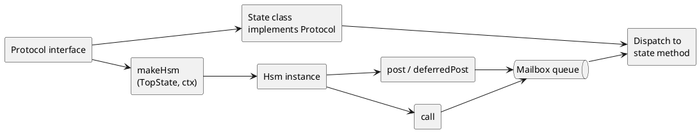

# ihsm Reference Manual

**ihsm** is a zero-dependency hierarchical state machine library for TypeScript
and JavaScript. States are **classes**, events are **methods**, hierarchy is
**inheritance**, and the runtime is an **actor** with a serialized mailbox.

Lineage: Harel’s hierarchical statecharts, encoded the Samek/QP way (class
hierarchy + explicit transitions), with **cached LCA transition paths** and a
typed **`call()`** request/response channel.

| Attribute | Value |
| --------- | ----- |
| Production dependencies | **0** |
| Runtime test coverage | **100%** (statements, branches, functions, lines) |
| Node.js | **22+** |

Hands-on walkthroughs: [tutorials](https://filasieno.github.io/ihsm/tutorials/) · [source index](../tutorials/README.md)

---

## Introduction

ihsm targets TypeScript developers who model domain logic as **classes** rather
than JSON statecharts. You get hierarchical states via inheritance, typed events
via `Protocol`, and actor-style messaging with **`call()`** for typed
request/response — all in a runtime with **zero npm dependencies** and **100%**
test coverage.

**When to choose ihsm:** backend services, session actors, protocol handlers,
embedded tooling — anywhere you want compile-time event typing and a minimal
supply chain.

**When to prefer declarative libraries (e.g. XState):** visual editors, single-chart
parallel regions, or deep frontend/Stately integration. See
[§14 Comparison with XState](#_13-comparison-with-xstate).

---

## Table of contents

1. [Key concepts](#_1-key-concepts)
2. [Key features](#_2-key-features)
3. [Static type checking](#_3-static-type-checking)
4. [Messaging: post, call, sync](#_4-messaging-post-call-sync)
5. [Transitions](#_5-transitions)
6. [Tracing](#_6-tracing)
7. [restore()](#_7-restore)
8. [Error model](#_8-error-model)
9. [Async handlers](#_9-async-handlers)
10. [makeHsm](#_10-makehsm)
11. [Zero dependencies](#_11-zero-dependencies)
12. [Code coverage](#_12-code-coverage)
13. [Comparison with XState](#_13-comparison-with-xstate)
14. [API quick reference](#_14-api-quick-reference)

---

## 1. Key concepts

### State as class

Each state is a **class** extending `TopState` or a parent state class. The
active state is the **prototype** of a single instance object — switched with
`Object.setPrototypeOf` when you call `transition(NextStateClass)`.

```typescript
class DoorTop extends TopState<DoorCtx, DoorProtocol> {}

@InitialState
class Closed extends DoorTop {
  open(): void {
    this.transition(Open);
  }
}

class Open extends DoorTop {
  close(): void {
    this.transition(Closed);
  }
}
```

**XState:** states are nodes in a configuration object; behavior lives in
`actions` and `invoke` blocks attached to those nodes.

### Context (`ctx`)

`ctx` is your **domain data** — counters, IDs, buffers, flags. It is owned by
the machine instance and available in every state handler as `this.ctx`.

Context is **not** the state name. State is which class is active; context is
what that state knows about the world.

**XState:** `context` on the machine config, updated via `assign()`.

### Protocol

`Protocol` is a TypeScript **interface** listing:

- **Events** — methods `(payload...) => void | Promise<void>`
- **Services** — methods `(resolve, reject, payload...) => void | Promise<void>`
  used with `call()`

The compiler uses `Protocol` to type-check `post('event', ...)` and
`call('service', ...)`.

Most JavaScript HSM libraries have **no compile-time event vocabulary at all**.
Typed libraries (XState, Robot, etc.) use string discriminators and object
payloads; none tie **`post` / `call` / `deferredPost` argument lists and Promise
return types** to ordinary TypeScript method signatures on a single `Protocol`
interface the way ihsm does. See
[§3 Advanced: Protocol typing](#advanced-protocol-typing-and-compile-time-safety).

**XState:** event types as discriminated unions; no first-class typed
request/response on the same actor mailbox with inferred `Promise<T>` from a
service method signature.

### Actor mailbox

Each `Hsm` instance has an internal **job queue**. `post` and `call` enqueue
work; one job runs at a time. While a handler executes, new messages are
**queued**, not re-entered.

This gives you actor semantics without a separate framework: hold a reference,
send messages, deterministic ordering.

**XState:** `actor.send()` with interpreter; similar serialization per actor.

### makeHsm

`makeHsm` creates machine instances:

```typescript
const door = makeHsm(DoorTop, { openCount: 0 });
await door.sync(); // wait for initialization
```

---

## 2. Key features

### Summary table

| Feature | How in ihsm | Explicit in library? |
| ------- | ------------- | -------------------- |
| Context | `ctx` on instance | Yes |
| Typed events | `Protocol` interface | Yes |
| Hierarchy | class `extends` | Yes |
| Initial substate | `@InitialState` | Yes |
| Transition | `this.transition(StateClass)` | Yes |
| Cached LCA path | automatic | Yes (internal) |
| Entry / exit | `onEntry()` / `onExit()` | Yes |
| Internal transition | handle event, no `transition()` | Implicit (by omission) |
| Guards | `if` in handler | Implicit (code) |
| History | `ctx` + `restore()` | Implicit (data) |
| Orthogonal regions | nest multiple `Hsm` instances | Composition |
| `post` | fire-and-forget | Yes |
| `deferredPost` | `setTimeout` + queue | Yes |
| `call` | Promise + mailbox | Yes |
| `sync` | drain queue | Yes |
| `restore` | set state + ctx | Yes |
| `makeHsm` | create + optional init | Yes |
| Tracing | levels + `TraceWriter` | Yes |
| Errors | typed error hierarchy | Yes |
| Async handlers | `async` methods | Yes |

---

### Context

Mutable domain object passed as the second argument to `makeHsm`. Survives transitions
unless you replace it in `restore()`.

Tutorial: [../tutorials/03-context/README.md](../tutorials/03-context/README.md)

### Protocol

Declares the **vocabulary** of the machine. Event names must match method names
on state classes (or inherited from parents). The typing strategy — events vs
services, payload inference, reserved names — is documented in
[§3 Advanced: Protocol typing](#advanced-protocol-typing-and-compile-time-safety).

Tutorial: [../tutorials/04-protocol-typing/README.md](../tutorials/04-protocol-typing/README.md)

### Hierarchical states

Child states extend parent states. The prototype chain defines the **state tree**.
Entering a composite runs `onEntry` from outer to inner initial leaf; exiting
walks up the LCA path.

Tutorial: [../tutorials/05-hierarchy/README.md](../tutorials/05-hierarchy/README.md)

### `@InitialState`

Decorator function marking the default child of a composite:

```typescript
@InitialState
class CheckingInventory extends Active { }
```

Only one initial state per parent; duplicate marks throw `InitialStateError`.

### Transitions and caching

Calling `this.transition(Destination)` schedules a transition after the current
handler finishes. The runtime computes the **lowest common ancestor** path,
runs `onExit` up from the current leaf, then `onEntry` down to the target (via
initial substates if entering a composite).

Transition paths are **cached** keyed by `FromState=>ToState` for hot loops.

Tutorial: [../tutorials/05-hierarchy/README.md](../tutorials/05-hierarchy/README.md) (entry/exit and deep-stack topology)

### Entry and exit

Override `onEntry()` / `onExit()` on state classes. Sync or async. Only states
that **define their own** handlers participate in debug/trace exit lists; inherited
empty defaults from `TopState` are skipped in verbose tracing.

### Internal transitions

If the handler **does not** call `transition()`, the active state class
unchanged and **no** exit/entry runs. Updating `this.ctx` alone is an internal
transition.

Tutorial: [../tutorials/07-internal-transitions/README.md](../tutorials/07-internal-transitions/README.md)

### Guards

Use ordinary TypeScript:

```typescript
approve(amount: number): void {
  if (amount > this.ctx.limit) {
    this.transition(Rejected);
    return;
  }
  this.transition(Approved);
}
```

**XState:** declarative `guard` functions on transition arrays.

### History

Store “where we were” in `ctx`, or call `restore(stateClass, ctx)` to rehydrate.
No shallow/deep history pseudostates — you keep explicit control.

Tutorial: [../tutorials/11-restore/README.md](../tutorials/11-restore/README.md)

### Orthogonal regions

Run **multiple machines** and coordinate with `post` / `call` between instances.
Each region has its own queue and cache.

Tutorial: [../tutorials/14-nested-machines/README.md](../tutorials/14-nested-machines/README.md)

---

## 3. Static type checking

ihsm pushes correctness to **compile time** via generics on `makeHsm`,
`TopState`, and `Hsm`. At a glance:

```typescript
interface PaymentProtocol {
  charge(amount: number): Promise<void>;
  getBalance(
    resolve: (balance: number) => void,
    reject: (error: Error) => void
  ): void;
}

class PaymentTop extends TopState<Wallet, PaymentProtocol> implements PaymentProtocol {}
const wallet = makeHsm(PaymentTop, { balance: 0 });

wallet.post('charge', 10);              // ✓ event name + payload
// wallet.post('chargr', 10);           // ✗ unknown event
// wallet.post('charge', 'ten');         // ✗ string ≠ number

const balance = await wallet.call('getBalance'); // ✓ Promise<number>
```

Tutorial: [../tutorials/04-protocol-typing/README.md](../tutorials/04-protocol-typing/README.md)

---

### Advanced: Protocol typing and compile-time safety

This section explains **why other libraries cannot offer the same guarantees**,
the **typing strategy ihsm adopted**, and **every TypeScript mechanism** used in
`src/index.ts` so that mistakes fail at build time instead of in production.

#### What other libraries do not provide

| Library / style | Event names | Payload types | `call()` return type | Same mailbox for events + services |
| --------------- | ----------- | ------------- | -------------------- | ---------------------------------- |
| **ihsm** | `keyof Protocol` literals | inferred from method params | `Promise<T>` from `resolve` arg | Yes |
| **XState v5** | string `type` on objects | `setup().types` maps | snapshot / spawned actors / `waitFor` | No unified typed `call` |
| **JavaScript FSMs** (e.g. vanilla `switch`) | runtime strings | none | callbacks / manual | N/A |
| **Robot / SCXML ports** | strings or enums | manual validation | ad hoc | No |

Concrete gaps elsewhere:

1. **Stringly-typed events** — `send({ type: 'setTargt' })` compiles unless you
   maintain a separate union and exhaustiveness checks; ihsm rejects
   `post('setTargt', …)` because `'setTargt'` is not `keyof Protocol`.
2. **Untyped payloads** — object events decouple payload shape from handler
   signature; ihsm derives the rest parameters of `post('setTarget', …)` from
   `Protocol['setTarget']`.
3. **No typed request/response on the actor** — XState and peers use
   `getSnapshot()`, child actors, or external promises; ihsm’s `call('getBalance')`
   returns `Promise<number>` inferred from the service method’s `resolve` callback.
4. **Runtime-only vocabulary** — dynamic `send(eventName, data)` in untyped JS
   cannot catch refactors; ihsm’s vocabulary is checked when TypeScript compiles
   callers and when state classes `implement Protocol`.

ihsm is safe at compile time because **the Protocol interface is the single
source of truth** for both state handler signatures and external
`post` / `call` / `deferredPost` call sites.

#### Adopted typing strategy

Five rules define how a `Protocol` interface maps to the runtime mailbox:

| Rule | Meaning |
| ---- | ------- |
| **1. Two type parameters everywhere** | `Context` (domain data) and `Protocol` (vocabulary) flow through `makeHsm`, `TopState`, `Hsm`, and errors. |
| **2. Events are void handlers** | A **event** is a `Protocol` method whose return type is `void` or `Promise<void>`. Payload types are everything before that return. |
| **3. Services are resolve/reject handlers** | A **service** (for `call`) is a method whose **first two parameters** are `resolve: (result: T) => void` and `reject: (error: Error) => void`. Request args follow; `Promise` return type is `T`. |
| **4. Reserved names are excluded** | Keys that exist on `State` (e.g. `transition`, `post`, `ctx`) cannot be used as event or service names — they become `never` at the type level. |
| **5. Untyped escape hatch** | `Protocol` may be `undefined`; then `post` accepts `string` and `any[]` (legacy / gradual typing). |

State classes **implement** `Protocol` so handler signatures and the external
API cannot drift apart:

```typescript
export interface WalletProtocol {
  deposit(amount: number): void;
  getBalance(resolve: ResolveCallback<number>, reject: RejectCallback): void;
}

export class WalletTop extends TopState<WalletCtx, WalletProtocol>
  implements WalletProtocol {
  deposit(amount: number): void { /* … */ }
  getBalance(resolve: ResolveCallback<number>, reject: RejectCallback): void { /* … */ }
}
```

#### TypeScript features used (exhaustive)

The public API in `src/index.ts` implements the strategy with the following
TypeScript features. Each row links a language feature to the exported type or
signature that uses it.

##### 1. Generic type parameters

`Context` and `Protocol` are declared once and threaded through the whole API:

```typescript
export function makeHsm<Context, Protocol>(topState, ctx, initialize?, traceLevel?, traceWriter?, dispatchErrorCallback?): Hsm<Context, Protocol>
export abstract class TopState<Context = Any, Protocol extends {} | undefined = undefined> { /* … */ }
export interface Hsm<Context = Any, Protocol extends {} | undefined = undefined> { /* … */ }
```

**Effect:** `makeHsm(Top, ctx)` returns `Hsm<Context, Protocol>` — callers
inherit the same `Protocol` used on the state classes.

##### 2. Generic constraints (`extends`)

```typescript
Protocol extends {} | undefined
EventName extends keyof Protocol
```

**Effect:** `Protocol` must be an object type (your interface) or `undefined`
for untyped mode. Event names must be keys of that interface.

##### 3. `keyof` and literal event names

```typescript
post<EventName extends keyof Protocol>(
  eventName: PostedEvent<Protocol, EventName>,
  …
): void;
```

**Effect:** `post('open', …)` only accepts strings that exist on `Protocol`.
Autocomplete in the IDE lists valid event names.

##### 4. Indexed access types

```typescript
Protocol[EventName]
```

Used inside conditional types to read the method signature for a given event or
service name.

##### 5. Conditional types

Every helper type branches on `Protocol extends undefined` (untyped fallback)
and on whether a member is a valid event or service:

```typescript
export type PostedEvent<Protocol, EventName extends keyof Protocol> =
  Protocol extends undefined ? string
  : EventName extends keyof State<any, any> ? never
  : EventName;

export type EventPayload<Protocol, EventName extends keyof Protocol> =
  Protocol extends undefined ? any[]
  : Protocol[EventName] extends (...payload: infer Payload) => Promise<void> | void
    ? (Payload extends any[] ? Payload : never)
    : never;
```

**Effect:**

- Unknown protocol → permissive `string` / `any[]`.
- Names on `State` → `never` (compile error if used as event).
- Non-void-return methods that are not services → payload becomes `never`
  (usually means “not a valid event shape”; prefer `void` handlers for events).

##### 6. `infer` — extract parameter tuples and return types

**Event payloads** — rest parameters after the event name:

```typescript
Protocol[EventName] extends (...payload: infer Payload) => Promise<void> | void
  ? Payload
  : never
```

For `setTarget(celsius: number): void`, `infer Payload` is `[celsius: number]`,
so `post('setTarget', 22)` is valid and `post('setTarget', 'hot')` is not.

**Service request args** — everything after `resolve` and `reject`:

```typescript
export type ServiceRequest<Protocol, EventName extends keyof Protocol> =
  Protocol extends undefined ? any[]
  : Protocol[EventName] extends (
      resolve: (result: infer Reply) => void,
      reject: (error: infer Error) => void,
      ...payload: infer Payload
    ) => Promise<void> | void
    ? (Payload extends any[] ? Payload : never)
    : never;
```

**Service response** — type passed to `resolve`:

```typescript
export type ServiceResponse<Protocol, EventName extends keyof Protocol> =
  Protocol extends undefined ? any
  : Protocol[EventName] extends (
      resolve: infer Reply,
      reject: infer Error,
      ...payload: infer Payload
    ) => Promise<void> | void
    ? Reply
    : never;
```

For `getBalance(resolve: (n: number) => void, reject: …): void`, `Reply` is
`number`, so `call('getBalance')` is `Promise<number>`.

##### 7. `never` — reject invalid names at compile time

```typescript
EventName extends keyof State<any, any> ? never : EventName
```

If you add `transition` or `post` to `Protocol`, those keys collide with
`State` and become `never`, producing a type error at call sites.

Payload `never` also blocks wrong arity:

```typescript
// Protocol: setTarget(celsius: number): void
wallet.post('setTarget');        // ✗ missing argument
wallet.post('setTarget', 1, 2);  // ✗ too many arguments
```

##### 8. Generic methods on interfaces and classes

Both `Base` and `TopState` declare:

```typescript
post<EventName extends keyof Protocol>(
  eventName: PostedEvent<Protocol, EventName>,
  ...eventPayload: EventPayload<Protocol, EventName>
): void;

call<EventName extends keyof Protocol>(
  eventName: ServiceName<Protocol, EventName>,
  ...eventPayload: ServiceRequest<Protocol, EventName>
): Promise<ServiceResponse<Protocol, EventName>>;
```

**Effect:** each call site gets a **specialized** check for the literal event
string you pass; TypeScript narrows `EventName` and applies the matching
`Protocol[EventName]` signature.

##### 9. Rest parameters with inferred tuples

`...eventPayload: EventPayload<…>` types the variadic tail of `post`
as an exact tuple derived from the handler, not as `any[]`.

##### 10. `implements Protocol` on state classes

State handlers are ordinary class methods. Implementing `Protocol` forces the
compiler to verify that every protocol member exists with a compatible
signature on the state hierarchy (or a parent).

##### 11. Separate aliases for services vs events

```typescript
export type ServiceName<Protocol, EventName> =
  Protocol extends undefined ? string
  : EventName extends keyof State<any, any> ? never
  : EventName;
```

`call()` uses `ServiceName` + `ServiceRequest` / `ServiceResponse`;
`post()` uses `EventName` + `EventPayload`. Same key set,
different signature rules — a method is typed for `call` only if it matches the
resolve/reject pattern.

##### 12. Typed error hierarchy

Runtime errors carry the same generics so handlers can inspect typed event names
and payloads in `onError` / `onUnhandled`:

```typescript
export abstract class RuntimeError<
  Context,
  Protocol extends {} | undefined,
  EventName extends keyof Protocol
> extends HsmError<Context, Protocol> {
  eventName: PostedEvent<Protocol, EventName>;
  eventPayload: EventPayload<Protocol, EventName>;
}
```

**Effect:** `onError(error)` inside a state can treat `error.eventName` and
`error.eventPayload` as correlated with `Protocol`.

##### 13. Helper aliases for service callbacks

```typescript
export type ResolveCallback<Reply> = (result: Reply) => void;
export type RejectCallback = (error: Error) => void;
```

These document the expected resolve/reject shapes and match what `infer Reply`
extracts from service methods.

#### Compile-time checks (summary table)

| Mistake | TypeScript error |
| ------- | ---------------- |
| Typo in event name | `Argument of type '"setTargt"' is not assignable to parameter of type 'keyof Protocol'` (or `never`) |
| Wrong payload type | `Argument of type 'string' is not assignable to parameter of type 'number'` |
| Wrong payload count | Tuple arity mismatch on rest parameters |
| Calling service with `post` | Service-shaped method may yield `never` payload or wrong inference — use `call` |
| Calling event with `call` | Request/response inference fails; return type may be `never` |
| Using reserved name | Event name resolves to `never` |
| Drift between handler and Protocol | `implements Protocol` error on state class |

#### End-to-end flow



1. You define `Protocol` and `Context`.
2. State classes **implement** `Protocol` (handlers).
3. `makeHsm(TopState, ctx)` infers `Context` and `Protocol` from the top state class.
4. External code calls `post('event', …)` / `call('service', …)` — TypeScript
   validates against the same `Protocol` the handlers implement.
5. At runtime, ihsm dispatches to the method on the **current state** prototype
   chain; compile-time checks ensure the vocabulary and arity are valid at every
   call site.

**XState:** strong typing via `setup().types` and `createMachine`; events remain
 `{ type: 'charge', amount: 10 }` objects with separate type maps — not method
 signatures shared with state implementations and `call`-style Promise inference.

---

## 4. Messaging: post, call, sync

Every messaging API has two sides:

| Side | Where | Role |
| ---- | ----- | ---- |
| **Handler** | Method on the active state class | Runs when the mailbox dispatches the event or service |
| **Client** | Code holding `Hsm` | Calls `post`, `call`, or `sync` — never implements the handler inline |

The **Protocol** interface types both: handler signatures on state classes, client call sites via `post('name', …)` / `call('name', …)`.

### Reading UML statecharts

ihsm tutorials and the reference use **PlantUML state diagrams**. Map symbols to
runtime behavior as follows:

| Chart element | ihsm runtime |
| ------------- | ------------ |
| **`[ * ]` (filled circle)** | Initial pseudostate — exactly one `@InitialState` child per composite parent |
| **Rounded box / `state Name { … }`** | State **class**; nested box = composite with substates |
| **`A --> B : label`** | External transition — handler calls `this.transition(B)`; LCA exit/entry runs |
| **`StateName : event / action` inside a state box** | **Internal transition** — handler runs, no `transition()`, no exit/entry |
| **Arrow crossing box boundary** | External transition between substates or branches |

**Diagram layout (PlantUML):** tutorials use [PlantUML state diagrams](https://plantuml.com/state-diagram).
To reduce overlapping transition lines when several events leave the same state:

- **`left to right direction`** — default flow for most tutorial charts.
- **Directional arrows** — `-up->`, `-down->`, `-left->`, `-right->` (short form: `-u-`, `-d-`, …) fan arcs from one source to different targets.
- **Spacing** — `skinparam ranksep` and `skinparam nodesep` add room between states.
- **Orthogonal lines** — `skinparam linetype ortho` (optional; helps some nested composites).

PlantUML still uses Graphviz auto-layout — you nudge placement with hints, not pixel-perfect control.
With `left to right direction`, compass keywords are interpreted **before** the diagram is rotated:
to place a target **below** the source, use `-left->`; **above**, use `-right->`.
Do not use self-loop arrows for internal transitions — use in-state `State : event / action` text instead.

**After `makeHsm(TopState, ctx)`** the runtime performs **initialization**: `onEntry`
from the top state down through each composite’s initial child until the deepest
initial leaf is active (same order as following `[ * ]` arrows inward).

**Active state** = `Object.getPrototypeOf(instance).constructor` — always one
**leaf class** in normal operation, not “parent and child simultaneously”.

Full deep-hierarchy walkthrough with **trace for every transition kind**:
[tutorial 05](../tutorials/05-hierarchy/README.md) and
[§5 Transition taxonomy](#transition-taxonomy).

### `post(event, ...payload)`

Fire-and-forget. The client enqueues; the handler runs later on the active state.

**Handler** — event method, no `resolve` / `reject`:

```typescript
// Protocol: open(): void;
@InitialState
class Closed extends DoorTop {
  open(): void {
    this.ctx.openCount += 1;
    this.transition(Open);
  }
}
```

**Client** — returns immediately; use `sync()` to wait for side effects:

```typescript
door.post('open');
await door.sync(); // handler + transition complete
```

Inside a state handler, `this.post('tick')` schedules work **after** the current
handler completes (and after any transition it requested).

Tutorial: [../tutorials/08-post-and-sync/README.md](../tutorials/08-post-and-sync/README.md)

### `call(service, ...payload)` — typed request/response

**Unique to ihsm among common JS HSM libraries:** query the same actor through
its mailbox and receive a **typed Promise**.

**Handler** — first two parameters are `resolve` / `reject` (injected by runtime; client never passes them):

```typescript
// Protocol: getBalance(resolve: (n: number) => void, reject: (e: Error) => void): void;
getBalance(resolve: ResolveCallback<number>, _reject: RejectCallback): void {
  resolve(this.ctx.balance);
}

// async — await work, then resolve
async fetchBalance(resolve: ResolveCallback<number>, reject: RejectCallback, id: string): Promise<void> {
  const row = await db.load(id);
  resolve(row.balance);
}
```

**Client** — one `await`; no separate `sync()`:

```typescript
const balance = await wallet.call('getBalance');
```

The client's Promise settles when the handler calls **`resolve(value)`** or
**`reject(error)`** — not from the handler's return value alone.

Benefits:

- Same serialization guarantees as `post` (no re-entrancy)
- Client uses familiar `async`/`await`
- Return type inferred from `Protocol`

Tutorial: [../tutorials/10-call-services/README.md](../tutorials/10-call-services/README.md)

**XState:** read snapshot via `actor.getSnapshot()`, spawn promise actors, or
use `waitFor` — no single typed `call` on the interpreter.

### `deferredPost(millis, event, ...payload)`

Schedule an event after a delay via `setTimeout`, then enqueue normally.
Available **inside handlers only** (`this.deferredPost`).

**Handler:**

```typescript
scheduleReminder(text: string): void {
  this.deferredPost(50, 'deliver', text); // returns immediately
}

deliver(text: string): void {
  this.ctx.message = text;
}
```

**Client:**

```typescript
sm.post('scheduleReminder', 'hello later');
await sleep(100); // wait for timer
await sm.sync();  // wait for deliver handler
```

Tutorial: [../tutorials/09-deferred-post/README.md](../tutorials/09-deferred-post/README.md)

### `sync()`

Returns a Promise that resolves when a **sync marker** task reaches the front of
the queue — **client-side only** (no handler to implement).

**Client:**

```typescript
door.post('open');
await door.sync(); // through handler + its transition

sm.post('tick');
sm.post('tick');
sm.post('done');
await sm.sync();   // one sync drains all three posts
```

After a handler **chains** `this.post(...)` calls, call `sync()` again to wait
for those jobs (see [tutorial 08](../tutorials/08-post-and-sync/README.md)).
Use at test boundaries and integration seams in application code.

**Note:** `call()` returns a Promise tied to the service handler; you usually
do not need a separate `sync()` after `await call(...)`.

---

## 5. Transitions

```typescript
this.transition(TargetStateClass);
```

Scheduled when the current event handler finishes successfully. ihsm computes
the **lowest common ancestor (LCA)** on the class prototype chain, runs `onExit`
from the current leaf up to (but not including) the LCA, then `onEntry` down
toward the target — **descending `@InitialState` chains** when the target
is a composite.

Tutorial: [../tutorials/05-hierarchy/README.md](../tutorials/05-hierarchy/README.md)
(shallow entry/exit chain and [case-by-case topology](../tutorials/05-hierarchy/cases/)).

### Transition taxonomy

The table lists **external** transitions (handler calls `transition()`). An
**internal** transition omits `transition()` — only the handler body runs (see
[tutorial 07](../tutorials/07-internal-transitions/README.md)).

| Kind | Example (tutorial 05) | Chart notation | Exit / entry | Notes |
| ---- | --------------------- | -------------- | ------------ | ----- |
| **Internal** | `tick()` in `LeafWestA` | `LeafWestA : tick / value++` inside box | none | `ctx` updates; state class unchanged |
| **Child → sibling child** | `LeafWestA → LeafWestB` | `A --> B : goSiblingWest` | exit A, enter B | LCA = parent (`MidWest`) |
| **Child → parent composite** | `LeafWestA → MidWest` | arrow to parent composite | exit leaf; re-enter initial leaf | Composites with `@InitialState` descend again |
| **Child → ancestor** | `LeafWestB → StackWest` | arrow to ancestor | exit up to LCA; enter down initial chain | Ancestors above LCA untouched |
| **Child → root** | `LeafWestA → DeepTop` | arrow to root | exit to LCA; re-enter initial branch | Root’s own onExit/onEntry skipped at LCA |
| **Cross-stack leaf → leaf** | `LeafWestA → LeafEastB` | arrow across stacks | exit west stack; enter east leaf | LCA = `DeepTop` |
| **Cross-stack → branch composite** | `LeafWestA → StackEast` | arrow into composite | exit source stack; enter branch + initial chain | Target composite → initial leaf |
| **Cross-stack → mid composite** | `LeafWestA → MidEast` | arrow to mid composite | same as branch when initial chain matches | Often identical trace to branch target |
| **Self** | `LeafWestA → LeafWestA` | arrow to same state (rare) | none | Source equals destination leaf |

**Trace convention** (tutorial 05): push `enter:StateName` / `exit:StateName` from
`onEntry` / `onExit`; `handler:event` from the handler. Compare with
`npm run test:tutorials -- --grep 'Tutorial 05'`.

### LCA algorithm (prototype chain)

States are classes; inheritance is the hierarchy. To transition from `src` to
`dst`:

1. Walk `src` → `TopState`, recording path and indexes.
2. Walk `dst` upward until a class appears on the `src` path — that is the **LCA**.
3. **Exit** states from the current leaf up to (not including) the LCA — only
   classes that **define their own** `onExit` (debug/verbose trace lists).
4. **Enter** states from the LCA down toward `dst`; if `dst` is composite,
   follow each `@InitialState` until the deepest initial leaf.
5. Set `currentState` to that final leaf class.

Paths are **cached** per `FromState=>ToState` in `_transitionCache`.

### Sync vs async with transitions

| Pattern | Behavior |
| ------- | -------- |
| Sync handler + `transition()` | Handler completes → transition runs in same dispatch → `sync()` sees final state |
| `async` handler + `await` + `transition()` | Transition runs after `await`; `sync()` waits for both |
| `this.post('e')` inside handler | Deferred until current handler **and** its transition finish |
| `transition()` in `onEntry` / `onExit` | **Cleared** at end of dispatch — use `post()` from lifecycle hooks instead |

```typescript
sm.post('goAsyncCross');
await sm.sync(); // handler + transition + entry/exit complete
```

See [§4 `sync()`](#sync) and [tutorial 08](../tutorials/08-post-and-sync/README.md).

### Errors during transitions

| Failure | Error type | Default outcome |
| ------- | ---------- | --------------- |
| Handler throws | `EventHandlerError` | `onError` → often `FatalErrorState` |
| No handler | `UnhandledEventError` | `onUnhandled` → `onError` |
| `onExit` / `onEntry` throws | `TransitionError` | Recovery → `FatalErrorState` |
| `onError` throws | `FatalError` | `FatalErrorState` |

`sync()` drains the queue; with the **default** `dispatchErrorCallback` the
Promise still **resolves** after the machine enters `FatalErrorState` (the
callback throws to the console/logger, not to the caller). Override the callback
to propagate failures to application code.

### Rules of thumb

- Called from event handlers (or recovery hooks).
- Deferred until handler completes successfully.
- Cleared if handler throws (unless recovered).
- Self-transition: no exit/entry when source equals target leaf and initial
  descent unchanged.
- **`transition()` inside `onEntry`/`onExit` of the same dispatch is cleared**
  when that dispatch finishes — schedule follow-up work with `post()` from
  `onEntry`, or branch in the event handler (see tutorial 15).

---

## 6. Tracing

### Trace levels

| Level | Value | Use |
| ----- | ----- | --- |
| `PRODUCTION` | 0 | Minimal overhead |
| `DEBUG` | 1 | Transition and handler boundaries |
| `VERBOSE_DEBUG` | 2 | Lookup walks, cache hit/miss |

Set trace level: `makeHsm(Top, ctx, true, TraceLevel.DEBUG)`.

### Trace writer

Implement `TraceWriter`:

```typescript
interface TraceWriter {
  write(hsm, msg): void;
}
```

Default logs to `console` as `domain|…|StateName: message`. Inject a custom
writer for structured logging or tests (`CollectingTraceWriter` in
`tutorials/shared/trace.ts`).

Inside states: `this.traceHeader`, `this.traceWriter`, `this.traceLevel`.

**Docs site:** each tutorial page includes a live **Trace** panel in the browser. Tutorial
READMEs describe how to read `VERBOSE_DEBUG` output; run `npm run test:tutorials` for
headless verification.

Tutorial: [../tutorials/02-tracing/README.md](../tutorials/02-tracing/README.md) (**start here** after tutorial 01). Every other tutorial includes a **Reading the trace** section.

**XState:** `@xstate/inspect`, Stately visualizer — external tooling vs
in-process trace hooks.

### State display names (Node and minified browsers)

Trace output, error messages, `currentStateName`, and `topStateName` all read a
state's **display name**. By default that name comes from the JavaScript class
name (`Class.name`).

In **Node** (and any unminified build) class names are preserved, so everything
works out of the box — no setup required.

In a **minified browser bundle**, bundlers (esbuild, terser, Rollup, webpack)
**rename classes** to short identifiers like `t` or `e`. `Class.name` then
returns the mangled name and your traces, `currentStateName`, and error messages
become unreadable. To keep names stable in every environment, register an
explicit display name for each state class.

There are two ways to keep names stable. Pick whichever fits your build.

#### Option 1 — keep class names in your bundler (zero code)

If you can afford slightly larger output, tell your minifier not to rename
classes. Then `Class.name` is preserved and **no registration is needed**:

| Bundler | Setting |
| ------- | ------- |
| esbuild | `keepNames: true` |
| terser | `keep_classnames: true` |
| webpack (TerserPlugin) | `terserOptions: { keep_classnames: true }` |
| Rollup (terser plugin) | `terser({ keep_classnames: true })` |

#### Option 2 — register display names (no enumeration)

`registerStateNames` reads a stable name from each **export key**, which
minifiers preserve even when they mangle the class identifiers. The ergonomic
way is to register the module's own namespace — no need to list every state:

```typescript
// machine.ts
import * as ihsm from 'ihsm';
import * as self from './machine'; // self-reference

export class DoorTop extends ihsm.TopState<DoorCtx, DoorProtocol> {}
export class Open extends DoorTop {}
export class Closed extends DoorTop {}

export function createDoor() {
  return ihsm.makeHsm(DoorTop, { openCount: 0 });
}

ihsm.registerStateNames(self); // grabs every exported state automatically
```

**Placement:** put the `registerStateNames(self)` call **after every export** in the
module (it can stay above hoisted `function` declarations, but it must come after any
`const`/`let`/`class` export). Enumerating the self-namespace touches every export's
live binding; a `const`/`class` declared *after* the call is still in its temporal dead
zone and strict bundlers (e.g. Webpack SSR) will throw `Cannot access … before
initialization`. When in doubt, make it the last statement of the file — or register
from a consumer module instead (below), which is never affected.

Equivalently, register from a consumer that imports the module as a namespace:

```typescript
import * as machine from './machine';
registerStateNames(machine);
```

For one-off cases you can also name a single class explicitly:

```typescript
import { defineStateName } from 'ihsm';
defineStateName(DoorTop, 'DoorTop');
```

In every form, factory functions and other non-state exports are ignored.

Notes:

- Names are stored as a **non-enumerable, non-inherited own property**, so a
  subclass never accidentally reports its parent's display name.
- Registration is **idempotent** for the same name; registering a *different*
  name for an already-named class throws (names are intended to be stable).
- The library registers its own built-ins (`TopState`, `FatalErrorState`)
  automatically.
- This is exactly how the bundled tutorials and the minified browser test suite
  (`npm run test:browser`, built with `minify: true`) keep their state names
  readable.

---

## 7. restore

```typescript
hsm.restore(SavedStateClass, savedCtx);
```

Sets **both** active state class and context **without** running entry/exit.

Typical persistence flow:

```typescript
// suspend — JSON row / file (state classes are not serializable)
const json = JSON.stringify({
  stateName: 'Authenticated',
  ctx: { ...hsm.ctx },
});

// resume — new instance after restart
const sm = makeHsm(TopState, emptyCtx, false);
sm.restore(STATE_BY_NAME[stateName], parsed.ctx);
```

Use for:

- Hydration from database snapshot
- Session reattachment after process restart
- Tests that need a mid-flow starting point

Does not replay history automatically — you choose the concrete state class and supply `ctx`.

Tutorial: [../tutorials/11-restore/README.md](../tutorials/11-restore/README.md)

**XState:** `snapshot` / `restore` on actors (v5 persisted state API).

---

## 8. Error model

| Type | When |
| ---- | ---- |
| `UnhandledEventError` | No handler for event in current state |
| `EventHandlerError` | Handler threw |
| `InitializationError` | `onEntry` during init failed |
| `FatalError` | `onError` recovery failed |
| `InitialStateError` | Two `@InitialState` on same parent |

Hooks:

- `onUnhandled(error)` — default throws; override to recover or redirect
- `onError(error)` — default rethrows; override to log and transition

Fatal error state: `FatalErrorState` when transition recovery fails.

Tutorial: [../tutorials/12-error-recovery/README.md](../tutorials/12-error-recovery/README.md)

---

## 9. Async handlers

**Major advantage:** handlers may be `async`. The runtime `await`s the returned
`Promise` before applying `transition()`. You can **`await` an entire I/O pipeline
inside one handler** while the machine stays in the **same state class** — no need
to invent `Opening`, `Reading`, `Writing`, or `Closing` states for mechanical
open/read/write/close work.

Classic tools (and XState `invoke` + `done` events) often require **one state per
in-flight step** because the handler must return immediately. ihsm keeps the actor
serialized: while one async handler runs, `post` / `call` messages **queue** until
it finishes.

Add extra states only when a **waiting mode is domain-meaningful** (cancel allowed,
user-visible “Uploading”, different event set) — not for every syscall.

### Example: open → read → write → close in one handler

```typescript
@InitialState
class Idle extends FileTop {
  async transfer(from: string, to: string): Promise<void> {
    const readFd = await open(from, 'r');
    const data = await read(readFd);
    await close(readFd);

    const writeFd = await open(to, 'w');
    this.ctx.bytesWritten = await write(writeFd, data);
    await close(writeFd);

    this.transition(Done); // after entire pipeline — still was Idle until here
  }
}
```

One event, one handler, one state during all awaits, one transition when done.

### Mailbox during `await`

```typescript
sm.post('transfer', '/inbox/a.dat', '/archive/a.dat');
await sm.sync(); // through open, read, write, close + transition
```

While `await`ing, the mailbox **still accepts** `post`/`call` — messages queue
until the current handler finishes.

Tutorial: [../tutorials/13-async-handlers/README.md](../tutorials/13-async-handlers/README.md)

**XState:** often models async with `invoke` + `done` events — separate states
for in-flight work.

---

## 10. makeHsm

Creates a machine instance bound to a **context** object and optionally runs
initialization.

```typescript
import { makeHsm, TraceLevel } from 'ihsm';

// Default: initialize=true, traceLevel=DEBUG, console trace writer
const door = makeHsm(DoorTop, { openCount: 0 });
await door.sync();

// Verbose trace into a custom writer (tests, structured logs)
const writer = new CollectingTraceWriter();
const traced = makeHsm(
  DoorTop,
  { openCount: 0 },
  true,
  TraceLevel.VERBOSE_DEBUG,
  writer,
);

// Skip init — hydrate from a snapshot (tutorial 11)
const sm = makeHsm(SessionTop, emptyCtx, false);
sm.restore(Authenticated, savedCtx);
```

```typescript
makeHsm(
  TopStateClass,
  ctx,
  initialize?,           // default true — run onEntry descent
  traceLevel?,             // default TraceLevel.DEBUG
  traceWriter?,            // default console logger
  dispatchErrorCallback?   // default: log and rethrow
): Hsm<Context, Protocol>
```

| Parameter | Purpose |
| --------- | ------- |
| `topState` | Root state class (required) |
| `ctx` | Mutable domain context (required) |
| `traceLevel` | `PRODUCTION`, `DEBUG`, or `VERBOSE_DEBUG` |
| `traceWriter` | Custom `TraceWriter` (tests, structured logs) |
| `dispatchErrorCallback` | Hook when dispatch throws and is not recovered |

`Context` and `Protocol` are inferred from the top state class — callers get a
fully typed `Hsm<Context, Protocol>` without manual generic arguments.

Pass `initialize: false` when you will immediately `restore()` a snapshot (tutorial 11).
Pass `traceLevel`, `traceWriter`, and `dispatchErrorCallback` on each call when
tests or deployments need non-default behavior.

Tutorial: [../tutorials/01-hello-state-machine/README.md](../tutorials/01-hello-state-machine/README.md)

---

## 11. Zero dependencies

`package.json` has **no** `dependencies`. Runtime uses only JavaScript builtins
(`Map`, `Promise`, `setTimeout`, `Object.setPrototypeOf`).

Implications:

- No transitive supply-chain risk from npm deps
- Suitable for embedded tooling, CLI, edge, strict enterprise policies
- Bundle size = your code + ihsm (~2.5k LOC source)

---

## 12. Code coverage

The runtime under `src/` (excluding `src/spec/`) maintains **100%** coverage:

```shell
npm test
```

| Metric | Target |
| ------ | ------ |
| Statements | 100% |
| Branches | 100% |
| Functions | 100% |
| Lines | 100% |

All three dispatch implementations (production, debug, verbose) are exercised.

Tutorial tests: `npm run test:tutorials`

---

## 13. Comparison with XState

| Concern | ihsm | XState v5 |
| ------- | ---- | --------- |
| State definition | classes | `createMachine` config |
| Hierarchy | `extends` | nested `states:` |
| Events | methods on `Protocol` (compile-time `post` / `call`) | `{ type: '...' }` objects |
| Internal transition | omit `transition()` | `internal: true` transition |
| Guards | inline code | `guard` property |
| Parallel regions | multiple `Hsm` | `type: 'parallel'` |
| History | `ctx` / `restore()` | history pseudo-states |
| Async work | `async` handlers | `invoke`, actors |
| Request/response | **`call()` → Promise** | snapshot / spawned promises |
| Visualization | IDE + (future extract) | Stately editor |
| Dependencies | **0** | 0 (core) |
| Coverage | **100% runtime** | project tests |

Choose **ihsm** when domain logic is class-oriented, typed services matter, and
you want a tiny embeddable runtime. Choose **XState** when you need declarative
visual specs, parallel regions in one chart, or frontend ecosystem integration.

---

## 14. API quick reference

### `makeHsm<Context, Protocol>`

```typescript
makeHsm(
  topState,
  ctx,
  initialize?,           // default true
  traceLevel?,             // default TraceLevel.DEBUG
  traceWriter?,            // default console logger
  dispatchErrorCallback?,  // default: log and rethrow
): Hsm<Context, Protocol>
```

| Parameter | Description |
| --------- | ----------- |
| `topState` | Root state class |
| `ctx` | Domain context object |
| `traceLevel` | `PRODUCTION`, `DEBUG`, or `VERBOSE_DEBUG` |
| `traceWriter` | Custom trace sink |
| `dispatchErrorCallback` | Hook when dispatch throws and is not recovered |

### `TopState<Context, Protocol>`

| Method / property | Description |
| ----------------- | ----------- |
| `ctx` | Domain context |
| `transition(next)` | Schedule state change |
| `post(event, ...args)` | Enqueue event |
| `deferredPost(ms, event, ...args)` | Timed enqueue |
| `call(service, ...args)` | Enqueue service; returns Promise |
| `sleep(ms)` | Promise delay helper |
| `unhandled()` | Throw unhandled event |
| `onEntry` / `onExit` | Lifecycle |
| `onError` / `onUnhandled` | Recovery hooks |

### `Hsm<Context, Protocol>`

| Method | Description |
| ------ | ----------- |
| `sync()` | Drain mailbox |
| `restore(state, ctx)` | Rehydrate |

### Errors

| Class | When |
| ----- | ---- |
| `UnhandledEventError` | No handler in current state |
| `EventHandlerError` | Handler threw |
| `InitializationError` | Init `onEntry` failed |
| `FatalError` | `onError` recovery failed |
| `InitialStateError` | Duplicate `@InitialState` |
| `FatalErrorState` | Terminal recovery-failure state |

### Trace levels

| Name | Value |
| ---- | ----- |
| `TraceLevel.PRODUCTION` | 0 |
| `TraceLevel.DEBUG` | 1 |
| `TraceLevel.VERBOSE_DEBUG` | 2 |

### `InitialState(StateClass)`

Mark default substate of composite parent.

### `defineStateName(StateClass, name)`

Assign a stable display name to one state class so traces, error messages, and
`currentStateName` survive minification. See
[§6 State display names](#state-display-names-node-and-minified-browsers).

### `registerStateNames(exports)`

Register display names in bulk from an exports map (export key → state class);
non-state values are ignored. Recommended for minified browser bundles. See
[§6 State display names](#state-display-names-node-and-minified-browsers).

---

## Learning path

1. Read §1–4 of this manual.
2. Work through [tutorials 01–02](/tutorials) (hello + **tracing**), then 03–15.
3. Read §5–10; complete tutorials 06–13.
4. Study [tutorial 15](/tutorials/15-complex-workflow) for integration.
