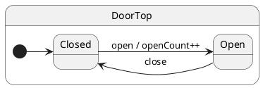

# Hello State Machine

## Problem

A plain class with boolean flags (`isOpen`, `isClosed`) mixes **mode** and **behavior**. Every method must re-validate flags, and invalid combinations compile without error.

## Solution

Model each mode as a **state class**. Events are methods; crossing a mode boundary calls `this.transition(NextState)`.

## UML statechart



We declare what the machine remembers (`DoorCtx`) and which events exist (`DoorProtocol`). The protocol drives typed `post('open')` at compile time.

```typescript
export interface DoorCtx {
	openCount: number;
}

export interface DoorProtocol {
	open(): void;
	close(): void;
}
```

The **root state** inherits mailbox machinery from `HsmTopState`. It anchors the hierarchy; behavior lives in substates.

```typescript
export class DoorTop extends HsmTopState<DoorCtx, DoorProtocol> {}
```

Mark the **initial state** with `@HsmInitialState`. After `makeHsm`, the runtime descends here.

### Handler — `Closed` state

```typescript
@HsmInitialState
export class Closed extends DoorTop {
	open(): void {
		this.ctx.openCount += 1;
		this.transition(Open);
	}
}
```

### Handler — `Open` state

```typescript
export class Open extends DoorTop {
	close(): void {
		this.transition(Closed);
	}
}
```

### Client — create actor, `post`, `sync`

Create the machine with `makeHsm` (or the tutorial helper `createDoor()`):

```typescript
import { makeHsm } from 'ihsm';

const door = makeHsm(DoorTop, { openCount: 0 });
await door.sync();           // wait for init (onEntry chain + then() if defined)
```

The client never calls `open()` directly — it enqueues the event by name:

door.post('open');           // fire-and-forget — enqueues open handler
await door.sync();           // wait until open handler + transition complete

door.post('close');
await door.sync();
```

| Side | Code | Waits? |
| ---- | ---- | ------ |
| Handler | `open(): void { … }` on `Closed` | Runtime runs it when dispatched |
| Client | `door.post('open')` | No — returns immediately |
| Client | `await door.sync()` | Yes — drain queue through handler + transition |

`post` returns immediately; `sync()` is how the **client** waits when there is no return value. For a typed reply in one step, use `call()` ([Call services](../10-call-services/README.md)). To batch several posts with one wait, see [Post and sync](../08-post-and-sync/README.md).

## Reading the trace

With `HsmTraceLevel.VERBOSE_DEBUG` and a custom `HsmTraceWriter`, ihsm logs each dispatch step. Trace line format is covered in [Tracing](../02-tracing/README.md).

Each line is **`domain|…|StateName: message`**. Domains nest as the runtime descends: `initialize` → `#eventName` → `execute` → `transition from X to Y`.

```trace
{{TRACE}}
```

**What to notice:** `initialize` descends to `Closed`. Each `post` opens a `#open` / `#close` domain. After the handler, `requested transition` and `started transition` show the LCA path; `final state is` confirms the new leaf.

## Verify

```shell
npm run test:tutorials -- --grep 'Tutorial 01'
```

