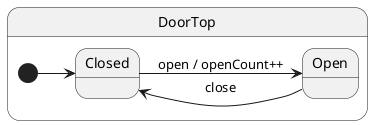

# Tutorial 01: Hello State Machine

## Problem

A plain class with boolean flags (`isOpen`, `isClosed`) mixes **mode** and **behavior**. Every method must re-validate flags, and invalid combinations compile without error.

## Solution

Model each mode as a **state class**. Events are methods; crossing a mode boundary calls `this.transition(NextState)`.

## UML statechart



## Walkthrough

We declare what the machine remembers (`DoorCtx`) and which events exist (`DoorProtocol`). The protocol drives typed `post('open')` at compile time.

```typescript
export interface DoorCtx {
	openCount: number;
}

export interface DoorProtocol {
	open(): void;
	close(): void;
}
```

The **root state** inherits mailbox machinery from `HsmTopState`. It anchors the hierarchy; behavior lives in substates.

```typescript
export class DoorTop extends HsmTopState<DoorCtx, DoorProtocol> {}
```

Mark the **initial state** with `@HsmInitialState`. After `factory.create`, the runtime descends here.

```typescript
@HsmInitialState
export class Closed extends DoorTop {
	open(): void {
		this.ctx.openCount += 1; // domain data in ctx
		this.transition(Open);   // ← explicit transition
	}
}
```

`Open` handles only what matters while open:

```typescript
export class Open extends DoorTop {
	close(): void {
		this.transition(Closed); // ← return to Closed
	}
}
```

Create the actor and drive it from the outside:

```typescript
const door = doorFactory.create({ openCount: 0 });
await door.sync();           // wait for init

door.post('open');
await door.sync();           // handler + transition complete
```

## Reading the trace

ihsm logs every dispatch step when `HsmTraceLevel.VERBOSE_DEBUG` is set and a custom `HsmTraceWriter` collects lines. Setup: [Tutorial 02 — Tracing](../02-tracing/README.md).

Each line is **`domain|…|StateName: message`**. Domains nest as the runtime descends: `initialize` → `#eventName` → `execute` → `transition from X to Y`.

```trace
{{TRACE}}
```

**What to notice:** `initialize` descends to `Closed`. Each `post` opens a `#open` / `#close` domain. After the handler, `requested transition` and `started transition` show the LCA path; `final state is` confirms the new leaf.

## Run the test

```shell
npm run test:tutorials -- --grep 'Tutorial 01'
```

## What you learned

- States are classes; `@HsmInitialState` picks the start state.
- `transition()` is always explicit.
- `post` enqueues; `sync()` waits for the current dispatch chain.

Next: [Tutorial 02 — Tracing](../02-tracing/README.md)
