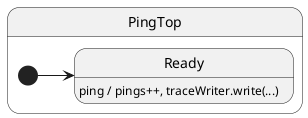

# Tracing

## Problem

You need visibility into dispatch and transitions in development, without paying that cost in production — and you need a **shared vocabulary** to read dispatch traces consistently across examples.

## Solution

Set **`HsmTraceLevel`** on the factory and inject a custom **`HsmTraceWriter`**. Use **`VERBOSE_DEBUG`** while learning; switch to **`PRODUCTION`** in hot paths.

## UML statechart



Tracing is orthogonal to state structure — same chart with observability layered on.

Shared collector (used in specs under `tutorials/`) lives in `tutorials/shared/trace.ts`:

```typescript
export class CollectingTraceWriter implements HsmTraceWriter {
	readonly lines: string[] = [];
	write(hsm: { traceHeader: string; currentStateName: string }, msg: unknown): void {
		if (typeof msg === 'string') {
			this.lines.push(`${hsm.traceHeader}${hsm.currentStateName}: ${msg}`);
		}
	}
}
```

Wire **`VERBOSE_DEBUG`** and the writer on the factory:

```typescript
export function createTracedPing(writer: CollectingTraceWriter) {
	return makeHsm(PingTop, { pings: 0 }, true, HsmTraceLevel.VERBOSE_DEBUG, writer);
}
```

Handlers can emit domain logs:

```typescript
ping(): void {
	this.ctx.pings += 1;
	this.traceWriter.write(this, `ping count is now ${this.ctx.pings}`);
}
```

### Trace line format

Each line is **`domain|…|StateName: message`**:

| Part | Meaning |
| ---- | ------- |
| `initialize\|` | Init descent through `@HsmInitialState` chain |
| `#eventName\|` | One mailbox dispatch for that event |
| `lookup\|` | VERBOSE: find handler on prototype chain |
| `execute\|` | Handler body running |
| `transition from A to B\|` | LCA exit/entry walk |
| `StateName:` | Active leaf when the line was written |
| `done:` / `failure:` | Domain frame popped — success or error |

| Level | Value | Dispatch implementation | Typical use |
| ----- | ----- | ----------------------- | ----------- |
| `PRODUCTION` | 0 | No trace overhead | Production |
| `DEBUG` | 1 | Boundaries only | Dev default |
| `VERBOSE_DEBUG` | 2 | Lookup, cache, skipped hooks | Learning, deep debugging |

## Reading the trace

ihsm logs every dispatch step when `HsmTraceLevel.VERBOSE_DEBUG` is set and a custom `HsmTraceWriter` collects lines.

Each line is **`domain|…|StateName: message`**. Domains nest as the runtime descends: `initialize` → `#eventName` → `execute` → `transition from X to Y`.

On the [documentation page](https://filasieno.github.io/ihsm/tutorials/02-tracing), use the embedded playground to dispatch events and inspect the **Trace** panel. Or run `npm run test:tutorials` headlessly.

**What to notice:** Lines mirror `ConsoleTraceWriter` format. Handlers may call `this.traceWriter.write(...)` for domain logs. Compare `DEBUG` (boundaries only) vs `VERBOSE_DEBUG` (cache hits, skipped onEntry, etc.).

## Verify

```shell
npm run test:tutorials -- --grep 'Tutorial 02'
```

