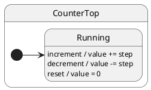

# Tutorial 03: Context

## Problem

Domain counters and configuration must survive many events. Storing them outside the actor invites drift between “state name” and “state data”.

## Solution

Pass a **context object** to `create(ctx)`. Handlers mutate `this.ctx`; the active state class can stay unchanged.

## UML statechart



Internal transitions: every event stays in `Running`; only `ctx.value` changes.

## Walkthrough

Context holds mutable domain fields:

```typescript
export interface CounterCtx {
	value: number;
	step: number;
}
```

Handlers live on the top state and **only touch ctx** — no `transition()`:

```typescript
export class CounterTop extends HsmTopState<CounterCtx, CounterProtocol> implements CounterProtocol {
	increment(): void {
		this.ctx.value += this.ctx.step; // ← ctx update, same state
	}

	decrement(): void {
		this.ctx.value -= this.ctx.step;
	}

	reset(): void {
		this.ctx.value = 0;
	}
}
```

One concrete state is enough when behavior does not depend on mode:

```typescript
@HsmInitialState
export class Running extends CounterTop {}
```

Factory seeds initial data:

```typescript
const counter = counterFactory.create({ value: 10, step: 5 });
await counter.sync();

counter.post('increment');
await counter.sync();
// counter.ctx.value === 15, currentState still Running
```

## Reading the trace

ihsm logs every dispatch step when `HsmTraceLevel.VERBOSE_DEBUG` is set and a custom `HsmTraceWriter` collects lines. Setup: [Tutorial 02 — Tracing](../02-tracing/README.md).

Each line is **`domain|…|StateName: message`**. Domains nest as the runtime descends: `initialize` → `#eventName` → `execute` → `transition from X to Y`.

```trace
{{TRACE}}
```

**What to notice:** `#increment` runs handler + `execute` domain but **no** `requested transition` — internal transition; only `ctx.value` changes.

## Run the test

```shell
npm run test:tutorials -- --grep 'Tutorial 03'
```

## What you learned

- `ctx` is domain data, not the state name.
- Omitting `transition()` keeps the current state (internal transition).

Next: [Tutorial 04 — Protocol typing](../04-protocol-typing/README.md)
