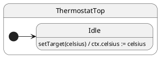

# Tutorial 04: Protocol Typing

## Problem

String event names and untyped payloads fail at runtime after refactors — `'setTargt'` compiles until the first `post` in production.

## Solution

Declare a **`Protocol` interface**. TypeScript checks `post('setTarget', celsius)` against method names and parameter types.

Other HSM libraries use runtime strings or untyped event objects; they **cannot**
tie `post()` / `call()` argument lists and Promise return types to the same
method signatures your state classes implement. ihsm does — see the reference
manual:
[Advanced: Protocol typing and compile-time safety](../../docs/REFERENCE.md#advanced-protocol-typing-and-compile-time-safety).

## UML statechart



Typing is compile-time; at runtime this is an internal transition in `Idle`.

## Walkthrough

The protocol is the machine’s **event vocabulary**:

```typescript
export interface ThermostatProtocol {
	setTarget(celsius: number): void;
	readTarget(): number;
}
```

Generics wire context and protocol through the hierarchy:

```typescript
export class ThermostatTop extends HsmTopState<ThermostatCtx, ThermostatProtocol>
	implements ThermostatProtocol {
	setTarget(celsius: number): void {
		this.ctx.celsius = celsius; // ← payload type enforced at post()
	}
}
```

The factory is typed end-to-end:

```typescript
export const thermostatFactory = new HsmFactory(ThermostatTop);
const t = thermostatFactory.create({ celsius: 18 });

t.post('setTarget', 22);   // ✓
// t.post('setTargt', 22); // ✗ compile error: unknown event
// t.post('setTarget', 'hot'); // ✗ compile error: string ≠ number
```

## Reading the trace

ihsm logs every dispatch step when `HsmTraceLevel.VERBOSE_DEBUG` is set and a custom `HsmTraceWriter` collects lines. Setup: [Tutorial 02 — Tracing](../02-tracing/README.md).

Each line is **`domain|…|StateName: message`**. Domains nest as the runtime descends: `initialize` → `#eventName` → `execute` → `transition from X to Y`.

```trace
{{TRACE}}
```

**What to notice:** Same internal pattern as context: `#setTarget` handler completes without a transition block.

## Run the test

```shell
npm run test:tutorials -- --grep 'Tutorial 04'
```

## What you learned

- `Protocol` lists events (and later, services for `call()`).
- Wrong names and payload types fail at build time.
- For every TypeScript mechanism involved (`keyof`, `infer`, conditional types,
  …), read
  [Advanced: Protocol typing](../../docs/REFERENCE.md#advanced-protocol-typing-and-compile-time-safety)
  in the reference manual.

Next: [Tutorial 05 — Hierarchy](../05-hierarchy/README.md)
