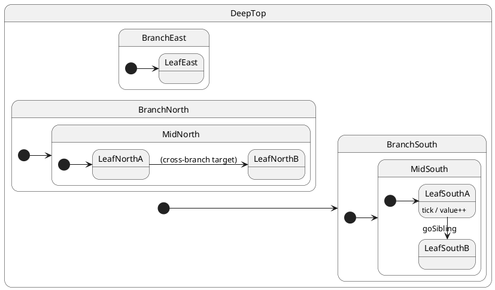

# Tutorial 05: Deep hierarchy and reading statecharts

## Problem

Flat state names hide structure. Without a shared mental model for **nested states**,
**initial substates**, and **LCA transitions**, it is hard to predict which
`onEntry` / `onExit` hooks run — or why a chart “jumps” to an unexpected leaf.

## Solution

Model a **deep class hierarchy** (four levels under the root). Each tutorial
section fires one transition kind; `ctx.trace` records `enter:` / `exit:` / `handler:`
lines so you can compare with the reference manual (§4–§5).

Hands-on reference: [§4 Reading statecharts](../../docs/REFERENCE.md#reading-uml-statecharts) ·
[§5 Transition taxonomy](../../docs/REFERENCE.md#transition-taxonomy).

## UML statechart (overview)



**How to read this chart**

| Symbol | Meaning in ihsm |
| ------ | ---------------- |
| `[ * ]` | Initial pseudostate — maps to `@HsmInitialState` on one child |
| `state X { … }` | Composite — a class that has substates (inheritance children) |
| `A --> B : event` | External transition — handler calls `this.transition(B)` |
| `StateName : event / action` inside a box | Internal transition — handler runs, no `transition()`, no exit/entry |
| Nested box | Outer state entered before inner; exited after inner |

After `create()`, ihsm walks **outer → inner** along each composite’s initial
chain: `DeepTop → BranchSouth → MidSouth → LeafSouthA`.

## Walkthrough — machine shape

Four levels under the root, three branches (South is the initial branch):

```typescript
// DeepTop → BranchSouth → MidSouth → LeafSouthA  (initial leaf)
@HsmInitialState export class BranchSouth extends DeepTop { … }
@HsmInitialState export class MidSouth extends BranchSouth { … }
@HsmInitialState export class LeafSouthA extends MidSouth { … }
```

Parallel branches for cross-ancestor moves:

```typescript
export class BranchNorth extends DeepTop { … }
@HsmInitialState export class MidNorth extends BranchNorth { … }
export class LeafNorthB extends MidNorth { … }

export class BranchEast extends DeepTop { … }
@HsmInitialState export class LeafEast extends BranchEast { … }
```

Shared handlers live on `DeepTop` (inherited by every leaf):

```typescript
goCrossBranch(): void {
  this.transition(LeafNorthB); // LCA = DeepTop
}
```

Tracing helper:

```typescript
onEntry(): void {
  this.ctx.trace.push(`enter:${this.currentStateName}`);
}
onExit(): void {
  this.ctx.trace.push(`exit:${this.currentStateName}`);
}
```

## Transition catalog (with traces)

Run `npm run test:tutorials -- --grep 'Tutorial 05'` — each test matches a row below.

### Initialization

| Event | Transition | Trace (after `await sync()`) |
| ----- | ---------- | ------------------------------ |
| *(create)* | Enter initial chain | `enter:DeepTop`, `enter:BranchSouth`, `enter:MidSouth`, `enter:LeafSouthA` |

### Internal transition (no `transition()`)

Handler runs; **no** `onExit` / `onEntry`.

| Event | Trace tail |
| ----- | ---------- |
| `post('tick')` | `handler:tick` |

Current state stays `LeafSouthA`; only `ctx.value` changes.

### Child → sibling child (same parent)

LCA is the parent composite (`MidSouth`). Only the two leaves exchange exit/entry.

| From | To | Trace tail |
| ---- | -- | ---------- |
| `LeafSouthA` | `LeafSouthB` | `exit:LeafSouthA`, `enter:LeafSouthB` |

### Child → parent composite

Target is `MidSouth`, which has `@HsmInitialState LeafSouthA`. ihsm **descends**
into the initial leaf again after exiting the current leaf.

| From | To (requested) | Final state | Trace tail |
| ---- | -------------- | ----------- | ---------- |
| `LeafSouthA` | `MidSouth` | `LeafSouthA` | `exit:LeafSouthA`, `enter:LeafSouthA` |

### Child → ancestor (shallower composite)

| From | To | Trace tail |
| ---- | -- | ---------- |
| `LeafSouthB` | `BranchSouth` | `exit:LeafSouthB`, `exit:MidSouth`, `enter:MidSouth`, `enter:LeafSouthA` |

`DeepTop` is **not** exited — still an ancestor of both source and target.

### Child → root

| From | To | Trace tail |
| ---- | -- | ---------- |
| `LeafSouthA` | `DeepTop` | `exit:LeafSouthA`, `exit:MidSouth`, `exit:BranchSouth`, `enter:BranchSouth`, `enter:MidSouth`, `enter:LeafSouthA` |

Exits stop at the LCA (`DeepTop`); re-entry follows the **initial** chain from
`BranchSouth` down (not a bare root with no leaf).

### Child → leaf under another branch (different ancestor)

LCA is `DeepTop`. Full south branch exits; north branch enters.

| From | To | Trace tail |
| ---- | -- | ---------- |
| `LeafSouthA` | `LeafNorthB` | `exit:LeafSouthA`, `exit:MidSouth`, `exit:BranchSouth`, `enter:BranchNorth`, `enter:MidNorth`, `enter:LeafNorthB` |

### Child → composite in another branch

Target is `BranchEast`; runtime descends to `@HsmInitialState LeafEast`.

| From | To (requested) | Final state | Trace tail |
| ---- | -------------- | ----------- | ---------- |
| `LeafSouthA` | `BranchEast` | `LeafEast` | `exit:LeafSouthA`, `exit:MidSouth`, `exit:BranchSouth`, `enter:BranchEast`, `enter:LeafEast` |

### Self-transition

| From | To | Trace tail |
| ---- | -- | ---------- |
| `LeafSouthA` | `LeafSouthA` | *(empty — no exit/entry)* |

### Async handler, then transition

`async goAsyncCross()` awaits `sleep`, then `transition(LeafNorthA)`. **`await sync()`**
waits for the handler **and** the transition.

| Step | Trace |
| ---- | ----- |
| Handler start | `handler:goAsyncCross:start` |
| After await | `handler:goAsyncCross:after-await` |
| Transition | `exit:LeafSouthA`, `exit:MidSouth`, `exit:BranchSouth`, `enter:BranchNorth`, `enter:MidNorth`, `enter:LeafNorthA` |

### Errors

| Scenario | What happens | `sync()` | Final state |
| -------- | -------------- | -------- | ----------- |
| `onExit` throws | `HsmTransitionError` → default recovery → `HsmFatalErrorState` | resolves | `HsmFatalErrorState` |
| Unhandled event | `HsmUnhandledEventError` → `onError` rethrows → fatal | resolves | `HsmFatalErrorState` |

`sync()` **drains the mailbox**; it does not reject when the default
`dispatchErrorCallback` logs and the machine lands in `HsmFatalErrorState`.
Use a custom callback in production if callers must observe failures.

Demo:

```typescript
sm.post('armFailExit');   // next onExit will throw
await sm.sync();
sm.post('goCrossBranch');
await sm.sync();
expect(sm.currentState.name).equals('HsmFatalErrorState');
```

## Reading the trace

ihsm logs every dispatch step when `HsmTraceLevel.VERBOSE_DEBUG` is set and a custom `HsmTraceWriter` collects lines. Setup: [Tutorial 02 — Tracing](../02-tracing/README.md).

Each line is **`domain|…|StateName: message`**. Domains nest as the runtime descends: `initialize` → `#eventName` → `execute` → `transition from X to Y`.

```trace
{{TRACE}}
```

**What to notice:** Init walks the initial chain (`DeepTop` → `BranchSouth` → `MidSouth` → `LeafSouthA`). `#tick` is internal — no transition section.

## Run the test

```shell
npm run test:tutorials -- --grep 'Tutorial 05'
```

## What you learned

- Read `[ * ]`, nested boxes, and labels as ihsm classes + `@HsmInitialState` + `transition()`.
- Internal vs external transitions; LCA controls exit/entry lists.
- Entering a composite always descends to its initial leaf chain.
- `post` + `await sync()` observe async handlers and following transitions.
- Transition and unhandled errors route to `HsmFatalErrorState` with default recovery.

Next: [Tutorial 06 — Entry & exit](../06-transitions-entry-exit/README.md)
