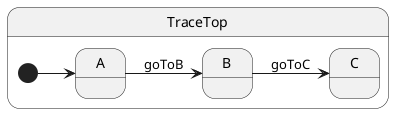
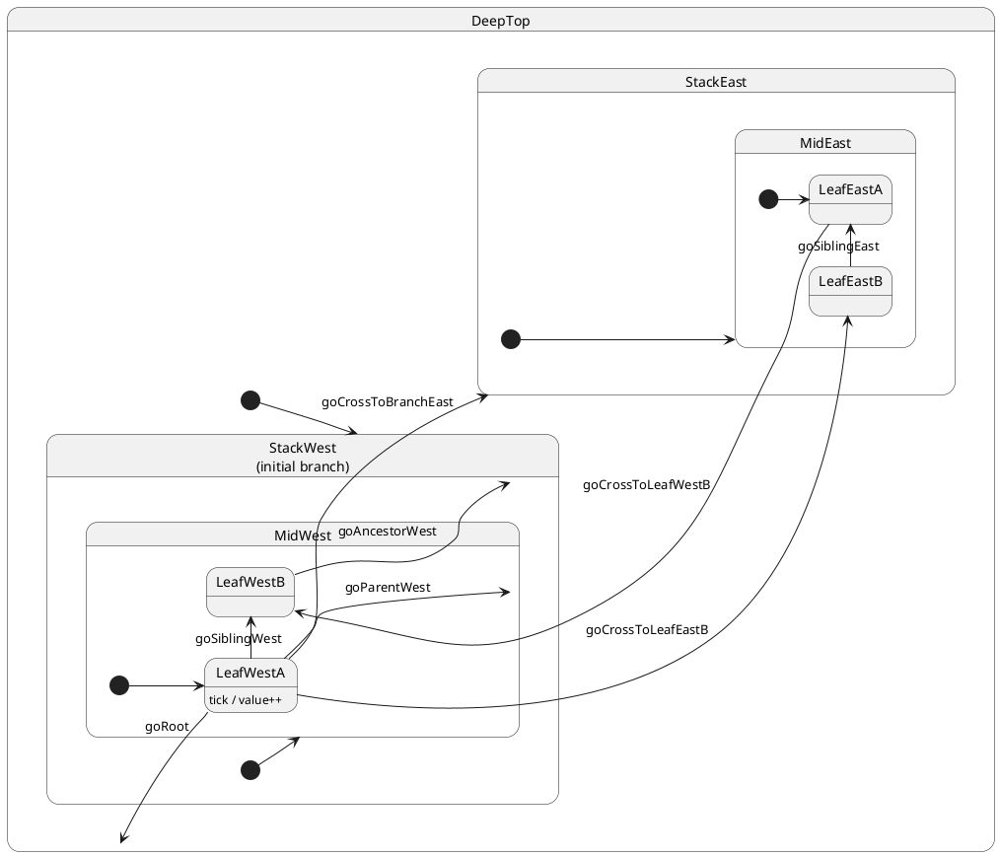

# Hierarchy and transitions

## Problem

Hierarchy alone does not explain **when** `onEntry` and `onExit` run. Crossing branches requires cleanup and setup in **LCA order** — easy to get wrong by hand. You need a shallow example first, then a shared deep machine where every topological case is visible.

## Solution

Call `this.transition(Destination)`. ihsm finds the **lowest common ancestor** on the class prototype chain, runs **`onExit`** from the current leaf up to (not including) the LCA, then **`onEntry`** down toward the target — following `@HsmInitialState` chains when the target is a composite.

Two machines in this topic:

| Machine | File | Purpose |
| ------- | ---- | ------- |
| Shallow siblings `A → B → C` | [`trace-sibling.ts`](./trace-sibling.ts) | Entry/exit order, sibling LCA |
| Two deep stacks | [`machine.ts`](./machine.ts) | Every transition topology |

---

## Entry and exit — shallow sibling chain

Three siblings under one root. **LCA = `TraceTop`** for `A → B` and `B → C`; the root is never exited.



### Expected trace

```trace
{{TRACE_SHALLOW}}
```

External transitions only (arrows). Handlers that stay in the same state use in-state `StateName : event / action` text — no self-loop arrow. See [Internal transitions](../07-internal-transitions/README.md).

### Handler (state machine)

```typescript
export class TraceTop extends HsmTopState<TraceCtx, TraceProtocol> implements TraceProtocol {
	onEntry(): void {
		this.ctx.log.push('enter:Top');
	}
	onExit(): void {
		this.ctx.log.push('exit:Top');
	}
	goToB(): void {
		this.transition(B);
	}
	goToC(): void {
		this.transition(C);
	}
}

@HsmInitialState
export class A extends TraceTop {
	onEntry(): void { this.ctx.log.push('enter:A'); }
	onExit(): void { this.ctx.log.push('exit:A'); }
}
```

`B` and `C` define their own `onEntry` / `onExit` the same way.

### Client (caller)

```typescript
const sm = createTracer();
await sm.sync();
// log: enter:Top, enter:A

sm.post('goToB');
await sm.sync();
// exit:A, enter:B — TraceTop stays active

sm.post('goToC');
await sm.sync();
// exit:B, enter:C — still no exit:Top
```

Chained siblings under one parent are the same rule as [03 · Sibling](./cases/03-sibling/README.md) under `MidWest` — only the depth changes.

---

## Deep stacks — transition topology

All cases share [`machine.ts`](./machine.ts) — one actor, two symmetric stacks:

```
DeepTop                          ← root / LCA for cross-stack moves
├── StackWest  (@HsmInitialState)  ← west stack (4 levels)
│   └── MidWest (@HsmInitialState)
│       ├── LeafWestA (@HsmInitialState)  ← default after create()
│       └── LeafWestB
└── StackEast                      ← east stack (4 levels)
    └── MidEast (@HsmInitialState)
        ├── LeafEastA (@HsmInitialState)
        └── LeafEastB
```

After `create()` + `await sync()`, the active leaf is **`LeafWestA`**. Handlers live on `DeepTop`; `ctx.trace` records `enter:` / `exit:` / `handler:` lines.

## Full statechart (both stacks)



### Expected trace

```trace
{{TRACE}}
```

## How ihsm applies a transition

1. Handler calls `this.transition(TargetStateClass)`.
2. Runtime finds the **LCA** on the class prototype chain (`HsmTopState` is not part of your hierarchy).
3. **`onExit`** from the current leaf **up to but not including** the LCA.
4. **`onEntry`** from the LCA **down toward** the target; if the target is a **composite**, follow each `@HsmInitialState` until the deepest leaf.
5. Active state is always a **leaf class**.

Transition paths are **cached** keyed by `FromState=>ToState`.

Reference: [§5 Transitions](../../docs/REFERENCE.md#_5-transitions) · [§5 Transition taxonomy](../../docs/REFERENCE.md#transition-taxonomy).

## Transition cases

| Case | Topology | From → To | LCA |
| ---- | -------- | --------- | --- |
| [01 · Initialization](./cases/01-initialization/README.md) | Initial chain | `create()` → `LeafWestA` | — |
| [02 · Internal](./cases/02-internal/README.md) | No `transition()` | `LeafWestA` (stays) | — |
| [03 · Sibling](./cases/03-sibling/README.md) | Leaf → sibling leaf | `LeafWestA` → `LeafWestB` | `MidWest` |
| [04 · Parent](./cases/04-to-parent/README.md) | Leaf → parent composite | `LeafWestA` → `MidWest` | `MidWest` |
| [05 · Ancestor](./cases/05-to-ancestor/README.md) | Leaf → ancestor composite | `LeafWestB` → `StackWest` | `StackWest` |
| [06 · Root](./cases/06-to-root/README.md) | Leaf → root | `LeafWestA` → `DeepTop` | `DeepTop` |
| [07 · Cross leaf](./cases/07-cross-leaf/README.md) | Leaf → leaf other stack | `LeafWestA` → `LeafEastB` | `DeepTop` |
| [08 · Cross branch](./cases/08-cross-branch/README.md) | Leaf → branch composite | `LeafWestA` → `StackEast` | `DeepTop` |
| [09 · Cross mid](./cases/09-cross-mid/README.md) | Leaf → mid composite | `LeafWestA` → `MidEast` | `DeepTop` |
| [10 · Self](./cases/10-self/README.md) | Leaf → same leaf | `LeafWestA` → `LeafWestA` | — |
| [11 · East sibling](./cases/11-east-sibling/README.md) | Leaf → sibling (east stack) | `LeafEastB` → `LeafEastA` | `MidEast` |
| [12 · Cross return](./cases/12-cross-return/README.md) | East → west leaf | `LeafEastA` → `LeafWestB` | `DeepTop` |
| [13 · Async cross](./cases/13-async-cross/README.md) | `await` then cross-stack | `LeafWestA` → `LeafEastA` | `DeepTop` |

Errors (`onExit` throw, unhandled events) are in [`tutorial.spec.ts`](./tutorial.spec.ts) under `14 errors`.

## Verify

```shell
npm run test:tutorials -- --grep 'Tutorial 05'
```

One deep-stack case:

```shell
npm run test:tutorials -- --grep '05 · 03 sibling'
```

Shallow entry/exit chain:

```shell
npm run test:tutorials -- --grep '05 · entry exit'
```

