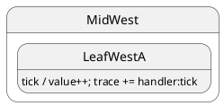

# Internal transition

## Topology

Handler runs; **no** `this.transition()`. State class unchanged — no `onExit` / `onEntry`.




### Expected trace

```trace
{{TRACE}}
```

## Starting point

`LeafWestA` after init.

## What happens

| Step | Action |
| ---- | ------ |
| 1 | `post('tick')` dispatches to inherited `DeepTop.tick()` |
| 2 | Handler updates `ctx.value` and pushes `handler:tick` |
| 3 | No `transition()` → **no** lifecycle hooks |
| 4 | Active leaf stays **`LeafWestA`** |

## Code

```typescript
sm.post('tick');
await sm.sync();
```


## Verify

```shell
npm run test:tutorials -- --grep '05 · 02 internal'
```
