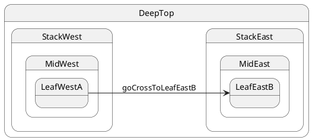

# Cross-stack: leaf → leaf

## Topology

Source and target are **leaves in different stacks**. **LCA = `DeepTop`** (only shared ancestor).




### Expected trace

```trace
{{TRACE}}
```

## Starting point

`LeafWestA` (west stack)

## What happens

| Step | Action |
| ---- | ------ |
| 1 | LCA = **`DeepTop`** |
| 2 | Exit **entire west stack**: `LeafWestA`, `MidWest`, `StackWest` |
| 3 | Enter **east stack** down to target leaf: `StackEast`, `MidEast`, **`LeafEastB`** |
| 4 | Final leaf = **`LeafEastB`** (non-initial sibling in east mid) |

## Code

```typescript
sm.post('goCrossToLeafEastB');
await sm.sync();
```


## Verify

```shell
npm run test:tutorials -- --grep '05 · 07 cross-stack to leaf'
```
