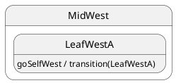

# Self-transition

## Topology

Source and target leaf class are **identical**. No lifecycle change.




### Expected trace

```trace
{{TRACE}}
```

## Starting point

`LeafWestA`

## What happens

| Step | Action |
| ---- | ------ |
| 1 | `transition(LeafWestA)` when already in `LeafWestA` |
| 2 | LCA path collapses — **no** `onExit` / `onEntry` |
| 3 | Final leaf = **`LeafWestA`** |

Useful as a no-op external transition; rare in production.

## Code

```typescript
sm.post('goSelfWest');
await sm.sync();
```


## Verify

```shell
npm run test:tutorials -- --grep '05 · 10 self'
```
