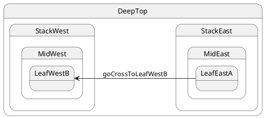

# Cross-stack return (east → west)

## Topology

Reverse of [case 07](./07-cross-leaf/README.md): east leaf to west leaf. **LCA = `DeepTop`**.




### Expected trace

```trace
{{TRACE}}
```

## Starting point

`LeafEastA` via `restore(LeafEastA, ctx)`.

## What happens

| Step | Action |
| ---- | ------ |
| 1 | LCA = **`DeepTop`** |
| 2 | Exit east stack: `LeafEastA`, `MidEast`, `StackEast` |
| 3 | Enter west stack to **`LeafWestB`** (non-initial west sibling) |
| 4 | Final leaf = **`LeafWestB`** |

Cross-stack works **both directions** with the same LCA rule.

## Code

```typescript
sm.post('goCrossToLeafWestB');
await sm.sync();
```


## Verify

```shell
npm run test:tutorials -- --grep '05 · 12 cross-stack return'
```
