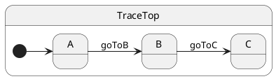

# Tutorial 06: Transitions, Entry and Exit

## Problem

Crossing hierarchy branches requires running cleanup and setup in LCA order — easy to get wrong by hand.

## Solution

Call `this.transition(Destination)`. ihsm computes the **lowest common ancestor** path and runs `onExit` / `onEntry` automatically.

## UML statechart



`A`, `B`, and `C` are siblings under `TraceTop`. `A → B` exits `A`, enters `B`. `B → C` exits `B`, enters `C` (Top stays active).

This chart shows **external** transitions only (arrows between states). **Internal** transitions — handlers that stay in the same state — are drawn as `StateName : event / action` text inside the state box (no self-loop arrow); see [tutorial 07](../07-internal-transitions/README.md).

## Walkthrough

Lifecycle hooks record order in context:

```typescript
export class TraceTop extends HsmTopState<TraceCtx, TraceProtocol> implements TraceProtocol {
	onEntry(): void {
		this.ctx.log.push('enter:Top');
	}
	onExit(): void {
		this.ctx.log.push('exit:Top');
	}
	goToB(): void {
		this.transition(B); // ← schedules LCA path
	}
}
```

Substates add their own hooks:

```typescript
@HsmInitialState
export class A extends TraceTop {
	onEntry(): void { this.ctx.log.push('enter:A'); }
	onExit(): void { this.ctx.log.push('exit:A'); }
}
```

Init runs entry from outer to inner initial leaf:

```typescript
const sm = createTracer();
await sm.sync();
// log includes enter:Top, enter:A
```

Crossing to a sibling:

```typescript
sm.post('goToB');
await sm.sync();
// exit:A, enter:B
```

## Reading the trace

ihsm logs every dispatch step when `HsmTraceLevel.VERBOSE_DEBUG` is set and a custom `HsmTraceWriter` collects lines. Setup: [Tutorial 02 — Tracing](../02-tracing/README.md).

Each line is **`domain|…|StateName: message`**. Domains nest as the runtime descends: `initialize` → `#eventName` → `execute` → `transition from X to Y`.

```trace
{{TRACE}}
```

**What to notice:** `#goToB` ends with `started transition from A to B` — sibling LCA. VERBOSE_DEBUG lists each `onExit` / `onEntry` (or skipped).

## Run the test

```shell
npm run test:tutorials -- --grep 'Tutorial 06'
```

## What you learned

- `onEntry` / `onExit` run on boundary crossings.
- Transition paths are cached per `From=>To` pair.

Next: [Tutorial 07 — Internal transitions](../07-internal-transitions/README.md)
