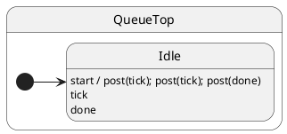

# Post and Sync

## Problem

If handlers could be re-entered mid-flight, invariants break. You need deterministic ordering when one handler schedules follow-up work — and a clear way to **wait** (or not) from outside the actor.

## Solution

ihsm serializes dispatch in a **mailbox**.

| Side | Where | Role |
| ---- | ----- | ---- |
| **Handler** | State class method | Runs when the event is dispatched |
| **Client** | Code that holds `Hsm` | Calls `post` / `sync` — never runs inside the machine |

| API | Client waits? | Return value? | Use when |
| --- | ------------- | ------------- | -------- |
| **`post(event, …)`** | No — returns immediately | No | Fire-and-forget events |
| **`call(service, …)`** | Yes — `await call(...)` | Yes — typed `Promise<T>` | One request that needs a reply |
| **`sync()`** | Yes — `await sync()` | No | Drain everything already enqueued |

**Rule of thumb:** need a value back → **`call`**. Just tell the actor something happened → **`post`**. Need to know a batch of **posted** work finished → **`post` … `post` … `await sync()` once**.

Typed request/response: [Call services](../10-call-services/README.md).

## UML statechart



## Protocol

Events are plain methods on the state class — return `void` (or `Promise<void>` for async):

```typescript
export interface QueueProtocol {
	start(): void;
	tick(): void;
	done(): void;
}
```

---

## Example 1 · Batch `post` from the client, one `sync`

### Handler (state machine)

```typescript
export class QueueTop extends HsmTopState<QueueCtx, QueueProtocol> implements QueueProtocol {
	tick(): void {
		this.ctx.events.push('tick');
	}

	done(): void {
		this.ctx.events.push('done');
	}
}
```

Each handler only mutates `ctx`. No return value — the client cannot `await post(...)`.

### Client (caller)

```typescript
const sm = createQueueMachine();
await sm.sync(); // wait for init

sm.post('tick');  // enqueue — returns immediately
sm.post('tick');
sm.post('done');
await sm.sync();  // wait until all three handlers finished

// sm.ctx.events === ['tick', 'tick', 'done']
```

One `sync` after the batch — not after every `post`:

```typescript
// ✗ unnecessary
sm.post('tick'); await sm.sync();
sm.post('tick'); await sm.sync();

// ✓ one drain point
sm.post('tick');
sm.post('tick');
sm.post('done');
await sm.sync();
```

---

## Example 2 · Handler chains `this.post` — client needs extra `sync`

### Handler (state machine)

`start` schedules follow-ups **after** it returns — they are not re-entrant:

```typescript
export class QueueTop extends HsmTopState<QueueCtx, QueueProtocol> implements QueueProtocol {
	start(): void {
		this.ctx.events.push('start');
		this.post('tick');  // queued for after start() completes
		this.post('tick');
		this.post('done');
	}

	tick(): void { this.ctx.events.push('tick'); }
	done(): void { this.ctx.events.push('done'); }
}
```

### Client (caller)

Inner posts do not exist in the queue until `start` finishes:

```typescript
const sm = createQueueMachine();
await sm.sync();

sm.post('start');
await sm.sync(); // through start only → events === ['start']
await sm.sync(); // through tick, tick, done → ['start','tick','tick','done']
```

---

## Example 3 · `call` vs `post` + `sync` 

When the client needs a **return value**, use `call` — not `post` + `sync`. See [Call services](../10-call-services/README.md).

### Handler (service on state class)

```typescript
getBalance(resolve: HsmResolveCallback<number>, _reject: HsmRejectCallback): void {
	resolve(this.ctx.balance);
}
```

### Client (caller)

```typescript
const balance = await wallet.call('getBalance'); // one await, typed result — no sync()

wallet.post('deposit', 10);   // fire-and-forget event
await wallet.sync();          // optional: wait for deposit side effect only
```

---

## Reading the trace

With `HsmTraceLevel.VERBOSE_DEBUG` and a custom `HsmTraceWriter`, ihsm logs each dispatch step. Trace line format is covered in [Tracing](../02-tracing/README.md).

Each line is **`domain|…|StateName: message`**. Domains nest as the runtime descends: `initialize` → `#eventName` → `execute` → `transition from X to Y`.

```trace
{{TRACE}}
```

**What to notice:** `#start` finishes before `#tick` / `#done` dispatches appear — FIFO mailbox, not re-entrant `post` from inside the handler.

## Verify

```shell
npm run test:tutorials -- --grep 'Tutorial 08'
```

