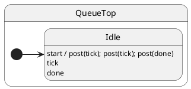

# Tutorial 08: Post and Sync

## Problem

If handlers could be re-entered mid-flight, invariants break. You need deterministic ordering when one handler schedules follow-up work.

## Solution

ihsm serializes dispatch in a **mailbox**. `this.post()` from a handler queues jobs that run after the current handler finishes.

## UML statechart



All events are handled in `Idle`; `start` chains internal posts.

## Walkthrough

`start` records itself, then schedules three follow-ups:

```typescript
export class QueueTop extends HsmTopState<QueueCtx, QueueProtocol> implements QueueProtocol {
	start(): void {
		this.ctx.events.push('start');
		this.post('tick');  // ← queued, not re-entrant
		this.post('tick');
		this.post('done');
	}
```

Those posts run **after** `start` returns — FIFO order:

```typescript
	tick(): void { this.ctx.events.push('tick'); }
	done(): void { this.ctx.events.push('done'); }
}
```

Drain the mailbox in tests:

```typescript
sm.post('start');
await sm.sync(); // through start handler
await sm.sync(); // through tick, tick, done
// events === ['start', 'tick', 'tick', 'done']
```

## Reading the trace

ihsm logs every dispatch step when `HsmTraceLevel.VERBOSE_DEBUG` is set and a custom `HsmTraceWriter` collects lines. Setup: [Tutorial 02 — Tracing](../02-tracing/README.md).

Each line is **`domain|…|StateName: message`**. Domains nest as the runtime descends: `initialize` → `#eventName` → `execute` → `transition from X to Y`.

```trace
{{TRACE}}
```

**What to notice:** `#start` finishes before `#tick` / `#done` dispatches appear — FIFO mailbox, not re-entrant `post` from inside the handler.

## Run the test

```shell
npm run test:tutorials -- --grep 'Tutorial 08'
```

## What you learned

- One handler at a time per actor.
- Chained `post` from a handler needs a second `sync()` to drain.

Next: [Tutorial 09 — Deferred post](../09-deferred-post/README.md)
